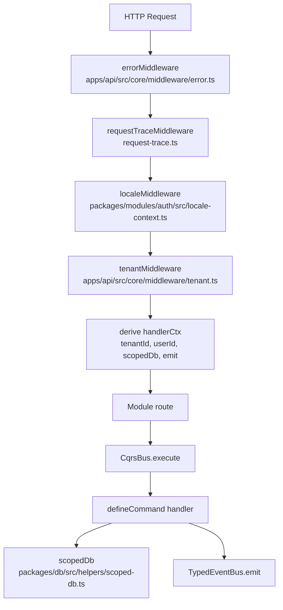

# Phase 15: Developer Documentation — Pattern Map

**Mapped:** 2026-04-17
**Files analyzed:** 15 (9 new docs + 1 doc index + 5 code deliverables for D-05)
**Analogs found:** 15 / 15

Phase 15 is predominantly a documentation-authoring phase. For each `.md` file, the closest analog is cited for **tone, structure, and formatting conventions** (not data flow). The single code-authoring track is D-05: extending `packages/modules/example/` with an event emission + BullMQ worker + tests so the "Add a Module" tutorial can walk through all four module surfaces.

---

## File Classification

### Documentation files (role = doc, data flow = narrative/reference)

| New/Modified File | Doc Role | Flow | Closest Analog | Match Quality |
|-------------------|----------|------|----------------|---------------|
| `docs/README.md` | doc-index | navigation | `.planning/ROADMAP.md` (table-driven index), `docs/jsdoc-style-guide.md` (tone) | role-match |
| `docs/getting-started.md` | doc-guide (onboarding) | narrative | `docs/jsdoc-style-guide.md` (tone) + `.planning/phases/13-jsdoc-annotations/13-01-PLAN.md` (ordered procedure sections) | partial (no onboarding guide exists yet) |
| `docs/architecture.md` | doc-reference (diagrams) | narrative + Mermaid | `.planning/phases/15-developer-documentation/15-RESEARCH.md` §"System Architecture Diagram" (Mermaid flowchart syntax in repo), `docs/jsdoc-style-guide.md` (tone) | role-match |
| `docs/add-a-module.md` | doc-tutorial (annotated walkthrough) | narrative + cited code | `docs/jsdoc-style-guide.md` §"Templates by Export Type" (Good/Bad examples + fenced code blocks) | role-match |
| `docs/configuration.md` | doc-reference (env/config catalog) | reference tables | `docs/jsdoc-style-guide.md` (tone) + `CLAUDE.md` §"Technology Stack" (table layout for catalogs) | role-match |
| `docs/testing.md` | doc-reference (test patterns) | narrative | `docs/jsdoc-style-guide.md` (tone) + `.planning/phases/14-unit-tests/14-RESEARCH.md` (test-pattern explanations in repo) | role-match |
| `docs/integrations/better-auth.md` | doc-integration | narrative + Mermaid sequenceDiagram | `docs/jsdoc-style-guide.md` §"Good vs Bad Examples" (tone + fenced blocks) | role-match |
| `docs/integrations/billing.md` | doc-integration | narrative + Mermaid sequenceDiagram | same as above | role-match |
| `docs/integrations/bullmq.md` | doc-integration | narrative + Mermaid sequenceDiagram | same as above | role-match |
| `docs/integrations/email.md` | doc-integration | narrative + Mermaid sequenceDiagram | same as above | role-match |

### Code files (D-05 example module extension — role = module, data flow = event-driven + job handler)

| New/Modified File | Role | Data Flow | Closest Analog | Match Quality |
|-------------------|------|-----------|----------------|---------------|
| `packages/modules/example/src/index.ts` (modify) | module-definition | module registration | `packages/modules/billing/src/index.ts` | exact |
| `packages/modules/example/src/commands/create-example.ts` (modify) | command handler (emits event + enqueues) | CRUD + event emission | `packages/modules/auth/src/auth.ts:70-82` (enqueue on emission site) + existing `create-example.ts` (pre-extension) | exact |
| `packages/modules/example/src/jobs/process-followup.ts` (new) | job handler (BullMQ worker processor) | event-driven / job consumer | `packages/modules/billing/src/jobs/send-email.ts` | exact |
| `packages/modules/example/src/__tests__/create-example.test.ts` (new) | unit test | command handler test | `packages/modules/billing/src/__tests__/billing.test.ts` + `packages/modules/__test-utils__/mock-context.ts` | exact |
| `packages/modules/example/src/__tests__/process-followup.test.ts` (new) | unit test | job handler test | `packages/modules/billing/src/__tests__/billing.test.ts` (module-level mock pattern) | role-match |

---

## Pattern Assignments — Documentation Files

### `docs/README.md` (doc-index, navigation)

**Analog:** `.planning/ROADMAP.md` (phase index) + `docs/jsdoc-style-guide.md` (tone)

**Tone anchor** — from `docs/jsdoc-style-guide.md:1-7`:

```markdown
# JSDoc Style Guide

This guide standardizes JSDoc across the Baseworks codebase. All exported symbols
(functions, types, interfaces, classes, constants) must have a JSDoc block unless
explicitly exempted. The goal is consistent IDE tooltips, self-documenting APIs,
and maintainable inline documentation that stays accurate as the code evolves.
```

Notes: single-sentence opening paragraph, declarative, no second person, no filler. New `docs/README.md` follows the same pattern.

**Navigation structure** — repurpose the link-table layout from the Phase 13 PATTERNS inventory (section 5.x) and from CLAUDE.md's technology-stack tables: a two-column Markdown table where col 1 is the doc filename (relative link) and col 2 is a one-line purpose.

**Heading hierarchy** — single `#` at top, `---` separator after lead paragraph, `##` section headings. Source: `docs/jsdoc-style-guide.md:1-10`.

---

### `docs/getting-started.md` (doc-guide, onboarding)

**Analog:** `docs/jsdoc-style-guide.md` (tone) + the opening of `docs/jsdoc-style-guide.md:1-23` (lead paragraph + "General Rules" list form).

**Tone rule applied** — DOCS-01 has discretion (per CONTEXT.md §"Claude's Discretion") for a slightly warmer onboarding voice. Cap warmth at "plain declarative" — no "basically", "simply", "just", no exclamations, no emojis (forbidden by D-11 and by `docs/jsdoc-style-guide.md:19-20`):

```markdown
- **Technical-precise tone:** Describe what the code does, not what the developer should feel.
  Use domain terminology. Avoid filler words ("basically", "simply", "just").
```

**Command examples** — use `bun` exclusively (CLAUDE.md constraint):

```bash
bun install
bun run docker:up
bun run db:migrate
bun run api
bun test
```

**Prerequisites section layout** — mirror the two-column catalog form from `CLAUDE.md` §"Core Runtime" (headings: Technology | Version | Purpose) for the prerequisites table. Reference: root `package.json` scripts for exact command names, `docker-compose.yml` for postgres:16 + redis:7 versions, `packages/config/src/env.ts` for env var list.

**Windows/POSIX note** — per Pitfall 7 in RESEARCH.md, include a one-paragraph note that commands assume a POSIX shell (bash/zsh/Git Bash/WSL2). Root-level `bun run {script}` commands are cross-platform.

---

### `docs/architecture.md` (doc-reference, 4 Mermaid diagrams)

**Analog:** `.planning/phases/15-developer-documentation/15-RESEARCH.md` §"System Architecture Diagram" (established Mermaid flowchart syntax convention in this repo) + `docs/jsdoc-style-guide.md` (tone).

**Mermaid diagram conventions** (D-02) — every box uses a concrete code identifier that matches a file/class name. Pattern from RESEARCH.md lines 228–239:



Rules: use `flowchart` (never deprecated `graph`), `sequenceDiagram`, or `stateDiagram-v2` only; no `classDiagram` for CQRS; preview on GitHub PR before committing (RESEARCH.md Pitfall 2).

**Code-anchor labels for the 4 mandated diagrams** (per CONTEXT.md canonical refs):

| Diagram | Required anchors |
|---------|------------------|
| Module system | `ModuleRegistry` (apps/api/src/core/registry.ts), `ModuleDefinition` (packages/shared/src/types/module.ts), `moduleImportMap` |
| CQRS flow | `CqrsBus.execute` / `CqrsBus.query` (apps/api/src/core/cqrs.ts), `defineCommand` / `defineQuery` (packages/shared/src/types/cqrs.ts), `HandlerContext` |
| Request lifecycle | `errorMiddleware`, `requestTraceMiddleware`, `localeMiddleware`, `cors`, auth routes, `tenantMiddleware`, `handlerCtx` derive, module routes (apps/api/src/index.ts) |
| Tenant scoping | `scopedDb` (packages/db/src/helpers/scoped-db.ts), `tenantIdColumn` (packages/db/src/schema/base.ts), session.activeOrganizationId (tenant.ts middleware) |

**Scope guard** (RESEARCH.md Pitfall 6): DOCS-02 is 4 diagrams + supporting prose. No Stripe webhook flow, no in-depth integration content — those belong in `docs/integrations/*.md`.

---

### `docs/add-a-module.md` (doc-tutorial, annotated walkthrough)

**Analog:** `docs/jsdoc-style-guide.md` §"Good vs Bad Examples" (lines 155–201) — precedent for teaching by example with fenced code blocks + short commentary. Plus the existing example module files as the code subject.

**Good/Bad example format** — from `docs/jsdoc-style-guide.md:157-181`:

```markdown
### Example 1: Function Documentation

**Bad:**

\`\`\`typescript
/** Creates a tenant. */
export const createTenant = defineCommand(...)
\`\`\`

**Good:**

\`\`\`typescript
/**
 * Create a new tenant organization and assign the requesting user as owner.
 * ...
 */
export const createTenant = defineCommand(...)
\`\`\`
```

Apply this before/after format for "wrong way" vs "right way" in the module tutorial only where it earns its space. For the 10-step walkthrough (see RESEARCH.md Pattern 4), use numbered headings (`## Step 1: Copy and rename`, etc.) with one cited code block per step.

**Tutorial prerequisite link** (D-06) — open with: "This tutorial assumes you have read [Architecture Overview](./architecture.md). CQRS, `ModuleRegistry`, `EventBus`, and `scopedDb` concepts are not re-explained here."

**Module shape reference** — canonical module definition from `packages/modules/billing/src/index.ts:28-63` (exact pattern the tutorial mirrors, post-D-05 extension of example):

```typescript
export default {
  name: "billing",
  routes: billingRoutes,
  commands: { /* ... */ },
  queries: { /* ... */ },
  jobs: {
    "billing:process-webhook": {
      queue: "billing:process-webhook",
      handler: processWebhook,
    },
    // ...
  },
  events: [
    "subscription.created",
    "subscription.cancelled",
    // ...
  ],
} satisfies ModuleDefinition;
```

This is the canonical "all four surfaces" template. Tutorial copies this shape, substituting the example module's names post-D-05.

**Command with event emission pattern** — cite `packages/modules/example/src/commands/create-example.ts:22-34` (post-D-05; the current file lines 22–34 already emit `example.created`):

```typescript
export const createExample = defineCommand(CreateExampleInput, async (input, ctx) => {
  const [result] = await ctx.db
    .insert(examples)
    .values({ title: input.title, description: input.description ?? null });
  ctx.emit("example.created", { id: result.id, tenantId: ctx.tenantId });
  return ok(result);
});
```

**Query pattern** — cite `packages/modules/example/src/queries/list-examples.ts:19-24`.

**Registry wiring** — cite `apps/api/src/core/registry.ts:10-16` for `moduleImportMap` entry, and `apps/api/src/index.ts` (modules array) + `apps/api/src/worker.ts:23` (modules array) for the two registration sites.

**Citation format (D-10)** — `path:start-end` for anything > ~10 lines; inline snippet (≤ 10 lines) verbatim for short usage. Prefer function-name anchors when a named anchor exists (RESEARCH.md Pitfall 1).

---

### `docs/configuration.md` (doc-reference, env/config catalog)

**Analog:** `CLAUDE.md` §"Core Runtime" table layout + `docs/jsdoc-style-guide.md` (tone).

**Env var table structure** — borrow the 4-column catalog pattern from CLAUDE.md (Technology | Version | Purpose | Why):

```markdown
| Env var | Required | Default | Purpose |
|---------|----------|---------|---------|
| `DATABASE_URL` | yes | — | PostgreSQL connection string used by all apps. |
| `BETTER_AUTH_SECRET` | yes | — | ≥ 32-char secret for better-auth session signing. |
| `REDIS_URL` | conditional | — | Required when `INSTANCE_ROLE=worker` or `all`. |
```

Source the exact list and constraints from `packages/config/src/env.ts` (Zod schema). Do NOT duplicate the schema — cite it (`packages/config/src/env.ts`) and provide the catalog as a readable index.

**Module loading config** — cite `apps/api/src/index.ts` line 27 and `apps/api/src/worker.ts:23`:

```typescript
const registry = new ModuleRegistry({
  role: "worker",
  modules: ["example", "billing"],
});
```

Cite `apps/api/src/core/registry.ts:10-16` for the `moduleImportMap` and explain "add to the map + add to the `modules` array" is the module-loading switch.

**Provider selection pattern** — cite `packages/modules/billing/src/provider-factory.ts::getPaymentProvider` (named anchor preferred per RESEARCH.md Pitfall 1).

**Deployment config** — cite `docker-compose.yml`, `Dockerfile.api`, `Dockerfile.worker`, `Dockerfile.admin`. Use sequenceDiagram for startup flow if helpful (optional — not part of the 8 locked diagrams).

**Security guardrail** (RESEARCH.md §"Security Domain"): every example env value is a placeholder (`your-secret-here`, `sk_test_xxx`, `re_xxx`). Never real keys. Grep check before merge: `sk_live_`, `sk_test_[0-9a-zA-Z]{24,}`, `re_[0-9a-zA-Z]+`, `whsec_[0-9a-zA-Z]{24,}`.

---

### `docs/testing.md` (doc-reference, test patterns)

**Analog:** `docs/jsdoc-style-guide.md` (tone) + existing test utilities (`packages/modules/__test-utils__/mock-context.ts`) as the code subject.

**Mock factory citation** — `packages/modules/__test-utils__/mock-context.ts:44-64` (createMockContext) and `:13-42` (createMockDb). Inline-snippet form for the 10-line createMockContext body:

```typescript
// packages/modules/__test-utils__/mock-context.ts:53-64
export function createMockContext(
  overrides?: Partial<HandlerContext>,
): HandlerContext {
  return {
    tenantId: "test-tenant-id",
    userId: "test-user-id",
    db: createMockDb(),
    emit: mock(() => {}),
    enqueue: mock(() => Promise.resolve()),
    ...overrides,
  };
}
```

**Two-mock-category split** (Phase 14 precedent, per `.planning/phases/14-unit-tests/14-CONTEXT.md`):

1. Auth handlers: `mock.module("../auth")` to intercept the better-auth singleton.
2. Billing handlers: `setPaymentProvider()` + `createMockPaymentProvider()` + mock db.

Cite `packages/modules/billing/src/__tests__/billing.test.ts:1-56` for the `mock.module(...)` pattern (ioredis, bullmq, stripe, postgres, config all mocked at test file top).

**Test runner scope** — document `bun test` today; note Vitest for React components is deferred to a later phase (Open Question 4 in RESEARCH.md). Do not over-promise.

**File citation** — cite `packages/modules/billing/src/__tests__/pagarme-adapter.test.ts` as the adapter-test template.

---

### `docs/integrations/better-auth.md` (doc-integration)

**Analog:** `docs/jsdoc-style-guide.md` (tone) — no existing integration doc in repo; new template established here.

**Document template** (all 4 integration docs follow this, per D-07) — from RESEARCH.md Pattern 3:

```markdown
# [Integration Name]

## Overview
[One paragraph: what the integration provides, which upstream lib it wraps.]

## Upstream Documentation
- [Official docs link]
- [Relevant SDK reference]

## Setup
### Env vars
### Module wire-up
### Smoke test

## Wiring in Baseworks
[File paths, abstractions used, flow diagram (1 Mermaid sequenceDiagram)]

## Gotchas

## Extending
### Add another [provider/queue/template/OAuth provider]
```

**Wiring citations (DOCS-06):**
- `packages/modules/auth/src/auth.ts:55-177` — `betterAuth()` config with `basePath: "/api/auth"`, emailAndPassword, socialProviders, magicLink, organization plugin, drizzleAdapter. Cite (>10 lines, evolves with better-auth upgrades).
- `packages/modules/auth/src/routes.ts` — `.mount(auth.handler)` pattern. Cite the gotcha inline (see next).

**Critical gotcha (inline snippet, per D-10)** — from `packages/modules/auth/src/auth.ts:55-57`:

> better-auth `basePath` already contains `/api/auth`, so mounting via `.mount(auth.handler)` WITHOUT a prefix is required. Prefixing doubles the path to `/api/auth/api/auth/*`.

**Magic-link flow sequenceDiagram** — one Mermaid diagram showing: better-auth `sendMagicLink` → `getEmailQueue().add("magic-link", ...)` → `email:send` BullMQ worker → `sendEmail` job → Resend. Cite `packages/modules/auth/src/auth.ts:127-138`.

**"Add another OAuth provider"** — point at the existing `socialProviders` config in `auth.ts`. Mention better-auth's plugin model; link to better-auth.com for the plugin catalog (D-08: link, do not re-document).

**Upstream link**: `https://www.better-auth.com`.

---

### `docs/integrations/billing.md` (doc-integration)

**Analog:** same template as `better-auth.md`; code subject is billing module.

**Wiring citations (DOCS-07):**
- `packages/modules/billing/src/ports/payment-provider.ts:38-159` — `PaymentProvider` interface (14 methods). Cite.
- `packages/modules/billing/src/provider-factory.ts::getPaymentProvider` — lazy singleton, branches on `PAYMENT_PROVIDER` env. Cite by function-name anchor.
- `packages/modules/billing/src/adapters/stripe/stripe-adapter.ts` — Stripe implementation (reference).
- `packages/modules/billing/src/adapters/pagarme/pagarme-adapter.ts` — Pagar.me implementation (the "added alongside Stripe" reference for D-09 Extending).

**Webhook sequenceDiagram** — Mermaid diagram: client → `billingRoutes` POST `/api/billing/webhooks` → `provider.verifyWebhookSignature()` → normalize event → enqueue `billing:process-webhook` → worker handler `processWebhook`. Cite `packages/modules/billing/src/routes.ts` for the entry point.

**Security invariant** (RESEARCH.md Security Domain): webhook handler MUST show `provider.verifyWebhookSignature()` as step one. Inline snippet form (≤ 10 lines).

**"Add another payment provider"** — step-by-step mirroring how Pagar.me was added:
1. Implement the `PaymentProvider` port in `packages/modules/billing/src/adapters/{new}/`.
2. Register the adapter in `provider-factory.ts::getPaymentProvider` switch.
3. Add `{NEW}_SECRET_KEY` to `packages/config/src/env.ts`.
4. Update `validatePaymentProviderEnv()` in config.

Cite `packages/modules/billing/src/hooks/on-tenant-created.ts:40-52` for the provider-name branching pattern (analog for `validatePaymentProviderEnv`).

**Upstream link**: `https://stripe.com/docs` and `https://docs.pagar.me`.

---

### `docs/integrations/bullmq.md` (doc-integration)

**Analog:** same template; code subject is queue package + worker entrypoint.

**Wiring citations (DOCS-08):**
- `packages/queue/src/index.ts:14-51` — `createQueue` (3-day / 7-day retention, 3 attempts, exponential backoff) and `createWorker` (concurrency 5, inline processor). Cite.
- `apps/api/src/worker.ts:23-77` — worker entrypoint that iterates `registry.getLoaded()` and starts a `createWorker` per `def.jobs` entry. Cite.
- Queue naming convention: `module:action` (e.g., `email:send`, `billing:process-webhook`). Inline-snippet form.

**Critical gotcha (inline, per D-10)** — from `packages/queue/src/index.ts:31-38`:

> Worker threads (sandboxed processors) are NOT used because they are broken on Bun runtime. All processors run inline in the main thread.

**Enqueue → worker → retry sequenceDiagram** — Mermaid diagram: command handler → `ctx.enqueue(name, data)` OR direct `queue.add(name, data)` → Redis → `createWorker` picks up → handler runs → on failure, exponential backoff retry (3 attempts) → removeOnFail at 7 days.

**"Add a new queue + worker + job type"** — step-by-step:
1. Export a job handler function (signature: `(data: unknown) => Promise<void>`). Template: `packages/modules/billing/src/jobs/send-email.ts:128-167`.
2. Register the job in your module's `jobs` map: `"module:action": { queue: "module:action", handler }`.
3. Include your module name in the `modules` array passed to `new ModuleRegistry(...)` in both `apps/api/src/index.ts` and `apps/api/src/worker.ts`.
4. Add your module to `moduleImportMap` in `apps/api/src/core/registry.ts:10-16`.

**Dashboard (Bull Board)** — RESEARCH.md Open Question 5 recommends a brief mention + link, no setup walkthrough (tooling not yet wired).

**Upstream link**: `https://docs.bullmq.io`.

---

### `docs/integrations/email.md` (doc-integration)

**Analog:** same template; code subject is send-email job + templates.

**Wiring citations (DOCS-09):**
- `packages/modules/billing/src/jobs/send-email.ts:128-167` — dispatcher: routes template name → React Email component → `render()` → `resend.emails.send()`. Graceful skip when `RESEND_API_KEY` absent. Cite.
- `packages/modules/billing/src/templates/` — `welcome.tsx`, `password-reset.tsx`, `team-invite.tsx`, `billing-notification.tsx`.
- `packages/modules/billing/src/jobs/send-email.ts:55-107` — `resolveTeamInvite` i18n pre-resolution (only `team-invite` pre-resolves strings).

**Template map pattern (inline, ≤ 10 lines)** — from `send-email.ts:15-24`:

```typescript
const templates: Record<string, (data: any) => JSX.Element> = {
  "welcome": (data) => WelcomeEmail(data),
  "password-reset": (data) => PasswordResetEmail(data),
  "magic-link": (data) => PasswordResetEmail({ ...data, userName: data.email }),
  "billing-notification": (data) => BillingNotificationEmail(data),
  "team-invite": (data) => TeamInviteEmail(data),
};
```

**Email queue → Resend sequenceDiagram** — Mermaid: caller → `queue.add("template-name", { to, template, data })` → `email:send` worker → `sendEmail` job → template lookup → `render()` → `resend.emails.send()`. Graceful-skip branch noted.

**"Add a new email template"** — step-by-step:
1. Create `packages/modules/billing/src/templates/{name}.tsx` as a React Email component.
2. Add an entry to the `templates` and `subjects` maps in `send-email.ts:15-35`.
3. Call-site: `await queue.add("template-name", { to, template: "template-name", data: {...} })`. Template: `packages/modules/auth/src/auth.ts:70-82` (password-reset call site).

**Upstream link**: `https://resend.com/docs` and `https://react.email`.

---

## Pattern Assignments — Code Files (D-05)

### `packages/modules/example/src/index.ts` (modify; module-definition)

**Analog:** `packages/modules/billing/src/index.ts` (exact match — same role, same ModuleDefinition shape)

**Full analog pattern** — from `packages/modules/billing/src/index.ts:28-63`:

```typescript
export default {
  name: "billing",
  routes: billingRoutes,
  commands: { /* ... */ },
  queries: { /* ... */ },
  jobs: {
    "billing:process-webhook": {
      queue: "billing:process-webhook",
      handler: processWebhook,
    },
    // ...
  },
  events: ["subscription.created", "subscription.cancelled", /* ... */],
} satisfies ModuleDefinition;
```

**Current state** — `packages/modules/example/src/index.ts` already declares `events: ["example.created"]` and `jobs: {}`. The D-05 extension populates the `jobs` map with one follow-up handler, e.g.:

```typescript
jobs: {
  "example:process-followup": {
    queue: "example:process-followup",
    handler: processFollowup,
  },
},
```

**Import pattern** — match existing imports in `packages/modules/example/src/index.ts:1-4` (relative imports from `./commands/...`, `./queries/...`; add `./jobs/process-followup`).

---

### `packages/modules/example/src/commands/create-example.ts` (modify; command + enqueue)

**Analog:** existing file (pre-extension) + `packages/modules/auth/src/auth.ts:70-82` (the canonical enqueue-on-event site).

**Current core pattern** — `packages/modules/example/src/commands/create-example.ts:22-34`:

```typescript
export const createExample = defineCommand(CreateExampleInput, async (input, ctx) => {
  const [result] = await ctx.db
    .insert(examples)
    .values({ title: input.title, description: input.description ?? null });
  ctx.emit("example.created", { id: result.id, tenantId: ctx.tenantId });
  return ok(result);
});
```

**D-05 extension option** — RESEARCH.md §"Open Questions" Q1 recommends the minimal enqueue-on-create pattern (no new table; worker emits a log and optionally updates a `processed_at` timestamp). Use `ctx.enqueue` (already in `HandlerContext` per `packages/shared/src/types/cqrs.ts:30`):

```typescript
// After ctx.emit(...)
await ctx.enqueue?.("example:process-followup", { exampleId: result.id, tenantId: ctx.tenantId });
```

Alternative: wire a `TypedEventBus.on("example.created", ...)` listener that enqueues — mirrors `packages/modules/billing/src/hooks/on-tenant-created.ts:31-78` (registerBillingHooks). Planner decides which to use based on simplicity-of-tutorial criterion in D-06.

**JSDoc pattern** — update the block per `docs/jsdoc-style-guide.md:44-59` (defineCommand template): one-line action + elaboration + `@param input` + `@param ctx` + `@returns`. Note the new enqueue side effect in the elaboration paragraph.

---

### `packages/modules/example/src/jobs/process-followup.ts` (new; job handler)

**Analog:** `packages/modules/billing/src/jobs/send-email.ts` (exact — same role, same job-handler signature).

**Handler signature pattern** — from `send-email.ts:128-133`:

```typescript
export async function sendEmail(data: unknown): Promise<void> {
  const { to, template, data: templateData } = data as {
    to: string;
    template: string;
    data: Record<string, unknown>;
  };
  // ...
}
```

**Imports pattern** — from `send-email.ts:1-13` (named imports from workspace packages, one import per line, alphabetized by source):

```typescript
import { env } from "@baseworks/config";
// ... other workspace imports
```

For the example follow-up handler, imports will likely be minimal: `env` (optional), logger (optional), `createDb` + `examples` from `@baseworks/db` if updating a timestamp.

**JSDoc pattern** — from `send-email.ts:109-127`:

```typescript
/**
 * [One-line action statement.]
 *
 * [Elaboration paragraph.]
 *
 * @param data - Job data: [shape]
 * @returns void
 * @throws [if applicable]
 *
 * Per D-05: [Phase 15 D-05 design reference.]
 */
export async function processFollowup(data: unknown): Promise<void> { ... }
```

**Error handling pattern** — match `send-email.ts` graceful-skip: if an optional env var is missing or a side-effect cannot be performed in test/dev, log and return without throwing. Throwing triggers BullMQ retry (3 attempts with exponential backoff per `packages/queue/src/index.ts:22-27`) — use this only for transient errors.

**Tenant scoping caveat** — worker runs outside the request context, so `scopedDb` is NOT available via `ctx`. If the handler must update tenant-scoped tables, use `createDb(env.DATABASE_URL)` + include `tenantId` from job data in the WHERE clause. Mirror `packages/modules/billing/src/hooks/on-tenant-created.ts:53-66` for the pattern.

---

### `packages/modules/example/src/__tests__/create-example.test.ts` (new; unit test)

**Analog:** `packages/modules/billing/src/__tests__/billing.test.ts` (module-level mock pattern) + `packages/modules/__test-utils__/mock-context.ts` (mock factory).

**Imports pattern** — from `billing.test.ts:1`:

```typescript
import { describe, test, expect, mock } from "bun:test";
```

**Mock strategy** — this is a commands test (not an adapter test), so NO `mock.module("@baseworks/config")` heavy block is needed if the handler does not import `env`. Use `createMockContext()` directly:

```typescript
import { describe, test, expect } from "bun:test";
import { createExample } from "../commands/create-example";
import { createMockContext } from "@baseworks/test-utils/mock-context";
import { assertResultOk } from "@baseworks/test-utils/assert-result";

describe("createExample", () => {
  test("inserts record, emits event, enqueues follow-up", async () => {
    const ctx = createMockContext({
      db: createMockDb({ insert: [{ id: "ex-1", title: "Hello" }] }),
    });
    const result = await createExample({ title: "Hello" }, ctx);
    assertResultOk(result);
    expect(ctx.emit).toHaveBeenCalledWith("example.created", expect.objectContaining({ id: "ex-1" }));
    expect(ctx.enqueue).toHaveBeenCalledWith("example:process-followup", expect.any(Object));
  });
});
```

**Behavioral-test rule** (Phase 14 precedent, RESEARCH.md §"Validation Architecture"): assert observable outcomes (emit called, enqueue called, result shape), not implementation details (don't assert insert was called with exactly a specific Drizzle builder object).

---

### `packages/modules/example/src/__tests__/process-followup.test.ts` (new; job handler test)

**Analog:** `packages/modules/billing/src/__tests__/billing.test.ts` (if the handler imports `@baseworks/config` or `postgres` — needs module-level mocks).

**Mock block pattern** — if `processFollowup` imports `env` or `postgres`, use the full module-level mock block from `billing.test.ts:1-56`. If not (minimal handler), a plain `createMockContext`-style test is sufficient.

**Test subject** — verify that given `{ exampleId, tenantId }` job data, the handler completes without throwing (success path) and throws on transient failure (retry path).

---

## Shared Patterns

### Fenced code block conventions (all docs)

**Source:** `docs/jsdoc-style-guide.md:44-59` (and throughout).

- TypeScript blocks use ```typescript, never ```ts or ```js.
- Bash/shell blocks use ```bash.
- Mermaid blocks use ```mermaid (GitHub renders natively).
- Every code block includes a file-path comment on the first line if the code is cited from a real file: `// From packages/modules/example/src/commands/create-example.ts:22-34`.

### Citation format (D-10, all docs)

**Source:** RESEARCH.md Pattern 2.

- **Cite by path + line range** (`packages/modules/billing/src/provider-factory.ts:32-75`) when code is > 10 lines OR likely to evolve.
- **Cite by path + named anchor** (`provider-factory.ts::getPaymentProvider`) when a stable function/class name exists — more drift-resistant per RESEARCH.md Pitfall 1.
- **Inline snippet** for ≤ 10 lines that rarely change (template maps, type shapes, config constants).

### Heading hierarchy (all docs)

**Source:** `docs/jsdoc-style-guide.md` — single `#` at top, `##` for major sections, `###` for subsections, `---` horizontal rules between major sections. No `####` unless unavoidable.

### Tone (all reference docs; D-11)

**Source:** `docs/jsdoc-style-guide.md:19-22`:

```markdown
- **Technical-precise tone:** Describe what the code does, not what the developer should feel.
  Use domain terminology. Avoid filler words ("basically", "simply", "just").
- **One declarative sentence opener:** Every JSDoc block starts with a single sentence
  stating what the export does. Use present tense, active voice.
```

Apply to all 9 docs. DOCS-01 (Getting Started) has discretion for slightly warmer voice — still no filler, no emojis, no exclamations.

### Forbidden patterns (all docs)

From CLAUDE.md §"What NOT to Use" + D-11:

- No `npm`/`yarn`/`pnpm` examples — use `bun` exclusively.
- No Prisma, NextAuth, Lucia, Express, tRPC, Moment.js references in code.
- No `pg` (node-postgres) — use `postgres` (postgres.js).
- No real secrets in env examples (placeholders only).
- No `graph` Mermaid keyword — use `flowchart`.
- No MDX — plain `.md` only.

### Security guardrails (integration docs)

**Source:** RESEARCH.md §"Security Domain".

1. Grep new docs for secret-shaped strings before merge: `sk_live_`, `sk_test_[0-9a-zA-Z]{24,}`, `re_[0-9a-zA-Z]+`, `whsec_[0-9a-zA-Z]{24,}`.
2. All env values in doc examples are placeholders.
3. DOCS-03 tutorial code uses `ctx.db` (ScopedDb) only — never `createDb(env.DATABASE_URL)` directly in a command/query handler.
4. DOCS-07 webhook example shows `provider.verifyWebhookSignature()` as step one.
5. DOCS-06 references the 32+ char secret requirement (`BETTER_AUTH_SECRET: z.string().min(32)` per `packages/config/src/env.ts:17`).

### JSDoc on modified code (D-05 files)

**Source:** `docs/jsdoc-style-guide.md` — the style guide is the contract for any new/modified `.ts` file. Apply:

- `defineCommand` / `defineQuery` handlers: template in `jsdoc-style-guide.md:44-59`.
- Plain functions (job handlers): template in `jsdoc-style-guide.md:63-78`.
- File-level block on schema/test files only if a non-obvious constraint applies.

---

## No Analog Found

All 15 files have at least one closely matching analog. Notes on fit quality:

- **`docs/getting-started.md`:** Tone analog exists (`docs/jsdoc-style-guide.md`) but no existing onboarding guide in the repo. Planner should lean on `CLAUDE.md` stack tables + Phase 13 style rules and establish the first-of-its-kind file format in this phase.
- **`docs/integrations/*.md`:** No pre-existing integration doc. `docs/jsdoc-style-guide.md` supplies tone; the 4 integration files establish the integration-doc template (per D-07). The template in RESEARCH.md Pattern 3 is authoritative.
- **`packages/modules/example/src/__tests__/create-example.test.ts`:** Phase 14 added 126 tests but none yet exist for the example module (Wave 0 gap per RESEARCH.md). Analog is strong (`billing.test.ts` + `__test-utils__`) but the test file itself is the first in this module.

---

## Metadata

**Analog search scope:**
- `docs/` (1 file — `jsdoc-style-guide.md`)
- `.planning/phases/13-jsdoc-annotations/` (tone + markdown-authoring precedent)
- `.planning/phases/14-unit-tests/` (test pattern precedent, mock strategy)
- `packages/modules/example/` (tutorial subject)
- `packages/modules/billing/` (module-definition analog, job handler analog, test analog, integration wiring)
- `packages/modules/auth/` (enqueue call-site analog, better-auth wiring for DOCS-06)
- `packages/queue/` (BullMQ conventions for DOCS-08)
- `packages/modules/__test-utils__/` (mock factory for DOCS-05)
- `packages/shared/src/types/` (HandlerContext / ModuleDefinition / DomainEvents shapes)
- `apps/api/src/core/` (registry, cqrs, event-bus for DOCS-02 anchors)
- `apps/api/src/worker.ts` (worker entrypoint for DOCS-08)
- `packages/config/src/env.ts` (env schema for DOCS-04)
- `packages/db/src/helpers/scoped-db.ts` (tenant scoping anchor for DOCS-02)
- `docker-compose.yml`, `CLAUDE.md`, root `package.json` (DOCS-01 + DOCS-04 sources)

**Files scanned:** ~35 (spot-read) + full reads of 11 canonical files this session.

**Pattern extraction date:** 2026-04-17

**Phase:** 15-developer-documentation
