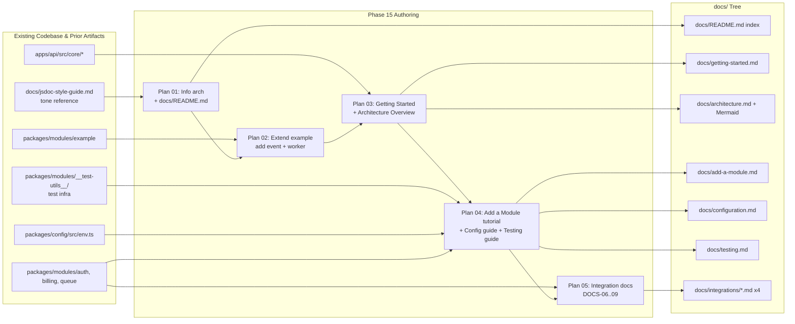
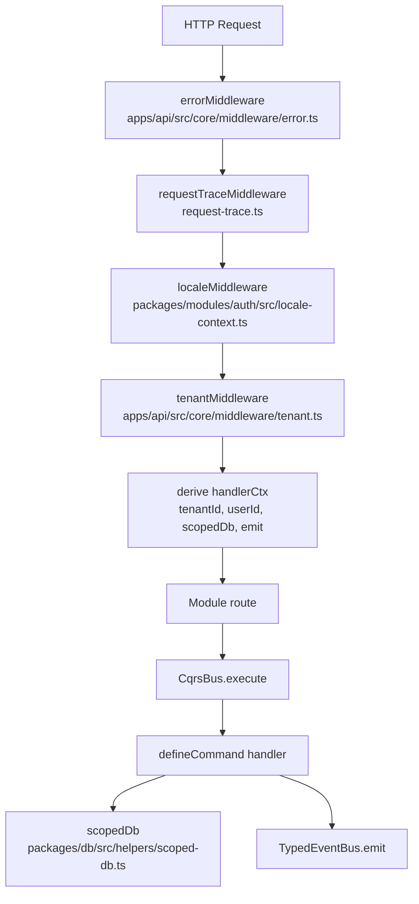

# Phase 15: Developer Documentation - Research

**Researched:** 2026-04-17
**Domain:** In-repo developer documentation (markdown + Mermaid) for a Bun/Elysia/Drizzle/Next.js/Vite monorepo SaaS starter
**Confidence:** HIGH

## Summary

Phase 15 authors nine in-repo markdown documents under `docs/` so a new developer can clone, configure, and extend Baseworks using in-repo content alone. The domain is not "novel library integration" — it is **technical writing discipline**: content organization, Mermaid diagramming for conceptual flows, code-citation strategy that survives code evolution, and consistency with the Phase 13 technical-precise tone already established in `docs/jsdoc-style-guide.md`.

The codebase is mature and well-annotated: Phase 13 delivered comprehensive JSDoc across public APIs, Phase 14 added 126 unit tests with a documented mock pattern, and the module system (ModuleRegistry, CqrsBus, TypedEventBus, scopedDb, PaymentProvider port) is production-grade. The "Add a Module" tutorial (DOCS-03) has a real, runnable subject in `packages/modules/example/` — but that module currently exercises only command + query surfaces; D-05 requires extending it to also emit an event and run a BullMQ worker so the tutorial can cover all four surfaces.

**Primary recommendation:** Treat Phase 15 as a **writing phase with one small code deliverable (example module extension)**. Lock a consistent information architecture in the first plan (folder layout, navigation index, cross-linking convention, code-citation format), extend the example module next, then fan out doc authoring. Use GitHub-native Mermaid (no build tooling), the Phase 13 tone, and `path:line` citations for anything > 10 lines.

## Architectural Responsibility Map

Phase 15 authors content about existing code. Mapping applies to the documentation deliverables themselves — which tier/subsystem each doc describes — not to new runtime code.

| Capability | Primary Tier | Secondary Tier | Rationale |
|------------|-------------|----------------|-----------|
| Getting Started (DOCS-01) | Tooling / Runtime | — | Bun install, Docker Compose for postgres+redis, env vars, `bun run api`, `bun test` |
| Architecture Overview (DOCS-02) | API / Backend + Shared Packages | Frontend (brief) | Module system, CQRS bus, event bus, tenant scoping all live in `apps/api/src/core/` and `packages/shared` |
| Add a Module tutorial (DOCS-03) | API / Backend | Database / Storage | Module = routes + commands + queries + jobs + events. Persistence via `scopedDb`. No frontend code. |
| Configuration guide (DOCS-04) | API / Backend + Tooling | Frontend Server | `packages/config/env.ts` drives API/worker/Next.js env; `docker-compose.yml` drives deployment |
| Testing guide (DOCS-05) | Tooling | API / Backend | `bun test` for non-DOM (handlers/adapters/core), Vitest planned for React components; mocks target `HandlerContext`/`PaymentProvider`/`auth` singleton |
| better-auth integration (DOCS-06) | API / Backend | Frontend (client SDK) | `packages/modules/auth/src/auth.ts` + `routes.ts`; client SDK used in `apps/web` and `apps/admin` |
| Billing integration (DOCS-07) | API / Backend | Database / Storage | `packages/modules/billing/src/ports/payment-provider.ts` + adapters + `provider-factory.ts` |
| BullMQ integration (DOCS-08) | API / Backend + Worker | Database / Storage (Redis) | `packages/queue` + `apps/api/src/worker.ts` + module `jobs` declarations |
| Email integration (DOCS-09) | API / Backend (Worker) | — | `billing/src/jobs/send-email.ts` + `billing/src/templates/*.tsx` + Resend SDK |

**Why this matters:** Every doc anchors at least one concrete file path. The planner MUST assign each doc to the tier that actually owns the behaviour, not to a UI/frontend tier just because docs "present" something.

<user_constraints>
## User Constraints (from CONTEXT.md)

### Locked Decisions

**Mermaid diagrams**
- **D-01:** Diagram count: 4 architecture diagrams (module system, CQRS flow, request lifecycle, tenant scoping) PLUS 1 sequence/flow diagram per integration doc = ~8 total Mermaid diagrams. Integration diagrams should cover: Stripe webhook flow (DOCS-07), magic-link auth flow (DOCS-06), BullMQ enqueue → worker → retry (DOCS-08), email queue → Resend send (DOCS-09).
- **D-02:** Diagram abstraction level: conceptual diagrams with **named code anchors** — boxes labeled with concrete component names (`ModuleRegistry`, `CqrsBus`, `EventBus`, `scopedDb`, `PaymentProvider`, etc.) that match the actual file/class names so readers can grep. Not abstract concept diagrams; not class-level UML.

**"Add a Module" tutorial**
- **D-03:** Tutorial format: **annotated walkthrough of the existing `packages/modules/example` module**, not from-scratch prose. Reader is told "copy `packages/modules/example/`, rename, modify these specific lines". Stays in sync because the example module is real, runnable, type-checked code that other tests/builds touch.
- **D-04:** Tutorial scope: cover all four module surfaces — command + query + event emission + BullMQ worker handler. Reader sees the full module pattern, not just the minimum surface.
- **D-05:** **The example module must be extended in this phase** to support D-04. Add an event (e.g., `ExampleCreated`) emitted by the create command, plus a BullMQ worker that handles a follow-up job triggered by that event. This is a planned task in Phase 15 plans, not a side effect — the planner must include it before the tutorial is written.
- **D-06:** Tutorial assumes the Architecture Overview (DOCS-02) is a prerequisite — no inline re-explanation of CQRS, ModuleRegistry, EventBus, scopedDb concepts. Tutorial focuses on mechanics ("here's where you wire it in"), not on why the architecture is shaped this way.

**Third-party integration docs (DOCS-06..09)**
- **D-07:** Per-integration document structure: a single doc per integration with two sections — **Setup** (env vars, config keys, module wire-up, smoke test) and **Extending** (how to add another provider/queue/job/template). One file per integration, not split into setup.md + extending.md.
- **D-08:** External-library coverage: explain **Baseworks-specific wiring** in detail (file paths, config keys, abstractions used, gotchas hit during integration). For library internals (better-auth APIs, Stripe SDK, BullMQ semantics, Resend API), **link to upstream official docs** rather than re-documenting them. No re-documenting upstream APIs.
- **D-09:** Every integration doc includes an "Add another X" section in its Extending portion:
  - DOCS-06 (better-auth): adding another OAuth provider via better-auth's plugin model
  - DOCS-07 (billing): adding a 3rd payment provider implementing the `PaymentProvider` port (mirroring how Pagar.me was added alongside Stripe)
  - DOCS-08 (BullMQ): adding a new queue + worker + job type
  - DOCS-09 (Resend/React Email): adding a new email template + send invocation
- **D-10:** Code blocks in integration docs follow a **mixed strategy**:
  - **Cite real files** (with `path:line` ranges) for full implementations or anything > ~10 lines. Citations stay accurate as code evolves.
  - **Inline snippets** for short usage examples (3-5 lines showing typical call sites) where the snippet rarely changes.
  This applies to all 9 docs, not only integrations.

**Tone & style**
- **D-11:** Tone for reference docs (Architecture Overview, Configuration, Testing, all 4 integrations): same **technical-precise, API-ref tone** established in Phase 13's `docs/jsdoc-style-guide.md`. Formal, declarative, domain-terminology-first. No filler ("basically", "simply", "just"). (Carried forward from Phase 13.)

### Claude's Discretion
- **Information architecture in `docs/`:** folder structure (flat vs grouped subdirectories like `docs/guides/`, `docs/integrations/`, `docs/architecture/`), file naming conventions, navigation/index approach (root `docs/README.md` vs `docs/index.md` vs none), root-level `README.md` content (link to docs vs full quickstart).
- **Tone variance for Getting Started (DOCS-01):** whether DOCS-01 keeps the same formal API-ref tone or adopts a slightly warmer onboarding voice. Discretion within Phase 13 tone bounds.
- **Mermaid theme/styling:** color palette, direction (LR vs TD), alignment with GitHub's Mermaid renderer.
- **Snippet length budget:** exact threshold for "inline snippet" vs "file citation" (D-10 uses ~10 lines as a guideline; planner can adjust).
- **Doc cross-linking:** how docs reference each other (relative paths, anchor links, glossary).
- **Code-citation freshness mechanism:** how to keep `path:line` references accurate over time (manual review, lint script, deferred).

### Deferred Ideas (OUT OF SCOPE)
- **TypeDoc auto-generated API reference** (APIDOC-01, APIDOC-02) — v2. Requires monorepo TypeDoc config and per-package output. JSDoc annotations from Phase 13 enable this when scheduled.
- **Contributing guide** (COMM-01) — v2. Out of scope for v1.2.
- **Changelog and migration guide** (COMM-02) — v2.
- **External documentation site** (Docusaurus/VitePress) — Out of scope (project decision in REQUIREMENTS.md "Out of Scope" table). In-repo markdown is sufficient.
- **Storybook for UI components** — Out of scope (REQUIREMENTS.md). shadcn components are documented upstream.
- **Snapshot tests for UI components** — Out of scope (REQUIREMENTS.md).
- **Video tutorials** — Out of scope (REQUIREMENTS.md).
- **Code-citation freshness lint/automation** — Claude's discretion whether to introduce in this phase or defer; default deferred unless trivial.
</user_constraints>

<phase_requirements>
## Phase Requirements

| ID | Description | Research Support |
|----|-------------|------------------|
| DOCS-01 | Getting Started guide (prerequisites, install, env setup, run dev, run tests) | Root `package.json` scripts verified (`bun api`, `bun worker`, `db:generate/migrate/push`, `docker:up/down`); `docker-compose.yml` runs postgres:16 + redis:7; `bun test` for backend / Vitest planned for frontend; env schema in `packages/config/src/env.ts` |
| DOCS-02 | Architecture Overview with Mermaid diagrams (module system, CQRS flow, request lifecycle, tenant scoping) | All four anchors confirmed: `apps/api/src/core/registry.ts` (ModuleRegistry), `apps/api/src/core/cqrs.ts` (CqrsBus), `apps/api/src/core/event-bus.ts` (TypedEventBus), `packages/db/src/helpers/scoped-db.ts` (scopedDb), `apps/api/src/index.ts` (request lifecycle: errorMiddleware → requestTraceMiddleware → localeMiddleware → cors → auth routes → tenantMiddleware → derive handlerCtx → module routes) |
| DOCS-03 | "Add a Module" tutorial using example module as reference | Current example module: `index.ts`, `commands/create-example.ts`, `queries/list-examples.ts`, `routes.ts`. D-05 extension needed: add event payload type + BullMQ worker job. Module registered in `apps/api/src/index.ts` line 27 (`modules: ["auth", "billing", "example"]`) and `apps/api/src/worker.ts` line 23 |
| DOCS-04 | Configuration guide (env vars, module config, provider selection, deployment config) | `packages/config/src/env.ts` lists all env vars with validation; `validatePaymentProviderEnv()` + `assertRedisUrl()` are the startup guards; `ModuleRegistry({ role, modules: [] })` controls module loading; `docker-compose.yml` + `Dockerfile.api` / `Dockerfile.worker` / `Dockerfile.admin` |
| DOCS-05 | Testing guide (test runner split, mock patterns for HandlerContext, how to test commands/queries) | `packages/modules/__test-utils__/mock-context.ts` exports `createMockContext()` + `createMockDb()`; Phase 14 established two mock categories — auth handlers use `mock.module("../auth")`, billing handlers use `setPaymentProvider()` + mock db. `assert-result.ts` + `mock-payment-provider.ts` are the shared helpers |
| DOCS-06 | Integration doc: better-auth setup and customization | `packages/modules/auth/src/auth.ts` configures `betterAuth()` with emailAndPassword, socialProviders (google/github conditional), magicLink, organization plugin, drizzleAdapter, databaseHooks. Routes mounted via `.mount(auth.handler)` at `/api/auth/*`. Env: `BETTER_AUTH_SECRET`, `BETTER_AUTH_URL`, optional OAuth client IDs. Magic-link email flow: `sendMagicLink` → `email:send` BullMQ queue → `sendEmail` job → Resend |
| DOCS-07 | Integration doc: Stripe/Pagar.me billing | `packages/modules/billing/src/ports/payment-provider.ts` defines the port (14 methods). Adapters at `adapters/stripe/` and `adapters/pagarme/`. `provider-factory.ts::getPaymentProvider()` is the selection point, driven by `PAYMENT_PROVIDER` env. Webhook flow: `routes.ts` → verify signature → normalize event → enqueue `billing:process-webhook` job |
| DOCS-08 | Integration doc: BullMQ queue setup and adding new job types | `packages/queue/src/index.ts` exports `createQueue` (defaults: 3-day retention, 3 attempts, exponential backoff) + `createWorker` (concurrency 5, inline processor — sandboxed workers broken on Bun). `apps/api/src/worker.ts` iterates `registry.getLoaded()` and starts workers for each `def.jobs`. Queue naming convention: `module:action` (e.g., `email:send`, `billing:process-webhook`) |
| DOCS-09 | Integration doc: Email templates with Resend and React Email | `packages/modules/billing/src/jobs/send-email.ts` is the dispatcher (routes template name → React Email component → `render()` → `resend.emails.send()`). Templates: `welcome.tsx`, `password-reset.tsx`, `team-invite.tsx`, `billing-notification.tsx`. Magic-link reuses `password-reset` template. `team-invite` pre-resolves i18n strings via `@baseworks/i18n` before render |

</phase_requirements>

## Project Constraints (from CLAUDE.md)

These are enforced across the project and apply to Phase 15 docs:

1. **Runtime:** Bun — documentation examples MUST use `bun` commands (`bun install`, `bun test`, `bun run api`), never `npm`/`yarn`/`pnpm`.
2. **ORM:** Drizzle — docs must not show Prisma, raw SQL, or any other ORM.
3. **Auth:** better-auth — DOCS-06 must not reference NextAuth, Lucia, Clerk, or Auth0.
4. **Payments:** Stripe + Pagar.me via the PaymentProvider port — DOCS-07 must not introduce non-port-based integration patterns.
5. **Queue:** BullMQ + Redis — DOCS-08 must not reference alternative queues.
6. **API client:** Eden Treaty — if docs discuss frontend-backend calls, they use `@baseworks/api-client`, not fetch/axios/tRPC.
7. **Styling:** Tailwind 4 + shadcn/ui — if docs show UI code, these are the only acceptable tools.
8. **Database:** PostgreSQL with `tenant_id` isolation — docs must reinforce that tenant isolation is via `scopedDb`, not RLS (RLS is mentioned as "available if needed later", not used).
9. **GSD workflow:** Any code changes inside Phase 15 (notably the D-05 example module extension) flow through GSD. The planner will package this as a task inside a plan, not as ad-hoc edits.
10. **User's feedback memory:** Command suggestions in docs should use colon form (`/gsd:quick`) not dash form — applies if docs reference internal GSD tooling; GSD is internal workflow tooling and is unlikely to appear in public developer docs.

## Standard Stack

### Core (Documentation Tooling)

| Library | Version | Purpose | Why Standard |
|---------|---------|---------|--------------|
| GitHub-native Mermaid | N/A (rendered in GitHub/VS Code) | Diagrams | Phase 15 has `commit_docs: true`; GitHub renders ```mermaid fenced blocks automatically since Feb 2022. No build step. [VERIFIED: codebase — `.planning/ROADMAP.md` and Phase 14 research use GitHub-rendered markdown] |
| Plain Markdown (CommonMark + GFM) | N/A | Doc format | Already the project standard; `docs/jsdoc-style-guide.md` is plain markdown. No MDX, no Docusaurus. [VERIFIED: CONTEXT.md deferred list] |

### Supporting (Mermaid syntax targets)

| Library | Version | Purpose | When to Use |
|---------|---------|---------|-------------|
| Mermaid `flowchart` | GitHub-embedded | Component diagrams (DOCS-02 module system, tenant scoping) | Default for boxes-and-arrows conceptual diagrams |
| Mermaid `sequenceDiagram` | GitHub-embedded | Flow diagrams (DOCS-02 request lifecycle, DOCS-07 webhook, DOCS-06 magic link, DOCS-08 enqueue→worker, DOCS-09 email flow) | When showing ordered messages between participants |
| Mermaid `stateDiagram-v2` | GitHub-embedded | Optional: job retry states (DOCS-08) | When documenting state transitions |

### Not Used (Explicitly Excluded)

| Instead of | Could Use | Why Not |
|------------|-----------|---------|
| Docusaurus/VitePress | Static site generator | Out of scope per REQUIREMENTS.md and D-deferred. In-repo markdown sufficient. |
| mermaid-cli (`mmdc`) for pre-rendered SVG | CLI rendering | Not installed (probe: `mmdc --version` returned exit 127) and unnecessary — GitHub renders Mermaid natively. |
| markdownlint | `markdownlint-cli` | Not installed (probe: exit 127). If added, would be a Claude's-discretion Phase 15 task; default is deferred per the "code-citation freshness mechanism" discretion note. |
| markdown-link-check | Link checker | Not installed (probe: exit 127). Same reasoning. |
| MDX | Rich markdown | Not needed — no interactive components. Plain markdown is sufficient. |
| PlantUML | Alternative diagrams | Mermaid is the GitHub-native choice; no tooling needed. |

**Version verification:** No new packages needed. All tooling is either built into GitHub rendering (Mermaid) or already present as part of the existing stack.

## Architecture Patterns

### System Architecture Diagram (Documentation Production Pipeline)



Reading this flow: existing codebase and Phase 13 tone reference feed Plan 01 (information architecture lockdown), which unblocks all subsequent plans. Plan 02 extends the example module to cover all four module surfaces, which is a prerequisite for DOCS-03. Plans 03–05 fan out content authoring; Plan 05 depends on Plan 04 because integration docs reference the Config and Testing guides for shared context.

### Recommended Output Structure

```
docs/
├── README.md              # Navigation index + reading order (discretion; planner decides)
├── getting-started.md     # DOCS-01
├── architecture.md        # DOCS-02 (with 4 Mermaid diagrams)
├── add-a-module.md        # DOCS-03
├── configuration.md       # DOCS-04
├── testing.md             # DOCS-05
├── integrations/          # Grouped per D-07
│   ├── better-auth.md     # DOCS-06
│   ├── billing.md         # DOCS-07
│   ├── bullmq.md          # DOCS-08
│   └── email.md           # DOCS-09
└── jsdoc-style-guide.md   # Existing (Phase 13)
```

**Note:** Folder structure (flat vs nested `integrations/`) is Claude's discretion per CONTEXT.md. The nested form above groups integrations and is the planner's default recommendation — but a flat structure (all .md at docs root) is acceptable. The planner MUST lock this choice in Plan 01 before authoring begins.

### Pattern 1: Mermaid Diagram with Named Code Anchors (D-02)

**What:** Every box in a Mermaid diagram uses a label that matches an actual code identifier so readers can `grep` for it.
**When to use:** All 4 architecture diagrams in DOCS-02 and all 4 integration flow diagrams.
**Example:**



Source anchors verified from `apps/api/src/index.ts` (lines 43–131) and `apps/api/src/core/middleware/tenant.ts`.

### Pattern 2: File Citation Format (D-10)

**What:** When a doc needs to show code > 10 lines, cite rather than embed.
**Format:** `` `packages/modules/example/src/commands/create-example.ts:22-34` `` followed by a brief summary of what the cited code demonstrates.

**Inline snippet form (≤ 10 lines, rarely changes):**

```typescript
// From packages/modules/example/src/commands/create-example.ts
export const createExample = defineCommand(CreateExampleInput, async (input, ctx) => {
  const [result] = await ctx.db.insert(examples).values({ title: input.title });
  ctx.emit("example.created", { id: result.id, tenantId: ctx.tenantId });
  return ok(result);
});
```

**Cited form (>10 lines or likely to evolve):**

> See `packages/modules/billing/src/provider-factory.ts:32-75` — the lazy-initialized singleton pattern that branches on `PAYMENT_PROVIDER` env var.

### Pattern 3: Integration Doc Structure (D-07, D-09)

Each of DOCS-06..09 follows this template:

```markdown
# [Integration Name]

## Overview
[One paragraph: what the integration provides, which upstream lib it wraps.]

## Upstream Documentation
- [Official docs link]
- [Relevant SDK reference]

## Setup
### Env vars
### Module wire-up
### Smoke test

## Wiring in Baseworks
[File paths, abstractions used, flow diagram (1 Mermaid sequenceDiagram)]

## Gotchas
[Pitfalls hit during Phase 1-12 integration — e.g., better-auth basePath doubling]

## Extending
### Add another [provider/queue/template/OAuth provider]
[Step-by-step using the existing pattern as reference]
```

### Pattern 4: "Add a Module" Annotated Walkthrough (D-03, D-04)

The tutorial structure mirrors a diff against `packages/modules/example/`:

1. **Copy and rename** — `cp -r packages/modules/example packages/modules/{your-module}` + rename package.json `name` field and exports.
2. **Define schema** — add a Drizzle table in `packages/db/src/schema/` and export it from `packages/db/src/index.ts`.
3. **Write command** — `defineCommand` pattern, cite `create-example.ts:22-34`.
4. **Write query** — `defineQuery` pattern, cite `list-examples.ts:19-24`.
5. **Declare module** — `ModuleDefinition` export with commands/queries/jobs/events maps, cite `example/src/index.ts:6-13` (post-extension).
6. **Wire events** — declare an event string in `events: []`, emit via `ctx.emit()`.
7. **Wire a job** — `jobs: { "{module}:process": { queue: "...", handler } }`, handler file, worker auto-registers.
8. **Register in ModuleRegistry** — add to `apps/api/src/core/registry.ts::moduleImportMap` and to the `modules: []` array in `apps/api/src/index.ts` and `apps/api/src/worker.ts`.
9. **Mount routes** — Elysia plugin in `routes.ts` (unless auth/billing-style special mounting).
10. **Write tests** — cite `packages/modules/__test-utils__/mock-context.ts` and `pagarme-adapter.test.ts` patterns.

### Anti-Patterns to Avoid

- **Abstract diagram labels.** `"Bus"`, `"Database Layer"`, `"Middleware"` — D-02 forbids this. Always use concrete names: `CqrsBus`, `scopedDb`, `tenantMiddleware`.
- **Re-documenting upstream APIs.** D-08 forbids explaining Stripe SDK methods, better-auth options, BullMQ job options in depth — link to upstream instead.
- **Long inline code blocks that duplicate source.** D-10 forbids this. Any snippet >10 lines MUST become a file citation.
- **Breaking the ambient tone.** D-11 locks the technical-precise, API-ref voice from `docs/jsdoc-style-guide.md`. No "basically", "simply", "just", second-person pep talks, emojis, or marketing tone.
- **Explaining CQRS/ModuleRegistry/scopedDb in DOCS-03.** D-06 forbids this; tutorial assumes DOCS-02 is read first and links back.
- **Code examples using `npm`/`yarn`/`pnpm`/Prisma/NextAuth/Lucia/Express/tRPC.** CLAUDE.md forbids these across the project; docs that show them are wrong.

## Don't Hand-Roll

| Problem | Don't Build | Use Instead | Why |
|---------|-------------|-------------|-----|
| Static doc site | Docusaurus/VitePress/mkdocs | GitHub-rendered markdown in `docs/` | Out of scope per CONTEXT.md deferred list; in-repo markdown is sufficient. |
| Diagram rendering | mermaid-cli / pre-rendered PNG/SVG | Fenced ```mermaid blocks | GitHub renders natively. Pre-rendered images go stale. |
| Code-example sync tooling | Custom script that extracts snippets from source | File path + line number citations (D-10) | Citations stay accurate; extracted snippets lie when code evolves. |
| API reference generation | TypeDoc output committed into `docs/` | Defer to v2 (APIDOC-01/02) | Explicit deferred item in CONTEXT.md and REQUIREMENTS.md. |
| Link checking CI | markdown-link-check GitHub Action | Manual review + relative paths | Deferred per CONTEXT.md discretion note; no tooling installed. |
| Changelog automation | conventional-changelog / release-please | Defer to v2 (COMM-02) | Explicit deferred item. |
| Module generator CLI | `bun run create-module my-module` | Manual tutorial in DOCS-03 | Tutorial is the deliverable. A generator would be a v2 convenience feature, not part of this phase. |
| Mock Mermaid parser / lint | Mermaid syntax validator | Render preview in GitHub or VS Code Mermaid plugin | No CI story for diagrams; visual review during PR is sufficient. |

**Key insight:** Phase 15 is a **writing phase, not a tooling phase**. Every "let's add a lint/validator/generator" impulse should be pushed to v2 unless it is trivially small. The one code deliverable (D-05 example module extension) is code, not docs tooling.

## Runtime State Inventory

> Phase 15 is a greenfield documentation phase with one small code change (D-05 example module extension). The runtime state inventory applies narrowly to that extension.

| Category | Items Found | Action Required |
|----------|-------------|------------------|
| Stored data | **None** — verified by reading `packages/db/src/schema/example.ts` reference via index barrel: the only persisted `examples` table already exists. The D-05 extension adds an event and a BullMQ job handler; it does NOT rename existing schema columns or introduce new tables unless the planner chooses to add an `example_followups` table for the worker demo. If the planner adds a table, a Drizzle migration is required. | If new table: `bun db:generate` + `bun db:migrate`. Otherwise: none. |
| Live service config | **None** — no external services are named after `example`. BullMQ queue name for the new job (e.g., `example:process-followup`) will be registered dynamically by the worker on first start; no manual registration. | None (queue auto-provisions in Redis). |
| OS-registered state | **None** — no Task Scheduler, launchd, systemd, or pm2 entries reference the example module. Worker processes are started via `bun run apps/api/src/worker.ts` or the `worker` service in docker-compose; no OS-level registration. | None. |
| Secrets / env vars | **None** — no new secrets required by the example module extension. Existing `REDIS_URL` is sufficient for the BullMQ worker. | None. |
| Build artifacts / installed packages | If `packages/modules/example/package.json` gains new dependencies (unlikely — `@baseworks/queue` may be needed if the worker is invoked from within the module rather than from the shared worker entrypoint), then `bun install` will update `bun.lockb`. | Run `bun install` after any dep change; commit updated lockfile. |

**The canonical question answered:** After all Phase 15 docs are written and the example module extension is merged, no runtime system holds a cached or registered string that needs updating — because no renames occur. The one asymmetry is if the planner chooses to add a new Drizzle table for the worker demo; that's a standard migration flow, not runtime state drift.

## Common Pitfalls

### Pitfall 1: Stale `path:line` Citations
**What goes wrong:** Docs cite `packages/modules/billing/src/provider-factory.ts:32-75`, later code is refactored, line numbers drift, reader jumps to wrong code.
**Why it happens:** Documentation and code evolve at different velocities.
**How to avoid:**
- Prefer citing **function/class names + file path** (e.g., `provider-factory.ts::getPaymentProvider`) over line ranges when a stable named anchor exists.
- Use line ranges only when no named anchor exists or for partial method citations.
- Reserve a Claude's-discretion lint task for v2 if drift becomes a pain point (CONTEXT.md deferred).
**Warning signs:** Line numbers pointing to blank lines, imports, or unrelated code during review.

### Pitfall 2: Mermaid Not Rendering on GitHub
**What goes wrong:** Diagram author uses syntax that works in mermaid-cli but not in GitHub's embedded version.
**Why it happens:** GitHub renders an older Mermaid version; some newer features (e.g., `classDiagram` with certain generics, `timeline`, `mindmap` edge cases) render inconsistently.
**How to avoid:**
- Stick to `flowchart` (preferred over the deprecated `graph` alias), `sequenceDiagram`, and `stateDiagram-v2` — all widely supported.
- Preview in an actual GitHub PR or GitHub web interface before committing, not just in a local IDE plugin.
- Avoid experimental features (timeline, C4, gitGraph for production docs).
**Warning signs:** Diagram renders locally but shows as raw code block on github.com.

### Pitfall 3: Re-documenting Upstream API Surface Drifts
**What goes wrong:** Doc explains `betterAuth()` options or `stripe.customers.create()` parameters; upstream library evolves, doc is wrong within 6 months.
**Why it happens:** Authors copy snippets from upstream docs for "completeness".
**How to avoid:** D-08 is the policy — Baseworks-specific wiring is documented in detail; upstream library behavior is **linked**, not copied. Every integration doc opens with an "Upstream Documentation" section that links `better-auth.com`, `stripe.com/docs`, `docs.bullmq.io`, `resend.com/docs`.
**Warning signs:** Doc contains a full parameter table for an upstream SDK method — delete and link instead.

### Pitfall 4: Tutorial Bit-Rot (D-03)
**What goes wrong:** "Add a Module" tutorial references file paths / line counts / exports that no longer exist.
**Why it happens:** Example module is changed in a future phase; tutorial doesn't get updated.
**How to avoid:**
- Tutorial cites `packages/modules/example/` file structure, not line-level content.
- Planner registers the example module in the test matrix so a future refactor that breaks the module surface breaks the build, forcing tutorial updates.
- D-05 extension codifies the "full four-surface module" — any later change that removes the event or worker from the example module must be caught as a breaking change.
**Warning signs:** Tutorial says "the module has commands, queries, events, and jobs" but the example module has only commands and queries.

### Pitfall 5: Inconsistent Tone Across Docs (D-11)
**What goes wrong:** Getting Started reads "Welcome! Let's get started by simply installing...", Architecture Overview reads "The CqrsBus routes dispatches to registered handlers via namespaced keys.". Reader gets whiplash.
**Why it happens:** Different authors, different moods, no style lockdown.
**How to avoid:**
- D-11 locks the Phase 13 tone for reference docs (DOCS-02, 04, 05, 06, 07, 08, 09).
- DOCS-01 has an explicit discretion exemption — a slightly warmer onboarding voice is acceptable — but not a complete tonal shift.
- Plan 01 should include a short "Tone reference" section in `docs/README.md` pointing back to `docs/jsdoc-style-guide.md` §"General Rules" (verified: lines 12–23 of that file specify the tone rules).
**Warning signs:** Filler words ("basically", "simply", "just"), second-person exclamation, emojis, marketing superlatives in any reference doc.

### Pitfall 6: Architecture Overview Becomes a Dumping Ground
**What goes wrong:** DOCS-02 tries to explain every subsystem in depth — auth, billing, i18n, testing, deployment — and becomes 40 pages.
**Why it happens:** Scope creep during writing.
**How to avoid:** DOCS-02 is **4 diagrams + supporting prose** (per D-01): module system, CQRS flow, request lifecycle, tenant scoping. Everything else is a one-liner with a link to the integration doc. If a section is longer than half a page, it's a candidate to move into its own doc or integration doc.
**Warning signs:** DOCS-02 has more than ~6 H2 headings; DOCS-02 mentions Stripe webhook flow in any detail.

### Pitfall 7: Windows Shell Assumptions in Getting Started (DOCS-01)
**What goes wrong:** DOCS-01 shows `cp -r ...`, `export FOO=...` bash idioms; Windows developer following along gets errors.
**Why it happens:** Project is developed on Windows 11 (per env context), but `scripts` in root `package.json` use bash-style commands (e.g., `cd apps/web && bun run dev`), and docker-compose + Bun work cross-platform.
**How to avoid:**
- Document that commands assume a POSIX-compatible shell (bash/zsh or Git Bash on Windows, or WSL2).
- For OS-specific steps, provide both forms or explicitly call out the assumption.
- All root-level `bun run {script}` commands work identically on Windows, Linux, macOS — prefer those over raw shell pipelines where possible.
**Warning signs:** `set FOO=bar` (Windows CMD) missing as an alternative to `export FOO=bar`.

## Code Examples

Verified patterns the docs will reference. These are the canonical citations the planner should reuse.

### Module Definition (DOCS-03 tutorial anchor)

```typescript
// From packages/modules/example/src/index.ts (post-D-05 extension; lines 6-13 currently)
export default {
  name: "example",
  routes: exampleRoutes,
  commands: { "example:create": createExample },
  queries: { "example:list": listExamples },
  jobs: { /* D-05: add "example:process-followup" here */ },
  events: ["example.created"],
} satisfies ModuleDefinition;
```

### Command with Event Emission (DOCS-03, DOCS-02 CQRS flow)

```typescript
// From packages/modules/example/src/commands/create-example.ts:22-34
export const createExample = defineCommand(CreateExampleInput, async (input, ctx) => {
  const [result] = await ctx.db
    .insert(examples)
    .values({ title: input.title, description: input.description ?? null });
  ctx.emit("example.created", { id: result.id, tenantId: ctx.tenantId });
  return ok(result);
});
```

### Tenant Scoping (DOCS-02 tenant scoping diagram anchor)

```typescript
// From packages/db/src/helpers/scoped-db.ts:46-77 — cite, do not inline in full
// The insert wrapper auto-injects tenantId:
insert(table) {
  return { values(data) { return db.insert(table).values(injectTenantId(data)).returning(); } };
}
```

### PaymentProvider Port (DOCS-07 "add another provider" anchor)

```typescript
// From packages/modules/billing/src/ports/payment-provider.ts:38-159 — cite
// Every new provider implements these 14 methods. Pagar.me adapter (lines 1-200+)
// is the reference for "add another provider".
```

### BullMQ Queue + Worker Convention (DOCS-08)

```typescript
// From packages/queue/src/index.ts:14-51 — cite
// createQueue defaults: 3-day completion retention, 7-day failure retention, 3 attempts, exponential backoff from 1000ms.
// createWorker defaults: inline processor (sandboxed workers broken on Bun), concurrency 5.
```

### Test Mock Factory (DOCS-05)

```typescript
// From packages/modules/__test-utils__/mock-context.ts:53-64
export function createMockContext(overrides?: Partial<HandlerContext>): HandlerContext {
  return {
    tenantId: "test-tenant-id",
    userId: "test-user-id",
    db: createMockDb(),
    emit: mock(() => {}),
    enqueue: mock(() => Promise.resolve()),
    ...overrides,
  };
}
```

### Email Dispatcher (DOCS-09)

```typescript
// From packages/modules/billing/src/jobs/send-email.ts:128-167 — cite
// Routes template name → React Email component → render() → resend.emails.send().
// Gracefully skips when RESEND_API_KEY is not set (dev/test).
```

### better-auth Configuration (DOCS-06)

```typescript
// From packages/modules/auth/src/auth.ts:58-177 — cite
// betterAuth({ basePath: "/api/auth", ... }) — critical: mount via .mount(auth.handler)
// WITHOUT a prefix (Pitfall 1 in that file: basePath already contains /api/auth, so
// prefixing doubles to /api/auth/api/auth/*).
```

## State of the Art

| Old Approach | Current Approach | When Changed | Impact |
|--------------|------------------|--------------|--------|
| Pre-rendered diagrams (PNG/SVG committed to repo) | GitHub-native Mermaid fenced blocks | GitHub enabled Mermaid rendering Feb 2022 | No build tooling for diagrams; edits diff cleanly. |
| TypeDoc-generated reference pages alongside narrative docs | Defer TypeDoc to v2; narrative docs + JSDoc inline | Phase 13 established JSDoc-first; Phase 15 defers auto-gen | Less maintenance burden. JSDoc tooltips in IDEs are the primary API ref for now. |
| Docusaurus/VitePress as the default for SaaS doc sites | In-repo markdown rendered by GitHub | User decision in REQUIREMENTS.md | Zero deployment. Zero tooling. Readers browse on github.com or in their IDE. |
| Copying upstream API docs into project docs | Link to upstream; document only Baseworks-specific wiring | D-08 in this phase | Docs don't rot when upstream libs release new versions. |
| Inline code blocks for every example | Mixed: inline for ≤10 lines, `path:line` citation for longer | D-10 in this phase | Docs stay in sync with code automatically for the cited portions. |

**Deprecated / outdated patterns to avoid:**
- **Mermaid `graph` keyword** — deprecated alias for `flowchart`. Use `flowchart` in all new diagrams.
- **Markdown in `.mdx` format** — no MDX pipeline exists in Baseworks. Use plain `.md`.
- **Mermaid `classDiagram` for CQRS architecture** — UML class diagrams misrepresent the functional handler pattern. Use `flowchart` or `sequenceDiagram` per D-02.

## Assumptions Log

| # | Claim | Section | Risk if Wrong |
|---|-------|---------|---------------|
| A1 | GitHub renders Mermaid `flowchart`, `sequenceDiagram`, `stateDiagram-v2` consistently on github.com and in GitHub's web preview. | Standard Stack, Pitfall 2 | [CITED: github.blog announcement Feb 2022 — widely known]. If wrong, pre-rendered SVG fallback needed. Low risk — these are stable diagram types used across thousands of repos. |
| A2 | The D-05 example module extension can reuse `@baseworks/queue::createQueue/createWorker` without new infrastructure. | Runtime State Inventory, Pattern 4 | [VERIFIED: codebase — `packages/queue/src/index.ts` exports both; `apps/api/src/worker.ts:32-77` already iterates `def.jobs` from any module]. Low risk. |
| A3 | The planner will package the D-05 extension as a separate plan/task within Phase 15, not merge it with doc-writing tasks. | Architecture Patterns Diagram | [ASSUMED]. If co-mingled, doc tasks may block on code review cycles. Recommended separation documented but not enforced by research. |
| A4 | No markdown lint / link check tooling will be introduced in this phase. | Standard Stack, Don't Hand-Roll | [CITED: CONTEXT.md deferred list]. Low risk — planner can elect to add one as a small discretion task if trivial. |
| A5 | The Phase 13 tone is captured fully in `docs/jsdoc-style-guide.md` §"General Rules" (lines 12–23). | Pitfall 5 | [VERIFIED: read lines 12–23 of that file]. Low risk. |
| A6 | All 9 DOCS-* requirements can be delivered as separate files (not one mega-doc). | Recommended Output Structure | [CITED: CONTEXT.md §"Phase Boundary" lists 9 deliverables; D-07 specifies one file per integration]. Low risk. |
| A7 | Root `README.md` creation is in Claude's discretion and not a mandatory Phase 15 output. | Claude's Discretion (copied from CONTEXT.md) | [CITED: CONTEXT.md]. If user expected a root README, planner should clarify in Plan 01 or add it as a small task. |

**If the planner wants to tighten risk on A3:** recommend locking Plan 02 as "Extend example module (D-05)" before any doc-authoring plan to prevent co-mingling.

## Open Questions

1. **Should the example module's D-05 extension add a new Drizzle table (e.g., `example_followups`) or reuse the existing `examples` table?**
   - What we know: The tutorial needs to show a BullMQ worker handling a follow-up job. The simplest demo could just log/no-op; a richer demo could insert into a new table.
   - What's unclear: Whether the richer pattern (adding a table) is worth the migration complexity for a tutorial.
   - Recommendation: Start minimal — worker handler emits a log + updates an existing column (e.g., set a `processed_at` timestamp on `examples`). Keep the tutorial short. If a table is needed, the planner should add the Drizzle migration task explicitly.

2. **Should `docs/README.md` be Claude's-discretion or locked in Plan 01?**
   - What we know: CONTEXT.md puts `docs/` information architecture in Claude's discretion.
   - What's unclear: Whether the user expects the doc index as a first-class deliverable or trusts the planner.
   - Recommendation: Plan 01 should create `docs/README.md` as a mandatory artifact, treating it as the navigation entry point. Without an index, 9 docs in a folder is a wayfinding problem.

3. **How should cross-doc links be formed — anchors or separate files?**
   - What we know: All 9 docs are separate files; internal sections within a doc need anchor links; cross-doc references need relative paths.
   - What's unclear: Whether to use GitHub-style auto-generated anchors (`#heading-name`) or explicit HTML anchors (`<a id="...">`).
   - Recommendation: GitHub-style auto anchors (lowercase, hyphens, strip punctuation) — reader can verify by hovering any heading on github.com. Explicit HTML anchors only when needed (e.g., multiple identical headings in one file).

4. **Should the Testing guide (DOCS-05) anticipate Phase 14's Vitest story even though the frontend Vitest setup is not yet in the codebase?**
   - What we know: Root `package.json` has no `vitest` script; no `vitest.config.*` files found in `apps/web` or `apps/admin`. Phase 14 focused on `bun test` backend tests.
   - What's unclear: Whether DOCS-05 should document "two test runners: `bun test` for backend, Vitest for frontend" as a principle even if Vitest integration is still pending, or describe only what exists today.
   - Recommendation: DOCS-05 documents what exists today (`bun test` across all packages) and notes "frontend React component tests via Vitest are deferred to a later phase." Over-promising test infrastructure that doesn't exist yet will frustrate readers.

5. **Does the BullMQ integration doc (DOCS-08) need to cover the BullMQ dashboard / Bull Board for observability?**
   - What we know: CLAUDE.md mentions "BullMQ Board or bull-monitor" as admin-dashboard options but the codebase does not have it wired.
   - What's unclear: Whether this is in scope for DOCS-08 or deferred.
   - Recommendation: Briefly mention as an available option with a link; do not walk through setup. Setup docs for unwired tooling is speculative.

## Environment Availability

| Dependency | Required By | Available | Version | Fallback |
|------------|------------|-----------|---------|----------|
| Bun | DOCS-01 quickstart, all docs | ✓ | 1.3.10 | — |
| Node.js | Optional — some Windows users may use node-based CLI tools | ✓ | v22.13.1 | — |
| Docker | DOCS-01 (local postgres+redis), DOCS-04 deployment | ✓ | 28.2.2 | — |
| GitHub Mermaid rendering | DOCS-02 + integration flow diagrams | ✓ (hosted on GitHub) | latest embedded | VS Code Mermaid preview plugin during authoring |
| mermaid-cli (`mmdc`) | Pre-rendered SVG generation | ✗ | — | Not needed — GitHub renders natively. If ever required: `bunx @mermaid-js/mermaid-cli`. |
| markdownlint-cli | Optional doc linting | ✗ | — | Manual review during PR; deferred per CONTEXT.md discretion. |
| markdown-link-check | Optional link validation | ✗ | — | Manual review during PR. |
| TypeDoc | v2 only (APIDOC-01/02) | Not checked (out of scope) | — | — |

**Missing dependencies with no fallback:** None.

**Missing dependencies with fallback:**
- `markdownlint-cli` and `markdown-link-check` — defer or add as small discretion task. Not blocking.
- `mermaid-cli` — not needed; GitHub's native renderer covers the use case.

## Validation Architecture

> `workflow.nyquist_validation` is `true` in `.planning/config.json`. This section applies.

Phase 15 is a documentation phase with one small code deliverable (D-05 example module extension). "Validation" therefore splits into two distinct concerns:

1. **Code validation** — the existing `bun test` + TypeScript compile pipeline covers the D-05 extension.
2. **Documentation validation** — reviewer eyes, GitHub Mermaid preview, and link sanity. No automated tests for prose.

### Test Framework

| Property | Value |
|----------|-------|
| Framework | `bun:test` (built-in, Bun 1.3.10) for backend code |
| Config file | None — `bun test` auto-discovers `*.test.ts` files. [VERIFIED: probed project root — no `bunfig.toml`, no `vitest.config.*`] |
| Quick run command | `bun test packages/modules/example` (module-scoped) |
| Full suite command | `bun test` (whole monorepo) + `bun run typecheck` |

### Phase Requirements → Validation Map

| Req ID | Behavior | Validation Type | Automated Command | File Exists? |
|--------|----------|-----------------|-------------------|-------------|
| DOCS-01 | Getting Started steps are runnable on a clean clone | manual-only (smoke-run on a fresh clone) | N/A | N/A |
| DOCS-02 | 4 Mermaid diagrams render on GitHub | manual-only (GitHub preview) | N/A | N/A |
| DOCS-03 | Tutorial's cited example module is real and runs | unit (example module tests) + manual (follow the tutorial) | `bun test packages/modules/example` | ❌ Wave 0 — no tests exist for the example module yet |
| DOCS-03 (D-05 extension) | New event emitted by createExample; new worker handler runs | unit test for the new event + worker | `bun test packages/modules/example` | ❌ Wave 0 — add tests alongside the extension |
| DOCS-04 | Env vars listed match `packages/config/src/env.ts` | manual review (diff doc against env.ts) | N/A | N/A |
| DOCS-05 | Mock patterns documented match `packages/modules/__test-utils__/` exports | manual review | N/A | N/A |
| DOCS-06..09 | Wiring described matches real files; `path:line` citations resolve | manual review (open each citation) | N/A | N/A |
| Integration: all docs | No broken relative links, no broken anchor links | manual review, optional `markdown-link-check` in future | N/A — optional `bunx markdown-link-check docs/**/*.md` | — (deferred) |
| Integration: all Mermaid blocks | Parseable by GitHub's embedded Mermaid | manual review in GitHub PR preview | N/A | — |

### Sampling Rate

- **Per doc commit:** Author previews the file in VS Code's markdown preview + GitHub PR preview; runs `bun run typecheck` if any code file changed alongside the doc (for D-05 tasks).
- **Per plan merge:** `bun test` across the whole monorepo stays green (existing tests catch any regression from the D-05 extension). Every code citation in new docs is opened to confirm the path/line exists.
- **Phase gate:** Full `bun test` + `bun run typecheck` green; one reviewer walks through DOCS-01 on a fresh clone and confirms `bun run api` + `bun run worker` + `bun test` succeed; one reviewer follows DOCS-03 end-to-end creating a throwaway module and verifies it registers + commands route.

### Wave 0 Gaps

- [ ] `packages/modules/example/src/__tests__/create-example.test.ts` — covers the existing command behavior; required before the D-05 extension modifies it.
- [ ] `packages/modules/example/src/__tests__/list-examples.test.ts` — covers the existing query behavior.
- [ ] `packages/modules/example/src/__tests__/worker.test.ts` (NEW, part of D-05) — covers the new BullMQ worker handler.
- [ ] `packages/modules/example/src/__tests__/event.test.ts` (NEW, part of D-05) — asserts the `example.created` event is emitted with the expected payload.

*(Existing framework install: none needed. `bun:test` and the `__test-utils__/mock-context.ts` infrastructure from Phase 14 are sufficient.)*

**No framework install needed.** `bun:test` is built into Bun 1.3.10; `@baseworks/test-utils` (the Phase 14 mock factory) is already workspace-available.

## Security Domain

> `security_enforcement` is not explicitly set in `.planning/config.json`. Treated as enabled by default.

Phase 15 produces documentation — not executable server code — so the security surface is narrow but real.

### Applicable ASVS Categories

| ASVS Category | Applies | Standard Control |
|---------------|---------|-----------------|
| V2 Authentication | Partial — DOCS-06 documents better-auth setup | Documentation MUST NOT show disabled auth, unverified email flows, or weak session configs. Reference the existing secure defaults (30+ char secret, database-backed sessions, 7-day expiry per `auth.ts:142-143`). |
| V3 Session Management | Yes — DOCS-06 | Document that sessions are DB-backed (not JWT) for revocation; show `session: { expiresIn, updateAge }` pattern, not anti-patterns. |
| V4 Access Control | Yes — DOCS-03, DOCS-06, architecture overview | Document `requireRole("owner", "admin")` and `tenantMiddleware` patterns. Tutorial MUST emphasize that `scopedDb` is the isolation boundary, not client-supplied tenant IDs. |
| V5 Input Validation | Yes — DOCS-03 tutorial | Show `defineCommand(TypeBoxSchema, ...)` pattern as the standard; every example uses a schema. No "bypass validation" examples. |
| V6 Cryptography | Yes — DOCS-04, DOCS-06, DOCS-07 | Never show hardcoded secrets in docs. All example env values MUST be placeholders (e.g., `your-secret-here`) or the exact dev defaults from `docker-compose.yml` with an explicit warning that those are dev-only. |
| V7 Error Handling & Logging | No (Phase 13 covers via JSDoc) | — |
| V8 Data Protection | Partial — DOCS-04 env vars | Document which env vars carry secrets; do not show real Stripe test keys, Resend keys, or better-auth secrets. Use `sk_test_xxx` / `re_xxx` placeholders. |

### Known Threat Patterns for Documentation Phases

| Pattern | STRIDE | Standard Mitigation |
|---------|--------|---------------------|
| Accidental secret commit in example env block | Information Disclosure | All env examples use placeholder values. Reviewer greps new docs for regex matches of real key formats (`sk_live_`, `sk_test_` + 24+ chars, `re_[A-Za-z0-9]+`) before merge. |
| Documentation of insecure-by-default patterns | Tampering / Elevation of Privilege | Every code example in integration docs uses the secure defaults from the existing codebase (e.g., `minPasswordLength: 8`, webhook signature verification, `trustedOrigins` configured). |
| Outdated security guidance (docs say "use X", reality is "X is vulnerable") | — | Upstream docs are the source of truth for library security guidance (D-08 policy). Link to their security pages; do not copy. |
| Tenant isolation bypass in tutorial code | Elevation of Privilege | DOCS-03 MUST show `ctx.db` (ScopedDb), never `createDb(env.DATABASE_URL)` directly in a handler. The example module correctly uses `ctx.db` — enforce this pattern in the tutorial. |
| Webhook signature verification omitted from billing integration example | Spoofing | DOCS-07 MUST show `provider.verifyWebhookSignature()` as the first step in the webhook handler. The existing `billing/src/routes.ts` and `provider-factory.ts` demonstrate this correctly. |

**Security review checklist for every doc:**
1. No real secrets (grep for `sk_live_`, `sk_test_[0-9a-zA-Z]{24,}`, `re_[0-9a-zA-Z]+`, `whsec_[0-9a-zA-Z]{24,}`).
2. Every env var example marked placeholder.
3. Every tutorial code path uses `ctx.db` / `requireRole` / `defineCommand(schema, ...)` — never bypass.
4. Webhook handlers in DOCS-07 show signature verification first.
5. Auth docs in DOCS-06 reference the existing 32+ char secret requirement (`BETTER_AUTH_SECRET: z.string().min(32)` per `env.ts:17`).

## Sources

### Primary (HIGH confidence — verified against codebase this session)
- `packages/modules/example/src/index.ts` — module registration surface [VERIFIED: read]
- `packages/modules/example/src/commands/create-example.ts` — command pattern with event emission [VERIFIED: read]
- `packages/modules/example/src/queries/list-examples.ts` — query pattern [VERIFIED: read]
- `packages/modules/example/src/routes.ts` — Elysia plugin pattern [VERIFIED: read]
- `apps/api/src/core/registry.ts` — ModuleRegistry with static import map at line 11–16 [VERIFIED: read]
- `apps/api/src/core/cqrs.ts` — CqrsBus with `execute` / `query` methods [VERIFIED: read]
- `apps/api/src/core/event-bus.ts` — TypedEventBus wrapping Node.js EventEmitter [VERIFIED: read]
- `apps/api/src/core/middleware/tenant.ts` — tenantMiddleware session → tenantId derivation [VERIFIED: read]
- `apps/api/src/index.ts` — request lifecycle composition (error → trace → locale → cors → auth → tenant → derive → module routes) [VERIFIED: read]
- `apps/api/src/worker.ts` — BullMQ worker entrypoint iterating module jobs [VERIFIED: read]
- `packages/db/src/helpers/scoped-db.ts` — ScopedDb interface + scopedDb factory [VERIFIED: read]
- `packages/db/src/index.ts` — package exports [VERIFIED: read]
- `packages/shared/src/types/cqrs.ts` — defineCommand, defineQuery, HandlerContext, Result<T> [VERIFIED: read]
- `packages/shared/src/types/module.ts` — ModuleDefinition, JobDefinition [VERIFIED: read]
- `packages/shared/src/types/events.ts` — DomainEvents declaration-merging pattern [VERIFIED: read]
- `packages/queue/src/index.ts` — createQueue, createWorker, defaults [VERIFIED: read]
- `packages/modules/auth/src/index.ts` — auth module definition [VERIFIED: read]
- `packages/modules/auth/src/auth.ts` — betterAuth config with plugins, databaseHooks [VERIFIED: read]
- `packages/modules/auth/src/routes.ts` — auth routes with .mount pattern and invitation endpoints [VERIFIED: read]
- `packages/modules/billing/src/index.ts` — billing module definition [VERIFIED: read]
- `packages/modules/billing/src/ports/payment-provider.ts` — PaymentProvider port (14 methods) [VERIFIED: read]
- `packages/modules/billing/src/provider-factory.ts` — getPaymentProvider lazy singleton [VERIFIED: read]
- `packages/modules/billing/src/jobs/send-email.ts` — email dispatcher [VERIFIED: read]
- `packages/modules/billing/src/hooks/on-tenant-created.ts` — event hook pattern [VERIFIED: read]
- `packages/modules/__test-utils__/mock-context.ts` — createMockContext / createMockDb [VERIFIED: read]
- `packages/modules/billing/src/__tests__/pagarme-adapter.test.ts` — adapter test pattern [VERIFIED: read first 80 lines]
- `packages/modules/billing/src/__tests__/billing.test.ts` — mock.module pattern [VERIFIED: read first 80 lines]
- `packages/config/src/env.ts` — env schema + validatePaymentProviderEnv + assertRedisUrl [VERIFIED: read]
- `docs/jsdoc-style-guide.md` — Phase 13 tone reference [VERIFIED: read lines 1-274]
- `package.json` (root) — scripts: api, worker, db:*, docker:*, typecheck, lint [VERIFIED: read]
- `docker-compose.yml` — postgres:16 + redis:7 + api/worker/admin services [VERIFIED: read first 40 lines]
- `apps/web/package.json` — Next.js 15, React 19, react-query 5.50+, etc. [VERIFIED: read]
- `apps/admin/package.json` — Vite 6, React 19, React Router 7, etc. [VERIFIED: read]
- `.planning/config.json` — commit_docs true, nyquist_validation true, no Brave/Exa/Firecrawl [VERIFIED: read]

### Secondary (MEDIUM confidence — CONTEXT.md and project docs)
- `.planning/phases/15-developer-documentation/15-CONTEXT.md` — user decisions D-01 through D-11 [VERIFIED: read]
- `.planning/REQUIREMENTS.md` — DOCS-01..09 definitions + Out of Scope table [VERIFIED: read]
- `.planning/STATE.md` — Phase 14 completion, accumulated context [VERIFIED: read]
- `.planning/PROJECT.md` — tech stack, current state, milestone goal [VERIFIED: read first 60 lines]
- `.planning/ROADMAP.md` — Phase 15 goal, dependencies, success criteria [VERIFIED: read first 80 lines]
- `.planning/phases/14-unit-tests/14-RESEARCH.md` — Phase 14 mock strategy precedent [VERIFIED: read first 80 lines]
- `CLAUDE.md` — project-wide tech stack constraints, versions, "what NOT to use" table [VERIFIED: included via system reminder]

### Tertiary (LOW confidence — not verified this session)
- GitHub Mermaid support dates and syntax coverage — claims based on general ecosystem knowledge [ASSUMED but widely documented].
- Exact Mermaid syntax quirks on GitHub vs mermaid-cli — [ASSUMED based on training; flagged in Pitfall 2].

## Metadata

**Confidence breakdown:**
- Standard Stack: HIGH — no new packages; all tooling is either GitHub-embedded (Mermaid) or part of existing stack.
- Architecture Patterns: HIGH — all canonical anchors read and verified this session; tutorial walkthrough maps 1:1 to real files.
- Pitfalls: HIGH — derived from codebase inspection (e.g., better-auth basePath doubling gotcha is documented inline in `auth.ts:55-57`) + CONTEXT.md decisions.
- Runtime State Inventory: HIGH — phase is greenfield docs + minor example module extension; no rename/migration risk.
- Security Domain: HIGH — documentation-only phase with well-defined secret-leak and tutorial-correctness threats.
- Validation Architecture: MEDIUM — `bun test` is proven; doc validation is inherently manual. Optional markdown lint tools deferred per CONTEXT.md.

**Research date:** 2026-04-17
**Valid until:** 2026-05-17 (30 days — stable domain; GitHub Mermaid and the Baseworks codebase both move slowly at this granularity)
