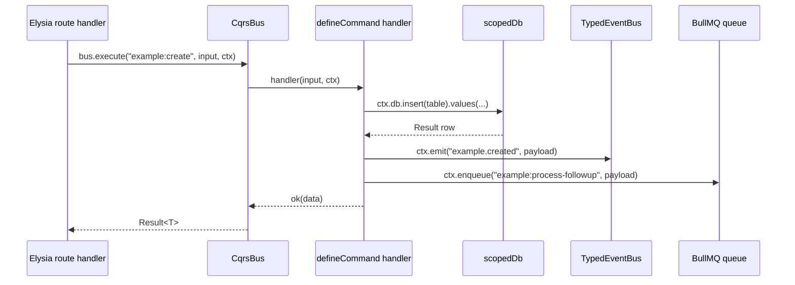
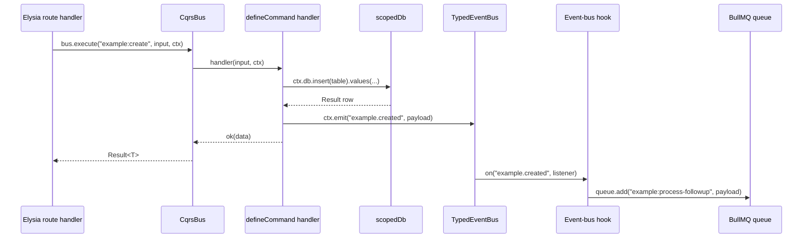

<objective>
Close the DOCS-02 + DOCS-08 audit gap (FAIL + WARN) by revising `docs/integrations/bullmq.md` and `docs/architecture.md` so their Mermaid diagrams and prose describe the REAL enqueue path — event-bus hooks, not `ctx.enqueue`. The live handlerCtx derive at `apps/api/src/index.ts:104-118` does not populate `enqueue`; the example module enqueues via `packages/modules/example/src/hooks/on-example-created.ts` which listens to the `example.created` event. `docs/add-a-module.md:40` already documents this correctly; bullmq.md and architecture.md must be brought into alignment.

Decision (Option A selected): Revise the two docs to match live code. Rationale per v1.2-MILESTONE-AUDIT.md §3 FAIL-2: Option A is "lowest effort," Option B "creates a new sanctioned pattern" which would require broader runtime changes in `apps/api/src/index.ts` and re-verifying all command-handler call sites. Sibling doc `docs/add-a-module.md:40` already documents the hook pattern as canonical, and `docs/integrations/bullmq.md:99-100` already contains an escape-hatch admission that `ctx.enqueue` is optional — so the truthful doc shape is achievable with prose-level edits only.

Purpose: Eliminate the single remaining incomplete narrative flow flagged in v1.2-MILESTONE-AUDIT.md §5 (BullMQ job-dispatch flow) and remove the soft-failure risk where a reader following bullmq.md in isolation would write `ctx.enqueue(...)` and hit `TypeError: ctx.enqueue is not a function`.

Output: Two docs files with revised Mermaid diagrams and aligned prose. No code changes, no test changes. `HandlerContext.enqueue` stays declared in packages/shared/src/types/cqrs.ts:29-30 (it is an optional, future-reserved slot already documented as optional in bullmq.md:99) — we are not deleting it, only removing the misleading "canonical enqueue path" framing.
</objective>

<execution_context>
@C:/Projetos/baseworks/.claude/get-shit-done/workflows/execute-plan.md
@C:/Projetos/baseworks/.claude/get-shit-done/templates/summary.md
</execution_context>

<context>
@.planning/STATE.md
@.planning/ROADMAP.md
@.planning/REQUIREMENTS.md
@.planning/v1.2-MILESTONE-AUDIT.md
@docs/integrations/bullmq.md
@docs/architecture.md
@docs/add-a-module.md
@apps/api/src/index.ts
@packages/modules/example/src/hooks/on-example-created.ts
@packages/modules/example/src/commands/create-example.ts
@packages/modules/example/src/index.ts
@packages/shared/src/types/cqrs.ts

<interfaces>
<!-- Source-of-truth extracts. Executor uses these directly — do not re-derive. -->

Live handlerCtx derive — apps/api/src/index.ts:104-118:
```typescript
.derive({ as: "scoped" }, (ctx: any) => {
  const tenantId: string = ctx.tenantId;
  return {
    handlerCtx: {
      tenantId,
      userId: ctx.userId,
      db: scopedDb(db, tenantId),
      emit: (event: string, data: unknown) =>
        registry.getEventBus().emit(event, {
          ...((typeof data === "object" && data !== null) ? data : { data }),
          _requestId: ctx.requestId,
        }),
    } satisfies HandlerContext,
  };
})
```
Fields present: `tenantId`, `userId`, `db`, `emit`. Field ABSENT: `enqueue`. The `HandlerContext.enqueue` type slot (cqrs.ts:29-30) is declared optional with JSDoc "Unavailable in test contexts"; at runtime the API process does not populate it either.

Real enqueue path — packages/modules/example/src/hooks/on-example-created.ts:50-75 (verbatim-ish):
```typescript
export function registerExampleHooks(eventBus: {
  on: (event: string, handler: (data: any) => Promise<void>) => void;
}): void {
  eventBus.on("example.created", async (data: unknown) => {
    const { id, tenantId } = data as ExampleCreatedEvent;
    try {
      const queue = getFollowupQueue();
      if (!queue) { /* fallback log */ return; }
      await queue.add("example:process-followup", { exampleId: id, tenantId });
    } catch (err) { /* log and swallow */ }
  });
}
```
The hook listens on `example.created`, lazy-constructs a BullMQ queue (via `createQueue` from `@baseworks/queue`), and calls `queue.add(...)` directly. The command handler emits the event (`ctx.emit("example.created", ...)`); the hook is the enqueue path.

Current create-example command — packages/modules/example/src/commands/create-example.ts (flow):
  1. Validates input
  2. `ctx.db.insert(examples).values(...)` — scoped INSERT
  3. `ctx.emit("example.created", { id, tenantId })` — fires event
  4. Returns `ok(result)`
No `ctx.enqueue(...)` call. The enqueue is driven by the event hook.

Sibling-doc reference — docs/add-a-module.md:40 (verbatim, already correct):
"`defineCommand` takes a TypeBox input schema and an async handler. `ctx.db` is the tenant-scoped database, `ctx.emit` publishes a domain event through `TypedEventBus`, and the return type is `Result<T>` produced by `ok(...)` or `err(...)`. Jobs are dispatched separately through a hook file (see Step 6) rather than through an `enqueue` parameter on the context."

Current bullmq.md Mermaid (lines 70-91, current — TO BE REPLACED):
```
sequenceDiagram
  participant Cmd as Command handler
  participant Q as BullMQ Queue
  participant Redis
  participant W as BullMQ Worker
  participant H as Job handler

  Cmd->>Q: ctx.enqueue("example:process-followup", payload)
  Q->>Redis: persist job
  ...
```

Current architecture.md Mermaid (lines 57-74, current — TO BE REPLACED):
```
sequenceDiagram
  participant Route as Elysia route handler
  participant Bus as CqrsBus
  participant Cmd as defineCommand handler
  participant DB as scopedDb
  participant EB as TypedEventBus
  participant Q as BullMQ queue

  Route->>Bus: bus.execute("example:create", input, ctx)
  Bus->>Cmd: handler(input, ctx)
  Cmd->>DB: ctx.db.insert(table).values(...)
  DB-->>Cmd: Result row
  Cmd->>EB: ctx.emit("example.created", payload)
  Cmd->>Q: ctx.enqueue("example:process-followup", payload)
  Cmd-->>Bus: ok(data)
  Bus-->>Route: Result<T>
```

Architecture HandlerContext callout — architecture.md:107 currently says "DV --> DV[derive handlerCtx<br/>tenantId, userId, db, emit, enqueue]". This MUST also be corrected (enqueue is not in the real derive).
</interfaces>
</context>

<threat_model>
## Trust Boundaries

None introduced. Documentation-only revision. No new code, no new API surface, no authentication/authorization change, no new data flow.

## STRIDE Threat Register

No new attack surface — documentation and Mermaid-diagram alignment with existing runtime code only. The corrected docs actually REDUCE a soft-failure risk noted in v1.2-MILESTONE-AUDIT.md §6 ("A reader who trusts the docs over the live code could try to call `ctx.enqueue(...)` in a new handler and get `TypeError: ctx.enqueue is not a function`.") but this is reliability, not security.
</threat_model>

<tasks>

<task type="auto">
  <name>Task 1: DOCS-08 fix — revise bullmq.md Mermaid + prose to event-bus-hook pattern</name>
  <read_first>
    - docs/integrations/bullmq.md (the file being modified; read FULL file — multiple passages touch the enqueue pattern, not just the Mermaid diagram)
    - packages/modules/example/src/hooks/on-example-created.ts (source of truth: the canonical hook)
    - packages/modules/example/src/commands/create-example.ts (source of truth: command emits event, does NOT enqueue)
    - apps/api/src/index.ts (source of truth: handlerCtx derive at lines 104-118 omits `enqueue`)
    - docs/add-a-module.md (read §"Step 6" and line 40 — this doc is ALREADY CORRECT; match its vocabulary for consistency)
    - packages/shared/src/types/cqrs.ts (source of truth: `HandlerContext.enqueue` is declared optional — we keep the type slot)
  </read_first>
  <files>docs/integrations/bullmq.md</files>
  <action>
Four distinct edits to docs/integrations/bullmq.md. Apply in order.

**EDIT 1 — Replace the Mermaid diagram block at lines 70-91.**

BEFORE (the entire ```mermaid ... ``` fence starting at line 70 and its preceding one-sentence lead-in at line 68-69):
```
The worker process in `apps/api/src/worker.ts:32-77` iterates every loaded module's `def.jobs` and starts one `createWorker(...)` per entry. Each worker wraps the handler in a structured child logger so job starts, completions, and errors carry the queue name and job ID.

```mermaid
sequenceDiagram
  participant Cmd as Command handler
  participant Q as BullMQ Queue
  participant Redis
  participant W as BullMQ Worker
  participant H as Job handler

  Cmd->>Q: ctx.enqueue("example:process-followup", payload)
  Q->>Redis: persist job
  W->>Redis: poll / pop
  Redis-->>W: job
  W->>H: handler(job.data)
  alt success
    H-->>W: resolve
    W->>Redis: removeOnComplete after 3 days
  else error (transient)
    H-->>W: throw
    W->>Redis: reschedule with exponential backoff
    Note over W,Redis: up to 3 attempts; then removeOnFail after 7 days
  end
```
```

AFTER (verbatim replacement — preserve the backticks, preserve the blank line above/below):
```
The worker process in `apps/api/src/worker.ts:32-77` iterates every loaded module's `def.jobs` and starts one `createWorker(...)` per entry. Each worker wraps the handler in a structured child logger so job starts, completions, and errors carry the queue name and job ID.

The canonical dispatch path goes through a domain event, not a context method: the command emits an event via `ctx.emit(...)`, a module-owned hook (registered on the event bus at API startup) listens for that event and calls `queue.add(...)` on a lazily-constructed BullMQ queue. See `packages/modules/example/src/hooks/on-example-created.ts` for the reference implementation and `docs/add-a-module.md` §"Step 6" for the walkthrough.

```mermaid
sequenceDiagram
  participant Cmd as Command handler
  participant EB as TypedEventBus
  participant Hook as Event-bus hook
  participant Q as BullMQ Queue
  participant Redis
  participant W as BullMQ Worker
  participant H as Job handler

  Cmd->>EB: ctx.emit("example.created", payload)
  EB->>Hook: on("example.created", listener)
  Hook->>Q: queue.add("example:process-followup", payload)
  Q->>Redis: persist job
  W->>Redis: poll / pop
  Redis-->>W: job
  W->>H: handler(job.data)
  alt success
    H-->>W: resolve
    W->>Redis: removeOnComplete after 3 days
  else error (transient)
    H-->>W: throw
    W->>Redis: reschedule with exponential backoff
    Note over W,Redis: up to 3 attempts; then removeOnFail after 7 days
  end
```
```

This replacement:
  - Inserts a new prose paragraph explaining the hook-based path BEFORE the diagram so the reader has context
  - Adds `EB as TypedEventBus` and `Hook as Event-bus hook` participants
  - Replaces the single `Cmd->>Q: ctx.enqueue(...)` arrow with three accurate arrows: `Cmd->>EB: ctx.emit(...)`, `EB->>Hook: on(...)`, `Hook->>Q: queue.add(...)`
  - Preserves the downstream (Redis, Worker, Job handler, retry) portion unchanged
  - Mermaid fence count is preserved (one fence replaced with one fence — the D-01 Mermaid floor of 8 is not affected)

**EDIT 2 — Update the `ctx.enqueue is optional` gotcha at line 99.**

BEFORE (line 99, single bullet):
```
- **`ctx.enqueue` is optional.** `HandlerContext.enqueue` is declared as `Promise<void> | undefined`. Test contexts receive a no-op via the mock factory; production command handlers invoke `await ctx.enqueue?.(...)` — the optional chaining preserves type safety if a future context skips queue wiring entirely.
```

AFTER (replacement bullet):
```
- **`HandlerContext.enqueue` is declared but not wired at runtime.** The type slot (`packages/shared/src/types/cqrs.ts:29-30`) is reserved for a future direct-enqueue pathway. Today the live API-process derive (`apps/api/src/index.ts:104-118`) populates only `tenantId`, `userId`, `db`, and `emit` — `enqueue` is undefined. `createMockContext` (test utility) provides a `mock(() => Promise.resolve())` stub for convenience, but production command handlers do NOT call `ctx.enqueue`. Enqueue via an event-bus hook instead (see the Mermaid diagram above and `docs/add-a-module.md` §"Step 6").
```

**EDIT 3 — Fix the "Extending" step 4 at line 120.**

BEFORE (line 120, inside the numbered list at §"Extending > Add a new queue + worker + job type"):
```
4. Enqueue from a command handler: `await ctx.enqueue?.("yourmodule:action", payload)`. The enqueue flows through `HandlerContext.enqueue`, which `ModuleRegistry` wires to `createQueue(queueName, redisUrl).add(...)`.
```

AFTER (replacement item 4):
```
4. Emit a domain event from the command handler (`ctx.emit("yourmodule.something-happened", payload)`) and add a hook file under `packages/modules/<yourmodule>/src/hooks/` that listens on that event and calls `queue.add(...)` on a lazily-constructed BullMQ queue. Mirror `packages/modules/example/src/hooks/on-example-created.ts` — it memoizes the queue, falls back to a console log when `REDIS_URL` is absent, and swallows listener errors so a failed enqueue does NOT crash the originating command. Register the hook at API startup (call your `registerYourModuleHooks(registry.getEventBus())` alongside the existing `registerExampleHooks(...)` and `registerBillingHooks(...)` calls).
```

**EDIT 4 — Fix the "worker.ts:21-24" reference in step 3.**

BEFORE (line 119, inside the same numbered list):
```
3. Ensure your module name is listed in the `modules` array in `apps/api/src/worker.ts:21-24` so the worker process loads it. No separate worker-registration call is required — `apps/api/src/worker.ts:32-77` iterates all `def.jobs` automatically on boot.
```

AFTER (replacement item 3 — adds the API-side registration requirement, matching Plan 16-01's DOCS-06 correction):
```
3. Ensure your module name is listed in the `modules` array in BOTH the API entrypoint (`apps/api/src/index.ts:25-28`) and the worker entrypoint (`apps/api/src/worker.ts:21-24`) so both processes load it. No separate worker-registration call is required — `apps/api/src/worker.ts:32-77` iterates all `def.jobs` automatically on boot.
```

Apply all four edits in sequence. Preserve all other content in the file (headings, smoke-test block, security section, dashboard section, "Next steps" section) unchanged.

Implements DOCS-08 per audit gap v1.2-MILESTONE-AUDIT.md §3 FAIL-2.
  </action>
  <verify>
    <automated>grep -c "ctx.enqueue" docs/integrations/bullmq.md</automated>
  </verify>
  <acceptance_criteria>
    - `grep -c "ctx.enqueue" docs/integrations/bullmq.md` returns `0`
    - `grep -c "on-example-created" docs/integrations/bullmq.md` returns `>=2` (prose cite + numbered-list cite)
    - `grep -c "Event-bus hook" docs/integrations/bullmq.md` returns `>=1` (Mermaid participant)
    - `grep -c "TypedEventBus" docs/integrations/bullmq.md` returns `>=1` (Mermaid participant)
    - `grep -c "declared but not wired" docs/integrations/bullmq.md` returns `1`
    - `grep -c "apps/api/src/index.ts:104-118" docs/integrations/bullmq.md` returns `>=1`
    - `grep -c 'ctx.emit("yourmodule' docs/integrations/bullmq.md` returns `1`
    - `grep -c 'apps/api/src/index.ts:25-28' docs/integrations/bullmq.md` returns `>=1` (updated Extending step 3)
    - Mermaid fence count on disk across docs/: `bun run scripts/validate-docs.ts` exits 0 (floor of 8 still met)
  </acceptance_criteria>
  <done>
    All four edits applied. The file no longer tells the reader to call `ctx.enqueue`; the Mermaid diagram, the "optional" bullet, the "Extending" §step 4, and the "Extending" §step 3 all describe the real event-bus-hook pattern and the real module-array requirement. The phase-close validator still passes.
  </done>
</task>

<task type="auto">
  <name>Task 2: DOCS-02 fix — revise architecture.md CQRS-flow Mermaid + handlerCtx callout</name>
  <read_first>
    - docs/architecture.md (the file being modified; read FULL file — the ctx.enqueue claim appears in both the CQRS Mermaid diagram around line 71 AND in the request-lifecycle prose around line 107)
    - packages/modules/example/src/hooks/on-example-created.ts (source of truth: the hook that does the enqueue)
    - packages/modules/example/src/commands/create-example.ts (source of truth: command emits event, does NOT enqueue)
    - apps/api/src/index.ts (source of truth: handlerCtx derive at lines 104-118; fields are tenantId, userId, db, emit — NO enqueue)
    - packages/shared/src/types/cqrs.ts (source of truth: HandlerContext.enqueue is declared optional)
    - docs/integrations/bullmq.md (sibling doc — after Plan 16-02 Task 1, this is the authoritative reference; architecture.md should match its story)
  </read_first>
  <files>docs/architecture.md</files>
  <action>
Three edits to docs/architecture.md. Apply in order.

**EDIT 1 — Replace the CQRS-flow Mermaid diagram at lines 57-74.**

BEFORE (the full ```mermaid ... ``` block starting at line 57):
```

```

AFTER (verbatim replacement):
```

```

This replacement:
  - Adds `Hook as Event-bus hook` participant
  - REMOVES the `Cmd->>Q: ctx.enqueue(...)` arrow
  - APPENDS two new arrows AFTER `Bus-->>Route` showing the event → hook → queue path (async, after the command response returns to the route)
  - Preserves the command's synchronous flow (db insert → emit → return) unchanged
  - Mermaid fence count preserved (one fence replaced with one fence)

**EDIT 2 — Update the HandlerContext citation immediately after the Mermaid diagram.**

The current text (around line 76-89, §"HandlerContext") already cites `cqrs.ts:20-31` and shows the enqueue field as optional, which is correct. Add one clarifying sentence AFTER the `export interface HandlerContext { ... }` code block that matches Plan 16-02 Task 1's prose on bullmq.md.

BEFORE (current — lines 80-93 approximately, the code block plus the single sentence at 93):
```
```typescript
// From packages/shared/src/types/cqrs.ts:20-31
export interface HandlerContext {
  tenantId: string;
  userId?: string;
  db: any;
  emit: (event: string, data: unknown) => void;
  enqueue?: (job: string, data: unknown) => Promise<void>;
}
```

### Queries vs commands

`defineCommand` and `defineQuery` (both in `packages/shared/src/types/cqrs.ts`) return `Promise<Result<T>>` and share the same input-validation pipeline built on TypeBox. Commands may emit events through `ctx.emit` and enqueue jobs; queries have no side effects. `CqrsBus.execute` dispatches commands by namespaced key; `CqrsBus.query` dispatches queries.
```

AFTER (replacement — adds a clarifier sentence between the code block and the `### Queries vs commands` heading, AND corrects the "enqueue jobs" claim in the following paragraph):
```
```typescript
// From packages/shared/src/types/cqrs.ts:20-31
export interface HandlerContext {
  tenantId: string;
  userId?: string;
  db: any;
  emit: (event: string, data: unknown) => void;
  enqueue?: (job: string, data: unknown) => Promise<void>;
}
```

The `enqueue` field is declared optional and is NOT populated by the live API derive at `apps/api/src/index.ts:104-118` (only `tenantId`, `userId`, `db`, and `emit` are present at runtime). It is a reserved type slot for a future direct-enqueue pathway. Today, command handlers emit a domain event and a module-owned hook on the event bus performs the actual `queue.add(...)` — see `docs/integrations/bullmq.md` §"Wiring in Baseworks" and `packages/modules/example/src/hooks/on-example-created.ts` for the reference implementation.

### Queries vs commands

`defineCommand` and `defineQuery` (both in `packages/shared/src/types/cqrs.ts`) return `Promise<Result<T>>` and share the same input-validation pipeline built on TypeBox. Commands may emit events through `ctx.emit` and — indirectly, via an event-bus hook listening on that event — trigger BullMQ enqueues; queries have no side effects. `CqrsBus.execute` dispatches commands by namespaced key; `CqrsBus.query` dispatches queries.
```

**EDIT 3 — Correct the request-lifecycle `handlerCtx` bullet at line 107, 120.**

BEFORE (line 107, inside the middleware Mermaid flowchart):
```
  TM --> DV[derive handlerCtx<br/>tenantId, userId, db, emit, enqueue]
```

AFTER (replacement — remove `enqueue` from the derived-field list, matching the real runtime):
```
  TM --> DV[derive handlerCtx<br/>tenantId, userId, db, emit]
```

BEFORE (line 120 approximately, the bullet-list item describing the derive step):
```
- **derive `handlerCtx`** (`apps/api/src/index.ts:104-118`) — Builds the `HandlerContext { tenantId, userId, db: scopedDb(db, tenantId), emit }` consumed by module route handlers.
```

This line is ALREADY CORRECT (does not list `enqueue`). Leave it unchanged. The only fix in the request-lifecycle section is the Mermaid node label on the earlier-mentioned line.

Apply all three edits. Preserve all other headings, prose, Mermaid diagrams (the four architecture diagrams are the bulk of the file — do not touch the tenant-scoping diagram or the module-system diagram), and citations unchanged.

Implements DOCS-02 per audit gap v1.2-MILESTONE-AUDIT.md §3 WARN (DOCS-02) — tracks the same underlying drift as DOCS-08.
  </action>
  <verify>
    <automated>grep -c "ctx.enqueue" docs/architecture.md</automated>
  </verify>
  <acceptance_criteria>
    - `grep -c "ctx.enqueue" docs/architecture.md` returns `0`
    - `grep -c "on-example-created" docs/architecture.md` returns `>=1`
    - `grep -c "Event-bus hook" docs/architecture.md` returns `>=1` (CQRS Mermaid participant)
    - `grep -c 'tenantId, userId, db, emit, enqueue' docs/architecture.md` returns `0` (old derive bracket label gone)
    - `grep -c 'tenantId, userId, db, emit\]' docs/architecture.md` returns `>=1` (new derive bracket label present — note the closing bracket)
    - `grep -c "reserved type slot" docs/architecture.md` returns `1`
    - `grep -c "indirectly, via an event-bus hook" docs/architecture.md` returns `1`
    - Mermaid fence count on disk across docs/: `bun run scripts/validate-docs.ts` exits 0 (floor of 8 still met)
    - Content-quality sanity: `grep -c 'Cmd->>Q: ctx.enqueue' docs/architecture.md` returns `0`
    - Content-quality sanity: `grep -c 'Hook->>Q: queue.add' docs/architecture.md` returns `1`
  </acceptance_criteria>
  <done>
    All three edits applied. The CQRS-flow Mermaid diagram shows the event-bus-hook dispatch path, the HandlerContext code block is followed by a clarifier paragraph explaining the runtime reality, the §Queries-vs-commands paragraph acknowledges the indirect-via-hook enqueue, and the request-lifecycle middleware Mermaid node label no longer lists `enqueue`. No other sections of the file changed.
  </done>
</task>

</tasks>

<verification>
After both tasks complete, run:

```bash
# Must be ZERO occurrences across both files
grep -c "ctx.enqueue" docs/integrations/bullmq.md docs/architecture.md

# Hook pattern citations must be present in both
grep "on-example-created" docs/integrations/bullmq.md docs/architecture.md

# Event-bus-hook vocabulary must be present in both
grep -c "event-bus hook\|Event-bus hook" docs/integrations/bullmq.md docs/architecture.md

# Sibling-doc (add-a-module.md:40) untouched — this is a regression check
grep "Jobs are dispatched separately through a hook file" docs/add-a-module.md

# Phase-close validator must still pass
bun run scripts/validate-docs.ts
```

Spot-check: render both Mermaid diagrams mentally or via GitHub Markdown preview — the `Cmd->>Q` arrow must be GONE from both, and the `Cmd->>EB: ctx.emit(...)` + `Hook->>Q: queue.add(...)` arrows must be PRESENT.

Regression check: confirm docs/add-a-module.md:40 still reads "Jobs are dispatched separately through a hook file (see Step 6) rather than through an `enqueue` parameter on the context." — this plan does not edit that file; the sibling consistency is the test that the two plan-02 fixes land on the right side.
</verification>

<success_criteria>
- Two ROADMAP Phase 16 success criteria closed: #2 (DOCS-02 + DOCS-08 bundled decision)
- Two audit items closed: DOCS-08 (FAIL → PASS), DOCS-02 (WARN → PASS)
- Decision recorded in objective: Option A (revise docs to match live code), rationale cited
- No code files modified; two docs files touched (bullmq.md, architecture.md)
- `bun run scripts/validate-docs.ts` still exits 0 (Mermaid floor, forbidden-import, secret-shape all hold)
- All grep invariants in acceptance_criteria hold
- `docs/add-a-module.md:40` unchanged (regression-check passes)
</success_criteria>

<output>
After completion, create `.planning/phases/16-v1-2-content-drift-fixes/16-02-SUMMARY.md` with:
  - `requirements_completed: [DOCS-02, DOCS-08]`
  - `gap_closure: true`
  - `closes_gap_from: .planning/v1.2-MILESTONE-AUDIT.md`
  - Record the Option A decision with one-line rationale (sibling doc already correct; Option B would require runtime code change in apps/api/src/index.ts)
  - Verbatim before/after snippets of BOTH Mermaid fences (bullmq.md worker-flow and architecture.md CQRS-flow)
  - Verbatim before/after snippets of the three prose edits (bullmq.md gotcha bullet, bullmq.md Extending §step 3, bullmq.md Extending §step 4, architecture.md HandlerContext clarifier, architecture.md Queries-vs-commands paragraph, architecture.md request-lifecycle Mermaid node label)
  - Confirmation that grep invariants in acceptance_criteria all hold
  - Confirmation that `bun run scripts/validate-docs.ts` exits 0
  - Confirmation that `docs/add-a-module.md:40` sibling text is unchanged
</output>
