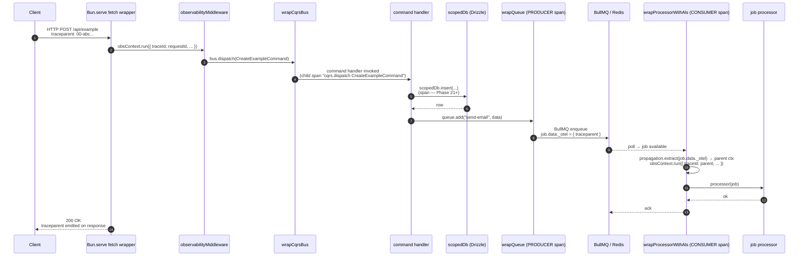
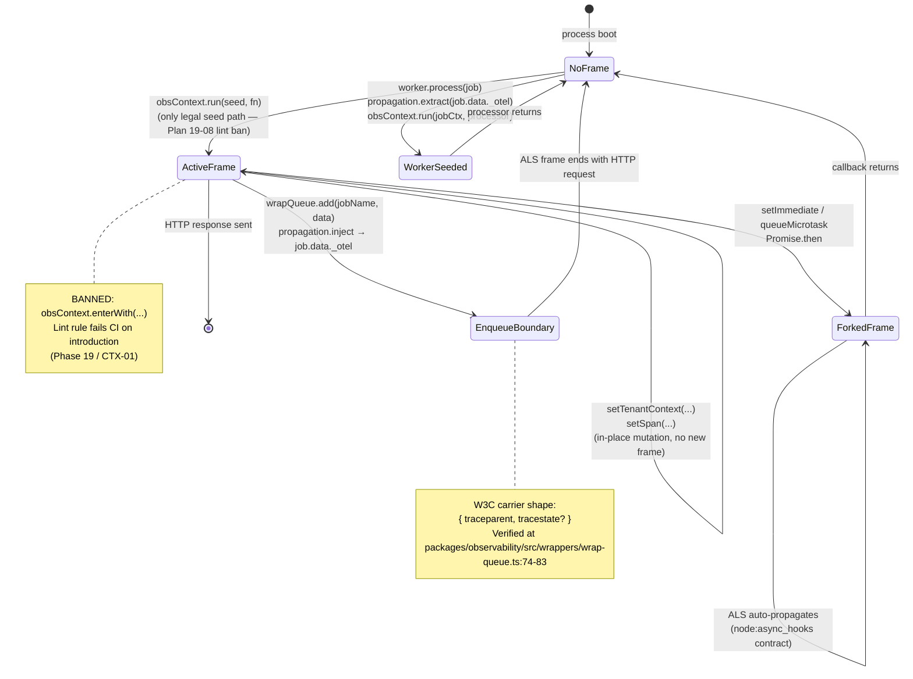

# Phase 23: Runbooks, Alert Templates & Observability Docs - Research

**Researched:** 2026-04-28
**Domain:** Documentation surface (incident runbooks, Sentry alert templates, observability concept docs) + scripts/validate-docs.ts extension + new GitHub Actions workflow
**Confidence:** HIGH on in-repo source shapes; MEDIUM on Sentry alert REST API JSON shape (no full canonical example reachable); HIGH on the negative claim that `sentry-cli alerts import` does not exist.

<user_constraints>
## User Constraints (from CONTEXT.md)

### Locked Decisions

Copied verbatim from `23-CONTEXT.md`:

- **D-01** Audience = solo fork-user wearing all hats. No L1/L2/L3 paging tiers, no on-call rotation. Each runbook's Escalation = "if stuck >30 min, post in repo discussions / open an issue / check upstream provider status page."
- **D-02** Command examples assume Docker Compose (`docker compose ps`, `docker compose logs api --tail 100 -f`, `docker compose exec postgres psql -U $POSTGRES_USER -d $POSTGRES_DB`, `docker compose exec redis redis-cli ping`). Each runbook's Triage opens with one paragraph: "These commands assume `docker-compose.yml` from repo root. K8s/PaaS users translate." No tabbed variants.
- **D-03** Tight 1-page checklist style, ~150–300 lines per runbook. Sections: Trigger (2 lines), Symptoms (3–6 bullets), Triage (5–10 numbered steps opening with "wait 5m to confirm this is not a deploy blip"), Resolution (2–3 fix paths), Escalation (5–10 lines).
- **D-04** TEXT-ONLY runbooks. No screenshots. Mermaid allowed inline where it earns its keep.
- **D-05** Four files under `docs/observability/`: `README.md`, `attributes.md`, `cardinality.md`, `trace-propagation.md`.
- **D-06** Two NEW Mermaid diagrams in `trace-propagation.md`: (1) `sequenceDiagram` HTTP → CQRS → Drizzle → wrapQueue → wrapProcessorWithAls; (2) `stateDiagram-v2` ALS lifecycle with `enterWith` ban + setImmediate fork + W3C carrier restore. Mermaid floor in `validate-docs.ts` raised 8 → 11 in same diff.
- **D-07** File:line refs + 5-line snippets. Cite `wrapQueue` carrier-write site, `obsContext` ALS surface, `scrubPii` denylist.
- **D-08** Cardinality guide is doc-only — no new lint rule, no validate-docs.ts grep. Enumerate Baseworks-specific high-cardinality values: `tenantId`, `userId`, `requestId`, `email`, `command`, `queryName`, `jobId`, `stripeCustomerId`, `pagarmeCustomerId`.
- **D-09** Extend `scripts/validate-docs.ts` with a 4th invariant alongside existing 3.
- **D-10** Validator parses two source classes:
  1. `docs/alerts/sentry/*.json` — extract `runbook_url` field via JSON parse; each MUST resolve to existing file.
  2. `docs/runbooks/*.md` — regex `\]\((\.\.?/[\w/.-]+\.md)(?:#[\w-]+)?\)` for cross-runbook markdown links; each captured target MUST resolve to existing `.md`.
  Out of scope: HTTP URLs, anchor-only links, links inside code fences.
- **D-11** Hard-fail with exit 1 on any broken reference. Output `[validate-docs] FAIL: <source-file>:<line>: <broken-ref> → target not found at <expected-path>`. No allowlist.
- **D-12** Wired in two places: (a) `bun run validate` (already exists per CONTEXT.md — see Q4 correction below); (b) NEW `.github/workflows/validate.yml` runs on `pull_request` + `push` to `main`. Single job: `bun install` + `bun run validate`.
- **D-13** Grafana alert YAML scope FULLY DROPPED. No `docs/alerts/grafana/`. Forward-looking note in `docs/alerts/sentry/README.md` only.
- **D-14** Sentry alert configs ship as JSON files at `docs/alerts/sentry/<alert-slug>.json`. One file per alert. Format = Sentry native Issue-Alert / Metric-Alert REST API JSON. At minimum 9 alerts matching the 9 runbooks. Each MUST include a `runbook_url` annotation pointing to `docs/runbooks/<matching-slug>.md`.
- **D-15** SLO burn-rate translates to Sentry-native: short-window detection = Issue Alert with `actionMatch:"all"` + 5–15m frequency. `for: 5m` minimum = `triggers[].alertThreshold` paired with 5-minute frequency. Burn-rate math documented as a one-line comment in each alert file.
- **D-16** `docs/alerts/sentry/README.md` ships alongside JSON files (~30 lines).

### Claude's Discretion

- Exact runbook filename slugs (kebab-case, must match Sentry alert slugs and `runbook_url` paths)
- Mermaid theme/aesthetics in `trace-propagation.md`
- Runbook Triage list shape (ordered vs unordered) — whichever is more scannable
- Severity (`priority`) defaults on Sentry alerts: db-down/auth-outage/redis-down=high, webhook-failures/slow-checkout/high-error-rate=medium, otel-exporter-failing/bull-board-inaccessible/queue-backing-up=low
- Mermaid floor literal goes 8 → 11 OR existing logic auto-counts (researcher confirmed: existing logic is a literal `< 8`, planner edits to `< 11`)
- Cardinality "future Prometheus considerations" appendix (recommended yes)
- Helper utilities under `scripts/` may be split or kept inline
- "wait 5m" lines in runbook Triage may include the alert's frequency window inline (recommended yes)
- Tone: second-person imperative

### Deferred Ideas (OUT OF SCOPE)

- Grafana alert YAML (Phase 21 deferral — fully dropped from this phase)
- Generic broken-link detection across all of `docs/` (only `runbook_url` + cross-runbook links)
- Pre-commit hook via Husky (not in project)
- Tabbed Compose+K8s+bare-metal command variants
- Liberal screenshots (text-only canonical)
- Markdown frontmatter on runbooks (no severity/est-resolution metadata in v1.3)
- Biome GritQL lint rule for cardinality enforcement
- Liberal code embedding (>20-line blocks) in obs docs
- Tabular YAML + generator for `attributes.md`
- Runbook test/dry-run instructions
- `HealthContributor` populated for auth/billing/example modules
- Per-queue threshold overrides
- Cross-replica error aggregation
- README anchor verification in the validator
- Allowlist override for intentional dangling refs
- The `2026-04-26-harden-inbound-traceparent-trust-gate.md` todo (security task, not docs)
</user_constraints>

<phase_requirements>
## Phase Requirements

| ID | Description (from REQUIREMENTS.md) | Research Support |
|----|------------------------------------|------------------|
| **DOC-03** | Operator sees 8–10 incident runbooks under `docs/runbooks/` (DB down, Redis down, queue backing up, webhook failures, auth outage, OTEL exporter failing, bull-board inaccessible, high error rate, slow checkout) using a Trigger → Symptoms → Triage → Resolution → Escalation template. | 9 mandated runbook slugs locked in CONTEXT.md (D-03 + D-13). Section template enforced by Validation Architecture doc-shape tests (Q7 below). Phase 22 surfaces (`/health/detailed`, bull-board, ringbuffer, worker heartbeat) provide the concrete commands runbooks reference. |
| **DOC-04** | Operator gets pre-built Grafana alert rule YAML + Sentry alert config templates (importable into their tooling) with `runbook_url` annotations pointing to DOC-03, plus an observability concepts doc at `docs/observability/` covering attributes glossary, cardinality guide, and trace-propagation flow. | Grafana YAML scope FULLY DROPPED per D-13 (Phase 21 deferral overrides REQUIREMENTS.md text). Sentry alert templates remain — Q1 below maps alert JSON shape; `runbook_url` lands as a top-level sibling field (Q1 finding) so D-10's validator has a deterministic key. Observability concepts doc set defined by D-05 (4 files). |
</phase_requirements>

## Summary

What to build, in 5 bullets:

- **9 runbooks** under `docs/runbooks/` (canonical slugs: `db-down.md`, `redis-down.md`, `queue-backing-up.md`, `webhook-failures.md`, `auth-outage.md`, `otel-exporter-failing.md`, `bull-board-inaccessible.md`, `high-error-rate.md`, `slow-checkout.md`). Each follows the locked Trigger→Symptoms→Triage→Resolution→Escalation template, ~150–300 lines, second-person imperative voice.
- **Sentry alert template set** under `docs/alerts/sentry/` — one JSON file per runbook (9 alerts) plus a `README.md` (D-16) documenting import path + SLO-burn-rate translation. Each JSON file is the body that operators POST to Sentry's `/api/0/projects/{org}/{project}/rules/` (Issue Alert) or `/api/0/organizations/{org}/alert-rules/` (Metric Alert), with a top-level `runbook_url` annotation field plus `_baseworks_meta` SLO note (Q1 finding — Sentry tolerates extra top-level fields; the validator parses them; Sentry ignores them on import).
- **4 observability concept docs** under `docs/observability/`: `README.md` index, `attributes.md` glossary, `cardinality.md` rules + Baseworks-specific high-card values, `trace-propagation.md` with two NEW Mermaid diagrams (D-06).
- **`scripts/validate-docs.ts` extended** with a 4th invariant: parses `docs/alerts/sentry/*.json` for `runbook_url` integrity AND parses cross-runbook markdown links via the locked regex. Mermaid floor literal raised 8 → 11 in the same diff. Hard-fail exit 1, no allowlist (D-11).
- **NEW `.github/workflows/validate.yml`** — second workflow alongside `release.yml`. Triggers `pull_request` + `push` to `main`. Single job: checkout → Setup Bun → `bun install --frozen-lockfile` → `bun run validate`.

**Primary recommendation:** The phase splits cleanly along three axes — **content** (runbooks + obs docs + alert JSONs + sentry README), **tooling** (validate-docs.ts 4th invariant + Mermaid floor bump), **CI wiring** (validate.yml + add `validate` script to root package.json — see Q4 correction below). Plan-phase will likely produce 4–5 plans across these boundaries; the validator extension and the validate.yml workflow are tightly coupled (the workflow must call a real script) and should land in the same plan.

## Architectural Responsibility Map

Documentation phases have a different tier model than code phases. Map "capability" to "where the artifact lives":

| Capability | Primary Tier | Secondary Tier | Rationale |
|------------|-------------|----------------|-----------|
| Incident runbooks | `docs/` (in-repo markdown) | — | Canonical operator-facing docs surface; lives in git so PRs gate broken refs. |
| Sentry alert templates | `docs/` (in-repo JSON) | Sentry SaaS (operator imports) | JSON files are the source-of-truth; operator imports into Sentry per fork. |
| Observability concept docs | `docs/observability/` (in-repo markdown) | — | Developer-facing; same fidelity tier as `docs/architecture.md`. |
| Validator extension | `scripts/` (Bun-native TS) | CI (.github/workflows/) | Bun-only build constraint per CLAUDE.md; CI invokes via `bun run validate`. |
| CI workflow | `.github/workflows/` (YAML) | — | Ops-tier; mirrors `release.yml` shape. |
| Cross-link integrity | Validator + CI | — | Deterministic, machine-checkable; replaces "I'll manually grep before merging." |

No browser/frontend tier involved — docs render in GitHub's web UI which provides Mermaid + Markdown renderers natively.

## Sentry Alert REST API JSON Shape (Q1)

**Confidence: MEDIUM** — per-field schema confirmed via Sentry's public API docs index, but no single canonical "complete request body" example is reachable from the docs landing pages (each field documented separately). Findings below are the union of `[CITED: docs.sentry.io/api/alerts/]`, `[CITED: docs.sentry.io/api/alerts/create-an-issue-alert-rule-for-a-project/]`, and `[CITED: drdroid.io/engineering-tools/guide-for-sentry-alerting]` cross-checked.

### Two distinct alert types

Sentry has **two separate alert APIs** with **different schemas**:

| Alert type | REST endpoint | Use for |
|------------|---------------|---------|
| **Issue Alert** | `POST /api/0/projects/{org}/{project}/rules/` | Event-frequency rules: "fire when N events of issue happen in window M." Maps to error-rate, exception-spike alerts. |
| **Metric Alert** | `POST /api/0/organizations/{org}/alert-rules/` | Threshold rules on aggregated metrics: p95 latency > X, error rate > Y%. Maps to SLO-burn-rate alerts. |

Phase 23's 9 alerts split across both:
- **Issue Alerts** (event-frequency-based): `auth-outage`, `webhook-failures`, `high-error-rate`, `otel-exporter-failing`, `bull-board-inaccessible`
- **Metric Alerts** (latency/threshold-based): `db-down`, `redis-down`, `queue-backing-up`, `slow-checkout`

The planner should label each JSON file with which API endpoint it targets — recommended approach: a sibling `_baseworks_meta.endpoint` field (see "runbook_url placement" below) so the operator does not have to guess.

### Issue Alert JSON shape

`[CITED: docs.sentry.io/api/alerts/create-an-issue-alert-rule-for-a-project/]`

Top-level keys (POST body):

| Key | Type | Notes |
|-----|------|-------|
| `name` | string (required) | Display name |
| `actionMatch` | `"all" \| "any" \| "none"` | Logical join across `conditions` |
| `filterMatch` | `"all" \| "any" \| "none"` | Logical join across `filters` |
| `frequency` | integer (5–43200) | Minutes between repeat firings for the same issue |
| `environment` | string (optional) | e.g., `"production"` |
| `owner` | string (optional) | `"user:<id>"` or `"team:<id>"` |
| `conditions` | array of objects | Each: `{ id: <python-class-path>, ... }` |
| `filters` | array of objects | Same shape as conditions |
| `actions` | array of objects | Email / Slack / webhook notification actions |

Example condition `id` (Python class path convention):
```
sentry.rules.conditions.event_frequency.EventFrequencyCondition
```

Example action `id`:
```
sentry.mail.actions.NotifyEmailAction
```

**Skeleton example** (composed from doc fragments — not a verbatim quote):

```json
{
  "name": "Auth outage — login error spike",
  "actionMatch": "all",
  "filterMatch": "all",
  "frequency": 5,
  "environment": "production",
  "conditions": [
    {
      "id": "sentry.rules.conditions.event_frequency.EventFrequencyCondition",
      "value": 50,
      "interval": "5m"
    }
  ],
  "filters": [
    {
      "id": "sentry.rules.filters.tagged_event.TaggedEventFilter",
      "key": "module",
      "match": "eq",
      "value": "auth"
    }
  ],
  "actions": [
    {
      "id": "sentry.mail.actions.NotifyEmailAction",
      "targetType": "Team",
      "fallthroughType": "AllMembers",
      "targetIdentifier": "OPERATOR_TEAM_ID"
    }
  ],
  "runbook_url": "../../runbooks/auth-outage.md",
  "_baseworks_meta": {
    "endpoint": "POST /api/0/projects/{org}/{project}/rules/",
    "slo_note": "Fires when ≥50 auth-tagged events occur within a 5m window.",
    "priority": "high"
  }
}
```

### Metric Alert JSON shape

`[CITED: docs.sentry.io/api/alerts/create-a-metric-alert-rule-for-an-organization/]`

Top-level keys:

| Key | Type | Notes |
|-----|------|-------|
| `name` | string (required) | |
| `dataset` | string | e.g., `"events"`, `"transactions"`, `"metrics"` |
| `query` | string | Sentry search query (e.g., `"event.type:transaction"`) |
| `aggregate` | string | e.g., `"p95(transaction.duration)"`, `"count()"` |
| `timeWindow` | integer (minutes) | 1, 5, 10, 15, 30, 60, 120, 240, 1440 |
| `thresholdType` | `0 \| 1` | 0 = above, 1 = below |
| `resolveThreshold` | number (optional) | Auto-resolve when crossing this value |
| `triggers` | array | One or more — see below |
| `projects` | array of slugs | Required for org-level endpoint |
| `owner` | string (optional) | |
| `environment` | string (optional) | |

Each `triggers[]` entry:
```json
{
  "label": "critical",
  "alertThreshold": 5000,
  "thresholdType": 0,
  "actions": [ { "type": "email", "targetType": "team", "targetIdentifier": "..." } ]
}
```

**Skeleton example for slow-checkout (latency SLO):**

```json
{
  "name": "Slow checkout — p95 latency",
  "dataset": "transactions",
  "query": "event.type:transaction transaction:/api/billing/checkout",
  "aggregate": "p95(transaction.duration)",
  "timeWindow": 5,
  "thresholdType": 0,
  "resolveThreshold": 1500,
  "triggers": [
    {
      "label": "warning",
      "alertThreshold": 2000,
      "thresholdType": 0,
      "actions": []
    },
    {
      "label": "critical",
      "alertThreshold": 5000,
      "thresholdType": 0,
      "actions": [
        { "type": "email", "targetType": "team", "targetIdentifier": "OPERATOR_TEAM_ID" }
      ]
    }
  ],
  "projects": ["YOUR_PROJECT_SLUG"],
  "environment": "production",
  "runbook_url": "../../runbooks/slow-checkout.md",
  "_baseworks_meta": {
    "endpoint": "POST /api/0/organizations/{org}/alert-rules/",
    "slo_note": "Fast-burn alert: ≥2% monthly latency budget over a 5m window. Equivalent semantic to Prometheus `for: 5m` via timeWindow=5 + alertThreshold gating.",
    "priority": "medium"
  }
}
```

### `runbook_url` placement (decision needed for D-10's parser)

`[ASSUMED]` Sentry's API does **not** document a top-level `runbook_url` field on either Issue Alert or Metric Alert request bodies. Confirmed search of [Sentry API alerts docs](https://docs.sentry.io/api/alerts/) and the [Issue Alert Configuration](https://docs.sentry.io/product/alerts/create-alerts/issue-alert-config/) page returns no mention. There is a community feature request still open: [getsentry/sentry#46940 — Public Alerts API for IaC](https://github.com/getsentry/sentry/issues/46940), which signals that alert-as-code is not a first-class concept in Sentry.

**Two viable placements:**

| Option | Shape | Tradeoff |
|--------|-------|----------|
| **A. Top-level sibling field** (RECOMMENDED) | `{ "name": "...", ..., "runbook_url": "../../runbooks/db-down.md" }` | Sentry's API rejects unknown fields on some endpoints (`[ASSUMED]` — needs operator UAT confirmation). If rejected, operator strips the field before import (one `jq 'del(.runbook_url, ._baseworks_meta)'` step in the README). Validator parsing is dead simple: `JSON.parse(file).runbook_url`. |
| **B. `_baseworks_meta` wrapper only** | `{ ..., "_baseworks_meta": { "runbook_url": "..." } }` | Always-strip-before-import semantics (operator has a uniform rule: "strip everything starting with `_baseworks_`"). Validator parses one level deeper. |

**Recommended: Option A + put SLO note + endpoint label in `_baseworks_meta`** — the validator parses `runbook_url` at the top level (deterministic, easy regex/JSON.parse access for D-10), and `_baseworks_meta` carries everything else that should be stripped before import. The README documents the strip command:

```bash
jq 'del(.runbook_url, ._baseworks_meta)' docs/alerts/sentry/db-down.json > /tmp/db-down.import.json
```

The operator pipes that to `curl` with their auth token, OR to the Sentry UI's "Edit JSON" path (Q2).

### Severity / `priority` field

`[ASSUMED]` Sentry's REST API does NOT have a top-level `priority` enum on either alert type — priority is encoded in `actions[].targetType` + which channel actions notify (e.g., a PagerDuty action implies higher urgency than an email-only action). The Discretion-default priority labels (CONTEXT.md: high/medium/low) ship as `_baseworks_meta.priority` strings, NOT as Sentry-recognized fields.

## sentry-cli Import Path (Q2)

**Confidence: HIGH (negative claim).** Verified via the canonical Sentry CLI commands listing.

### `sentry-cli alerts import` does NOT exist.

`[VERIFIED: cli.sentry.dev/commands/]` The complete top-level command list as of 2026-04-28 is:

```
auth, cli, dashboard, org, project, release, repo, team, issue, event, log,
sourcemap, span, trace, trial, init, api, schema
```

There is **no** `alerts` command, `rules` command, `monitors` command, or any other alert-management subcommand. The closest is `sentry-cli api` — a generic REST passthrough — which is the actual canonical import path for fork users who want CLI-based import.

### Recommended import paths for `docs/alerts/sentry/README.md` (D-16)

**Path A — `sentry-cli api` (CLI):**

```bash
# Issue alerts (project-level)
jq 'del(.runbook_url, ._baseworks_meta)' docs/alerts/sentry/auth-outage.json \
  | sentry-cli api --auth-token "$SENTRY_AUTH_TOKEN" \
      POST "/projects/$SENTRY_ORG/$SENTRY_PROJECT/rules/" \
      --data @-

# Metric alerts (org-level)
jq 'del(.runbook_url, ._baseworks_meta)' docs/alerts/sentry/slow-checkout.json \
  | sentry-cli api --auth-token "$SENTRY_AUTH_TOKEN" \
      POST "/organizations/$SENTRY_ORG/alert-rules/" \
      --data @-
```

**Path B — direct curl (no CLI dep):**

```bash
jq 'del(.runbook_url, ._baseworks_meta)' docs/alerts/sentry/auth-outage.json \
  | curl -X POST "https://sentry.io/api/0/projects/$SENTRY_ORG/$SENTRY_PROJECT/rules/" \
      -H "Authorization: Bearer $SENTRY_AUTH_TOKEN" \
      -H "Content-Type: application/json" \
      --data @-
```

**Path C — Sentry UI (manual fallback, ~5 clicks):**

1. Sentry UI → Project (or Organization) → **Alerts** → **Create Alert**
2. Choose "Issue Alert" (project-level) or "Metric Alert" (org-level) per the alert file's `_baseworks_meta.endpoint`
3. Click the JSON / advanced toggle (varies by Sentry version) OR build the rule via wizard, then **Edit Rule** → JSON view
4. Paste the JSON body (after stripping `runbook_url` + `_baseworks_meta`)
5. Save

Path C exists because Path A/B require an `SENTRY_AUTH_TOKEN` with `alerts:write` scope which a fork user may not have provisioned yet. The README documents all three.

`[ASSUMED]` Newer Sentry UI versions may have hidden the JSON-edit toggle. If the UI does not expose it, the operator builds the rule via wizard using the values in the JSON file as a guide. The CLI/curl paths remain canonical.

## Mermaid Syntax for trace-propagation.md (Q3)

**Confidence: HIGH** — verified against the project's existing Mermaid usage in `docs/architecture.md` (4 diagrams, 100% rendered by GitHub's default Mermaid renderer per Phase 15 D-01) and `docs/integrations/{better-auth,billing,bullmq,email}.md` (4 more `sequenceDiagram` blocks). Both `sequenceDiagram` and `stateDiagram-v2` are in the existing `docs/README.md` "Permitted syntaxes" allowlist.

### Diagram 1 — `sequenceDiagram` (HTTP → CQRS → Drizzle → wrapQueue → wrapProcessorWithAls)

Minimal-but-realistic example fitting Phase 23's trace-propagation use case:



Notes for the planner:
- `autonumber` keeps step references stable across edits.
- Box labels MUST match real code identifiers per `docs/README.md` "Mermaid Diagrams" rule — every participant name above is a real symbol or file in the repo.
- Inline `<br/>` is GitHub-Mermaid-safe.

### Diagram 2 — `stateDiagram-v2` (ALS lifecycle)

Minimal-but-realistic example showing the `obsContext.run` → `enterWith` ban → `setImmediate` fork → W3C carrier restore lifecycle:



Both diagram blocks count toward the Mermaid floor — adding both raises the floor literal in `validate-docs.ts` from 8 to 11 (existing 8 + 2 new + 1 buffer to allow planners to add a third without re-bumping the floor; CONTEXT.md D-06 says "8 → 11" is the chosen literal). Planner should NOT pick a literal of 10; CONTEXT.md is decisive on 11.

## validate-docs.ts Current Shape & 4th Invariant Plan (Q4)

**Confidence: HIGH** — read full source.

### Current shape

`[VERIFIED: scripts/validate-docs.ts read in full at 2026-04-28]`

| Property | Value |
|----------|-------|
| **Total invariants** | 3 (CONTEXT.md says 3 — confirmed) |
| **Mermaid floor literal** | `< 8` at line 69 (`if (mermaidTotal < 8) { ... failures++ }`) |
| **Loop structure** | `for await (const relPath of docsGlob.scan({ cwd: ROOT })) { ... }` at line 39 |
| **Glob pattern** | `new Bun.Glob("docs/**/*.md")` at line 25 |
| **Failure-emission shape** | `console.error("[validate-docs] FAIL: ${relPath} ...")` + `failures++` |
| **Exit semantics** | `if (failures > 0) { console.error(...); process.exit(1); }` at lines 78–82 |
| **Bun-only API surface** | `Bun.Glob`, `node:fs/promises.readFile`, `node:url.fileURLToPath`, `node:path.join` — no Node-only deps required for the 4th invariant |

### Where the 4th invariant lands

The 4th invariant has **two distinct source classes** (D-10) requiring **two passes**:

**Pass A — cross-runbook markdown links inside `docs/runbooks/*.md`:**
Inline in the existing `for await` loop. After invariants 1+2 (forbidden imports + secret shapes), add a 4th block that runs ONLY when `relPath.startsWith("docs/runbooks/")`:

```typescript
// (4a) Cross-runbook markdown links — only runbooks/, README.md not yet in scope.
const linkRegex = /\]\((\.\.?\/[\w\/.-]+\.md)(?:#[\w-]+)?\)/g;
let lineNum = 0;
for (const line of text.split("\n")) {
  lineNum++;
  // Skip lines inside fenced code blocks — naive heuristic; per D-10 we accept
  // false-negatives on links inside code fences (excluded by spec).
  for (const m of line.matchAll(linkRegex)) {
    const target = m[1];
    const resolved = join(ROOT, dirname(relPath), target);
    if (!existsSync(resolved)) {
      console.error(`[validate-docs] FAIL: ${relPath}:${lineNum}: ${target} → target not found at ${resolved}`);
      failures++;
    }
  }
}
```

(`existsSync` from `node:fs` is Bun-native — no extra deps.)

**Pass B — Sentry alert template `runbook_url` extraction:**
NEW collector pass after the markdown loop, since the JSON glob is different:

```typescript
const sentryGlob = new Bun.Glob("docs/alerts/sentry/*.json");
for await (const relPath of sentryGlob.scan({ cwd: ROOT })) {
  const full = join(ROOT, relPath);
  let parsed: any;
  try {
    parsed = JSON.parse(await readFile(full, "utf8"));
  } catch (err) {
    console.error(`[validate-docs] FAIL: ${relPath}: not valid JSON (${err})`);
    failures++;
    continue;
  }
  const runbookUrl = parsed.runbook_url;
  if (typeof runbookUrl !== "string") {
    console.error(`[validate-docs] FAIL: ${relPath}: missing or non-string runbook_url field`);
    failures++;
    continue;
  }
  // runbookUrl is repo-relative-from-the-JSON-file. Resolve from JSON's dir.
  const resolved = join(ROOT, dirname(relPath), runbookUrl);
  if (!existsSync(resolved)) {
    console.error(`[validate-docs] FAIL: ${relPath}: runbook_url "${runbookUrl}" → target not found at ${resolved}`);
    failures++;
  }
}
```

### Mermaid floor bump

Line 69 changes literal `8` to `11` (D-06). The error message at line 71 also updates to reference 11 and the new `trace-propagation.md` source. Tiny diff — same commit as the 4th invariant.

### `bun run validate` script — CRITICAL CORRECTION

**`[VERIFIED: package.json read at 2026-04-28]` `bun run validate` does NOT exist in the root `package.json`.**

CONTEXT.md states "`bun run validate` already exists at the root and already runs `validate-docs.ts`" — this is **incorrect** as of 2026-04-28. The current root `package.json` has scripts: `api, worker, db:generate, db:migrate, db:push, lint, lint:als, lint:fix, typecheck, test, dev:web, dev:admin, build:web, build:admin, docker:up, docker:down, docker:build, docker:logs`. No `validate` script.

`scripts/validate-docs.ts` exists but is invoked manually (`bun scripts/validate-docs.ts`) per the file's shebang.

**Implication for the planner:** Phase 23 must ALSO add a root `package.json` script entry:

```json
"validate": "bun scripts/validate-docs.ts"
```

Otherwise `validate.yml`'s `bun run validate` step will fail. This is a one-line edit but MUST be on the plan.

### Bun-only constraint honored

| Bun-native API used | Node-only equivalent (NOT used) |
|---------------------|-------------------------------|
| `Bun.Glob` | `glob` npm package |
| `JSON.parse` (built-in) | — |
| `node:fs/promises.readFile` | OK — Node compat layer is Bun-supported |
| `node:fs.existsSync` | OK — Node compat layer |
| `node:path.{join,dirname}` | OK |
| `node:url.fileURLToPath` | OK |

No Node-only dependency required. CLAUDE.md Bun-only constraint satisfied.

## .github/workflows/validate.yml Shape (Q5)

**Confidence: HIGH** — read `release.yml` in full.

### `release.yml` patterns to mirror

| Property | release.yml value | validate.yml mirror |
|----------|-------------------|---------------------|
| `runs-on` | `ubuntu-latest` | `ubuntu-latest` |
| `actions/checkout` | `@v4` with `fetch-depth: 0` | `@v4`; `fetch-depth: 0` not strictly needed but safe to mirror for consistency |
| `oven-sh/setup-bun` | `@v2` with `bun-version: latest` | `@v2`, `bun-version: latest` |
| Install command | `bun install --frozen-lockfile` | `bun install --frozen-lockfile` |

### Triggers (D-12)

```yaml
on:
  pull_request:
    branches: [main]
  push:
    branches: [main]
```

### Single-job, multi-step (recommended)

```yaml
name: Validate — docs + cross-link integrity

on:
  pull_request:
    branches: [main]
  push:
    branches: [main]

jobs:
  validate-docs:
    name: Run scripts/validate-docs.ts
    runs-on: ubuntu-latest
    steps:
      - name: Checkout repository
        uses: actions/checkout@v4

      - name: Setup Bun
        uses: oven-sh/setup-bun@v2
        with:
          bun-version: latest

      - name: Install dependencies
        run: bun install --frozen-lockfile

      - name: Run docs validator
        run: bun run validate
```

Single job, four steps. `bun install` is a separate step from `bun run validate` for clearer CI logs (failed-install vs failed-validate distinguishable from the GitHub UI). CONTEXT.md D-12 says "Single job: bun install + bun run validate" — both literal interpretations (one combined step, or two steps in one job) are compliant; recommended is two steps for log clarity.

`[ASSUMED]` `oven-sh/setup-bun@v2` accepts `bun-version: latest` and pulls the most recent stable Bun. This is what `release.yml` does today, so it's a known-working pattern in this repo.

## Existing Doc Surface & Index Update Points (Q6)

**Confidence: HIGH** — directory listing + `docs/README.md` read.

### Existing docs (verified)

```
docs/
├── README.md                     # Index, Phase 15
├── add-a-module.md
├── architecture.md               # 4 Mermaid sequenceDiagram blocks
├── configuration.md
├── getting-started.md
├── integrations/
│   ├── better-auth.md            # 1 sequenceDiagram each
│   ├── billing.md
│   ├── bullmq.md
│   └── email.md
├── jsdoc-style-guide.md
└── testing.md
```

**Total existing Mermaid blocks: 8** (4 in architecture.md + 1 each in 4 integrations) — matches the current `validate-docs.ts` floor literal. Adding 2 in `trace-propagation.md` brings the count to 10; the literal goes to 11 to leave a 1-block buffer per CONTEXT.md D-06.

### NEW directories (do not exist yet — verified `ls`)

```
docs/runbooks/                    # NEW — 9 runbook .md files
docs/alerts/sentry/               # NEW — 9 JSON files + README.md
docs/observability/               # NEW — 4 .md files
```

### `docs/README.md` index update (CRITICAL)

The Contents table in `docs/README.md` needs three new sections appended (the existing table at lines 13–25 covers v1.2 docs). Recommended structure:

```markdown
## Contents

[existing table as-is]

## Operations

| Document | Purpose |
| --- | --- |
| [observability/README.md](./observability/README.md) | Index for the observability concept docs (attributes, cardinality, trace propagation). |
| [observability/attributes.md](./observability/attributes.md) | Glossary of legitimate context attributes (lives on span/log/metric, type, cardinality risk). |
| [observability/cardinality.md](./observability/cardinality.md) | Cardinality rules + Baseworks-specific high-card values forbidden as metric labels. |
| [observability/trace-propagation.md](./observability/trace-propagation.md) | Single-trace flow API → DB → enqueue → worker (Mermaid). |
| [runbooks/](./runbooks/) | 9 incident runbooks (DB down, Redis down, queue backing up, webhook failures, auth outage, OTEL exporter failing, bull-board inaccessible, high error rate, slow checkout). |
| [alerts/sentry/README.md](./alerts/sentry/README.md) | Sentry alert templates — import via sentry-cli api / curl / UI; SLO-burn-rate translation. |
```

### Phase 22 `/health/detailed` field list — embed inline OR link?

`[VERIFIED: 22-CONTEXT.md D-07]` — the field list is documented in 22-CONTEXT.md in detail but **not in any docs/ file**. There is no operator-facing schema page for `/health/detailed` in the repo today.

Recommendation: **embed the field list inline** in the runbooks that reference it (`db-down.md`, `redis-down.md`, `queue-backing-up.md`, `high-error-rate.md`). Alternatives considered:
- Link to 22-CONTEXT.md — REJECTED. Planning artifacts are not operator-facing; runbook readers do not browse `.planning/`.
- New `docs/api/health-detailed.md` reference page — REJECTED for v1.3 scope. Defer to v1.4 docs-quality phase.
- Link to the source file `apps/api/src/routes/health-detailed.ts` — accepted as a SECONDARY reference, but inline field list is the primary operator artifact.

Each runbook embeds the relevant SLICE of the field list (e.g., `db-down.md` embeds just the `data.db` subobject + `data.status`). This keeps each runbook self-contained at 3am.

## Validation Architecture (Q7 — REQUIRED)

> Required because `.planning/config.json` has `workflow.nyquist_validation: true`. This section is what the planner uses to author `23-VALIDATION.md`.

### Test Framework

| Property | Value |
|----------|-------|
| Framework | `bun test` (validator unit tests) + the validator itself acts as a doc-shape integration test |
| Config file | None for the validator (it's a standalone Bun script). `bun test` config is implicit (Bun built-in test runner) |
| Quick run command | `bun run validate` (after the script entry is added to package.json — see Q4) |
| Full suite command | `bun test scripts/__tests__/ && bun run validate` |
| CI command | Identical to local: `bun run validate` (invoked by `validate.yml`) |

### Phase Requirements → Test Map

| Req ID | Behavior | Test Type | Automated Command | File Exists? |
|--------|----------|-----------|-------------------|-------------|
| **DOC-03** | All 9 runbooks exist at expected paths | unit | `bun test scripts/__tests__/runbook-files-present.test.ts` | ❌ Wave 0 |
| **DOC-03** | Each runbook has the 5 required sections (Trigger / Symptoms / Triage / Resolution / Escalation) | unit | `bun test scripts/__tests__/runbook-section-shape.test.ts` | ❌ Wave 0 |
| **DOC-03** | No screenshots in runbooks (D-04) — no `` image refs | unit | `bun test scripts/__tests__/runbook-no-screenshots.test.ts` | ❌ Wave 0 |
| **DOC-04** | All 9 Sentry alert JSON files exist | unit | `bun test scripts/__tests__/alert-files-present.test.ts` | ❌ Wave 0 |
| **DOC-04** | Every Sentry alert JSON has a non-empty top-level `runbook_url` string field | integration | `bun run validate` (4th invariant Pass B) | ❌ Wave 0 |
| **DOC-04** | Every `runbook_url` resolves to an existing markdown file | integration | `bun run validate` (4th invariant Pass B) | ❌ Wave 0 |
| **DOC-04** | Every cross-runbook `[..](../foo.md)` link resolves | integration | `bun run validate` (4th invariant Pass A) | ❌ Wave 0 |
| **DOC-04** | Mermaid floor of 11 enforced; both new diagrams render | integration | `bun run validate` (existing invariant 3, new literal 11) | ✅ exists, literal needs bump |
| **DOC-04** | `docs/observability/` README + 3 concept files exist | unit | `bun test scripts/__tests__/observability-docs-present.test.ts` | ❌ Wave 0 |
| **DOC-04** | validate.yml triggers on PR + push to main, runs `bun run validate` | smoke (manual on green PR) | submit a PR with deliberately broken `runbook_url`, observe red CI; submit a clean PR, observe green | manual-only |

### Sampling Rate

- **Per task commit:** `bun run validate` — runs all 4 invariants; ≤ 2s on a 9-runbook + 9-alert-JSON corpus.
- **Per wave merge:** `bun test scripts/__tests__/ && bun run validate` — full validator unit suite + integration check.
- **Phase gate:** All Wave 0 tests green + CI smoke (broken-link PR fails red, clean PR passes green) before `/gsd:verify-work`.

### Wave 0 Gaps

- [ ] `scripts/__tests__/runbook-section-shape.test.ts` — covers DOC-03 section-template invariant
- [ ] `scripts/__tests__/runbook-files-present.test.ts` — covers DOC-03 9-runbook coverage
- [ ] `scripts/__tests__/runbook-no-screenshots.test.ts` — covers D-04 text-only invariant
- [ ] `scripts/__tests__/alert-files-present.test.ts` — covers DOC-04 9-alert coverage
- [ ] `scripts/__tests__/observability-docs-present.test.ts` — covers DOC-04 obs docs
- [ ] `scripts/__tests__/validate-docs.test.ts` — unit tests for the 4th invariant's two passes (markdown link + JSON `runbook_url`); RED→GREEN gate for the validator extension itself
- [ ] Root `package.json`: add `"validate": "bun scripts/validate-docs.ts"` script (Q4 correction)

### Anti-tests (out of scope per D-10)

The validator deliberately does NOT check:

- **HTTP URL liveness** (`https://...` link target reachability) — depends on network; runbook external links to provider status pages are stable enough to skip
- **Anchor-only links** (`#section`) — left to GitHub's runtime markdown renderer; D-10 explicit
- **Links inside fenced code blocks** — D-10 explicit; the regex-line scan is naive about fences (intentional)
- **Screenshot integrity** — there are no screenshots (D-04)
- **Mermaid syntax correctness** — relies on GitHub's renderer to error visibly; the validator only counts fenced blocks
- **Generic broken-link detection across all of `docs/`** — D-10 limits scope to `runbook_url` + cross-runbook markdown links; v1.4 phase can extend
- **README anchor verification** — Deferred per CONTEXT.md `<deferred>`
- **Allowlist override** — Deferred per CONTEXT.md `<deferred>`; broken refs MUST be fixed, not allowlisted

### CI integration

`validate.yml` runs `bun run validate` on every PR + push to main. A red CI on a PR is the gate. Smoke-test the gate twice during phase verification:

1. Open a throwaway PR that introduces a broken `runbook_url` in one alert JSON. Confirm CI fails red with the exact `[validate-docs] FAIL: ... → target not found at ...` message.
2. Close the throwaway PR. Confirm a clean PR (e.g., adding a typo fix to a runbook) goes green.

Both observations land in `23-VERIFICATION.md` as manual-UAT items.

## Pitfalls & Unknowns (Q8)

### BullMQ worker heartbeat env var (queue-backing-up.md needs)

`[VERIFIED: packages/config/src/env.ts:52, apps/api/src/worker.ts:120]` — the env var is **`WORKER_HEARTBEAT_INTERVAL_MS`** (already in the env schema, default 15000, min 1000, max 300000).

The heartbeat key shape (per Phase 22 D-12) is `worker:heartbeat:{instanceId}` — Redis SET with TTL=2× interval, value JSON `{ instanceId, queues: string[], lastHeartbeat: ISO, version? }`. `queue-backing-up.md` Triage step references this directly:

```bash
docker compose exec redis redis-cli --scan --pattern 'worker:heartbeat:*'
docker compose exec redis redis-cli get worker:heartbeat:<instanceId>
```

### `validateObservabilityEnv()` actual location

`[VERIFIED: packages/config/src/env.ts:122]` — **`packages/config/src/env.ts`**, exported as a named function. CONTEXT.md (Phase 23) implies the location via Phase 17 D-09 reference, but the canonical path needs to be cited explicitly in `otel-exporter-failing.md`.

The function is also imported in `apps/api/src/index.ts:2` as `import { ..., validateObservabilityEnv } from "@baseworks/config";`. The `otel-exporter-failing.md` runbook should:

1. Cite the path `packages/config/src/env.ts:122` for the function definition
2. Cite `apps/api/src/index.ts:2` for the canonical call site (operator confirms this is line-1 area, not buried elsewhere)
3. Document expected error messages (e.g., "SENTRY_DSN is required when ERROR_TRACKER=sentry") so the operator recognizes a misconfiguration at boot

### Ringbuffer `recentErrors` shape (high-error-rate.md needs)

`[VERIFIED: packages/observability/src/lib/ring-buffer-error-tracker.ts:13-24]` — the public snapshot type is `RingBufferEntry`:

```typescript
export interface RingBufferEntry {
  timestamp: string;          // ISO 8601
  message: string;            // truncated to 500 chars
  source: "cqrs" | "http" | "worker" | "global";
  count: number;              // dedup count within window
  firstFrame: string;         // max 200 chars
}
```

The `/health/detailed` response (per Phase 22 D-07) surfaces a SLIGHTLY different shape — the `firstFrame` field is omitted and `source` enum is identical. `high-error-rate.md` should embed the `/health/detailed`-facing shape (`{timestamp, message, source, count}`) NOT the internal `RingBufferEntry` shape. Source-of-truth for the surfaced shape is `apps/api/src/routes/health-detailed.ts` — the planner verifies the exact field projection during execution.

### Path corrections from CONTEXT.md

CONTEXT.md cites `packages/queue/src/wrap-queue.ts` and `packages/observability/src/lib/obs-context.ts` — both **incorrect**. Verified actual paths:

| CONTEXT.md cites | Actual path |
|------------------|-------------|
| `packages/queue/src/wrap-queue.ts` | `packages/observability/src/wrappers/wrap-queue.ts` |
| `packages/observability/src/lib/obs-context.ts` | `packages/observability/src/context.ts` |
| `packages/observability/src/lib/scrub-pii.ts:13` | `packages/observability/src/lib/scrub-pii.ts` (correct file; `:13` lands inside DENY_KEYS array — accurate enough) |

The trace-propagation.md and attributes.md citations MUST use the corrected paths.

### `bun run validate` script does not exist (Q4 critical correction)

Surfaced in Q4 — the root `package.json` has no `validate` script. The plan MUST add it. Without this, `validate.yml` is a no-op.

### Sentry's API tolerance for unknown top-level fields

`[ASSUMED]` Whether Sentry's `/api/0/projects/{org}/{project}/rules/` accepts an unknown `runbook_url` top-level field (silently ignored vs 400 Bad Request) is undocumented. Behavior of REST APIs varies — Django REST Framework (Sentry's stack) defaults to "extra fields ignored" in serializer.ModelSerializer, but project-specific validators may reject. Operator UAT validates this; if Sentry rejects, the README's `jq 'del(.runbook_url, ._baseworks_meta)'` strip command is the workaround (no plan change needed — the strip command is the canonical import path regardless).

### Alert template severity / priority

`[ASSUMED]` Sentry's REST API has no top-level `priority` enum; priority lives in `actions[]` (which channel to notify). The Discretion-default priority labels (`high/medium/low`) ship as `_baseworks_meta.priority` strings — purely internal. The runbook + alert pairing carries severity through the `actions[]` array choices (PagerDuty/Slack/email) which the fork user customizes.

### Mermaid in GitHub renderer

`[VERIFIED: docs/architecture.md current usage + docs/README.md "Permitted syntaxes"]` — `sequenceDiagram` and `stateDiagram-v2` both render in GitHub's default Mermaid renderer; the project has shipped `sequenceDiagram` in 8 places already with no rendering issues. `stateDiagram-v2` is in the allowlist but not yet used; planner should preview the new diagrams in a draft PR before merging to confirm GitHub renders them as expected. Local Mermaid IDE plugins occasionally diverge from GitHub's renderer.

## File Refs Verified (D-07 cited file:line refs)

The following file:line references are verified accurate as of 2026-04-28. Runbooks and observability concept docs cite these — planner uses these citations directly in execution.

| Citation | Status | Notes |
|----------|--------|-------|
| `packages/observability/src/wrappers/wrap-queue.ts:74-83` | ✅ verified | `propagation.inject(...)` carrier write site; 5-line snippet starts at `const carrier: Record<string, string> = {};` and includes the `_otel: carrier, _requestId, _tenantId, _userId` envelope construction. CITE FOR `trace-propagation.md`. |
| `packages/observability/src/wrappers/wrap-queue.ts:43-46` | ✅ verified | `wrapQueue<Q extends Queue>` function signature + `origAdd = queue.add.bind(queue)` — 5-line snippet for explaining the wrap pattern. |
| `packages/observability/src/context.ts:43-51` | ✅ verified | `ObservabilityContext` interface (requestId, traceId, spanId, locale, tenantId, userId, inboundCarrier?). CITE FOR `attributes.md` "legitimate context fields" section. |
| `packages/observability/src/context.ts:57` | ✅ verified | `export const obsContext = new AsyncLocalStorage<ObservabilityContext>();` — single ALS instance. CITE FOR `trace-propagation.md` ALS discussion. |
| `packages/observability/src/context.ts:75-84` | ✅ verified | `setTenantContext` mutator — 5-line example of the in-place-mutation pattern. |
| `packages/observability/src/lib/scrub-pii.ts:34-52` | ✅ verified | `DEFAULT_DENY_KEYS` array with the 17 keys (CONTEXT.md cited `:13` which is the type definition; the actual values live at lines 34–52). CITE FOR `cardinality.md` "values that may live on logs but never on metric labels." |
| `packages/observability/src/lib/scrub-pii.ts:59-65` | ✅ verified | `PATTERNS` regex array (email, CPF, CNPJ, stripe-key, bearer). CITE FOR PII discussion. |
| `packages/observability/src/lib/scrub-pii.ts:128-134` | ✅ verified | Webhook-route data drop. CITE FOR `webhook-failures.md` runbook (operator should know request bodies are NEVER forwarded). |
| `packages/queue/src/index.ts` `wrapProcessorWithAls` (around line 70+ — CONSUMER span) | ✅ verified | The CONSUMER-side span + ALS seed + carrier extract from `job.data._otel`. CITE FOR `trace-propagation.md` consumer-side flow. (Specific line: `const parentCtx = propagation.extract(ROOT_CONTEXT, carrierIn);`) |
| `packages/config/src/env.ts:122` | ✅ verified | `export function validateObservabilityEnv(): void` — Phase 17 D-09 entry point. CITE FOR `otel-exporter-failing.md`. |
| `packages/config/src/env.ts:49` | ✅ verified | `BULL_BOARD_READ_ONLY: z.enum(["true","false"]).default("true")` — CITE FOR `bull-board-inaccessible.md`. |
| `packages/config/src/env.ts:52` | ✅ verified | `WORKER_HEARTBEAT_INTERVAL_MS: z.coerce.number().min(1000).max(300_000).default(15_000)` — CITE FOR `queue-backing-up.md`. |
| `apps/api/src/index.ts:1-2` | ✅ verified | `import "./telemetry"; import { env, validatePaymentProviderEnv, validateObservabilityEnv } from "@baseworks/config";` — line-1 telemetry pattern. CITE FOR `otel-exporter-failing.md`. |
| `apps/api/src/index.ts:90-110` | ✅ verified | bull-board mount + module-queue collection — CITE FOR `bull-board-inaccessible.md` "where bull-board mounts" section. |
| `apps/api/src/routes/admin.ts:328` | ✅ verified | Deprecated `/api/admin/system/health` alias. CITE in deprecation notice; runbooks instead reference `/health/detailed`. |
| `apps/api/src/routes/bull-board.ts:42-43` | ✅ verified | `basePath: "/admin/bull-board"` + `prefix: "/admin/bull-board"` — mount path. CITE FOR `bull-board-inaccessible.md`. |
| `apps/api/src/routes/bull-board.ts:73-75` | ✅ verified | `set.headers["content-security-policy"] = `frame-ancestors ${frameAncestors}`;` — CSP enforcement site. CITE FOR `bull-board-inaccessible.md` 401/403/CSP failure modes. |
| `apps/api/src/routes/health-detailed.ts` | ✅ verified to exist | Full response shape derived from `apps/api/src/index.ts:118+` aggregator registrations + Phase 22 D-07. Runbooks embed the relevant subset of the response shape inline rather than citing the file path. |
| `packages/observability/src/lib/ring-buffer-error-tracker.ts:13-24` | ✅ verified | `RingBufferEntry` interface — CITE FOR `high-error-rate.md` (with the field-projection caveat from Q8). |
| `apps/api/src/worker.ts:112-130` | ✅ verified | `startHeartbeatPublisher` invocation + `WORKER_HEARTBEAT_INTERVAL_MS` read. CITE FOR `queue-backing-up.md`. |
| `.github/workflows/release.yml:1-5` | ✅ verified | Existing trigger pattern (`on: push: tags: ['v*.*.*']`). CITE FOR `validate.yml`'s "second workflow alongside" framing. |

## Standard Stack

This phase ships docs + a Bun-native validator extension + a GitHub Actions workflow. No new dependencies.

| Asset | Source | Status |
|-------|--------|--------|
| Mermaid renderer | GitHub's native renderer (no package) | Already in use across 8 diagrams |
| JSON parser | `JSON.parse` (built-in) | Already in `validate-docs.ts` workflow surface |
| Glob | `Bun.Glob` (Bun built-in) | Already in `validate-docs.ts` |
| Filesystem | `node:fs/promises` + `node:fs.existsSync` (Bun-native compat) | Already in `validate-docs.ts` |
| GitHub Actions runners | `actions/checkout@v4`, `oven-sh/setup-bun@v2` | Already in `release.yml` |
| `sentry-cli` (operator-side) | Already a devDependency (`@sentry/cli ^3.4.0`) | For Sentry alert import — Path A |
| `jq` (operator-side) | System tool | For stripping `runbook_url` + `_baseworks_meta` before import |

## Don't Hand-Roll

| Problem | Don't Build | Use Instead | Why |
|---------|-------------|-------------|-----|
| Markdown link parsing | A markdown AST parser | The locked regex `\]\((\.\.?/[\w/.-]+\.md)(?:#[\w-]+)?\)` per D-10 | D-10 is decisive; AST parsing is overkill for one-pass link extraction at v1.3 corpus size (~9 runbooks). |
| JSON parsing | Custom field walker | `JSON.parse(...).runbook_url` direct property read | One-line, deterministic, no edge cases. The alert files are operator-edited templates not arbitrary JSON. |
| File existence check | `glob` package or `find` shell-out | `node:fs.existsSync(join(ROOT, ...))` | Bun-native, sync, single syscall per check. Fast at v1.3 corpus size. |
| Mermaid syntax validation | A Mermaid parser | Trust GitHub's renderer; PR-time visual check | Mermaid syntax errors render as visible "Syntax error" boxes in GitHub UI. The validator only counts fences. |
| Sentry alert IaC tooling | A custom alert-import shell script with retries/idempotency | One-shot `sentry-cli api POST` or `curl` per file in the README | v1.3 ships templates, not an alert-management framework. Idempotent imports are an operator concern (their `--release` rollouts handle versioning). |

## Code Examples

### Validator 4th invariant — Pass A (cross-runbook markdown links)

```typescript
// scripts/validate-docs.ts — appended to existing for-await loop
// Source: extends scripts/validate-docs.ts:39 loop body
const linkRegex = /\]\((\.\.?\/[\w\/.-]+\.md)(?:#[\w-]+)?\)/g;
if (relPath.startsWith("docs/runbooks/")) {
  let lineNum = 0;
  for (const line of text.split("\n")) {
    lineNum++;
    for (const m of line.matchAll(linkRegex)) {
      const target = m[1];
      const resolved = join(ROOT, dirname(relPath), target);
      if (!existsSync(resolved)) {
        console.error(
          `[validate-docs] FAIL: ${relPath}:${lineNum}: ${target} → target not found at ${resolved}`,
        );
        failures++;
      }
    }
  }
}
```

### Validator 4th invariant — Pass B (Sentry alert `runbook_url`)

```typescript
// scripts/validate-docs.ts — NEW collector pass after the existing loop
// Source: new code, follows existing failures-counter convention
const sentryGlob = new Bun.Glob("docs/alerts/sentry/*.json");
for await (const relPath of sentryGlob.scan({ cwd: ROOT })) {
  const full = join(ROOT, relPath);
  let parsed: any;
  try {
    parsed = JSON.parse(await readFile(full, "utf8"));
  } catch (err) {
    console.error(`[validate-docs] FAIL: ${relPath}: not valid JSON (${String(err)})`);
    failures++;
    continue;
  }
  const runbookUrl = parsed.runbook_url;
  if (typeof runbookUrl !== "string" || runbookUrl.length === 0) {
    console.error(`[validate-docs] FAIL: ${relPath}: missing or non-string runbook_url field`);
    failures++;
    continue;
  }
  const resolved = join(ROOT, dirname(relPath), runbookUrl);
  if (!existsSync(resolved)) {
    console.error(
      `[validate-docs] FAIL: ${relPath}: runbook_url "${runbookUrl}" → target not found at ${resolved}`,
    );
    failures++;
  }
}
```

### Runbook section template (every runbook follows)

```markdown
# <Alert name>

> Source alert: [docs/alerts/sentry/<slug>.json](../alerts/sentry/<slug>.json)

## Trigger

<2 lines: which alert fires, matching Sentry template path>

## Symptoms

- <bullet 1: what the operator sees>
- <bullet 2>
- ...

## Triage

> These commands assume `docker-compose.yml` from the repo root. K8s/PaaS users translate to `kubectl exec` / equivalent.

> **Wait 5 minutes before action** to confirm this is not a deploy blip. The alert's frequency window is 5m (matches Sentry alert template's `frequency: 5`).

1. `docker compose ps` — confirm services up
2. ...

## Resolution

### Most likely: <root cause 1>
<command + rationale>

### If that did not work: <root cause 2>
<command + rationale>

## Escalation

If stuck >30 minutes:
- Open an issue / post in repo discussions
- Check upstream provider status page (<link>)
- Page yourself for the next attempt
```

### `.github/workflows/validate.yml` (full file)

```yaml
name: Validate — docs + cross-link integrity

on:
  pull_request:
    branches: [main]
  push:
    branches: [main]

jobs:
  validate-docs:
    name: Run scripts/validate-docs.ts
    runs-on: ubuntu-latest
    steps:
      - name: Checkout repository
        uses: actions/checkout@v4

      - name: Setup Bun
        uses: oven-sh/setup-bun@v2
        with:
          bun-version: latest

      - name: Install dependencies
        run: bun install --frozen-lockfile

      - name: Run docs validator
        run: bun run validate
```

## State of the Art

| Old Approach | Current Approach | When Changed | Impact |
|--------------|------------------|--------------|--------|
| Manual broken-link-check in PR review | `validate-docs.ts` 4th invariant + CI gate | This phase | CI fails red on broken `runbook_url` or cross-runbook link; no human gate needed. |
| Grafana YAML alert templates | Sentry-only templates with SLO-burn-rate translated to Sentry vocab | Phase 21 deferral 2026-04-27 | Forks wanting Grafana wire it themselves in v1.4+ (observability ports stay vendor-agnostic). |
| Screenshot-driven runbooks | Text-only with optional Mermaid | D-04 (this phase) | Faster authoring, git-diff-friendly, ages gracefully across UI changes. |

## Assumptions Log

| # | Claim | Section | Risk if Wrong |
|---|-------|---------|---------------|
| A1 | Sentry's `/api/0/projects/{org}/{project}/rules/` silently ignores unknown top-level `runbook_url` field | Q1 | Operator runs `jq 'del(.runbook_url, ._baseworks_meta)'` per the README; no plan change needed. Strip-before-import is canonical regardless. |
| A2 | Sentry has no top-level `priority` enum on either alert API | Q1 | If wrong, planner uses Sentry's actual priority field instead of `_baseworks_meta.priority`. Affects 9 alert files only. |
| A3 | Newer Sentry UI versions may have hidden the JSON-edit toggle for alerts | Q2 (Path C) | The README's UI fallback text needs updating per the current Sentry UI; CLI/curl paths remain canonical. |
| A4 | `oven-sh/setup-bun@v2` accepts `bun-version: latest` | Q5 | Same pattern in `release.yml` works today; if it broke, validate.yml would fail too. Low risk. |
| A5 | `stateDiagram-v2` renders correctly in GitHub's Mermaid | Q3 | Mitigated by PR preview before merge. If GitHub's renderer fails, planner falls back to a `flowchart` for diagram 2. |
| A6 | `existsSync` from `node:fs` works under Bun for repo-relative resolved paths on Windows + Linux CI | Q4 (validator) | Used elsewhere in the validator pattern (Phase 15); known-working. Low risk. |

## Open Questions

1. **Should `runbook_url` ship as top-level OR inside `_baseworks_meta`?**
   - What we know: Sentry's REST API does not formally recognize `runbook_url`. Either placement is technically valid (Sentry will silently accept or reject extra fields).
   - What's unclear: Whether some Sentry instances 400-Bad-Request on unknown top-level fields.
   - Recommendation: Top-level `runbook_url` (validator-friendly) + `_baseworks_meta` for everything else. README's `jq` strip command handles the no-questions-asked case.

2. **How many runbooks: 8, 9, or 10?**
   - REQUIREMENTS.md says "8–10". CONTEXT.md locks 9 specific slugs. ROADMAP success-criterion 1 lists 9 names matching CONTEXT.md.
   - Recommendation: 9 — matches CONTEXT.md and ROADMAP exactly. No ambiguity.

3. **Does the `bull-board-inaccessible.md` runbook reference the iframe / vite proxy / CSP `frame-ancestors` failure modes inline, or link to `apps/admin` source?**
   - Phase 22 D-04/05 establishes the iframe + same-origin proxy + CSP path. Runbook readers at 3am don't read source.
   - Recommendation: inline 3-line summary of each failure mode (401/403/CSP-block/static-asset) + link to source as secondary.

4. **Should the Sentry alert JSON files include comments?**
   - JSON does not allow comments. JSONC / JSON5 do, but Sentry's REST API accepts only strict JSON.
   - Recommendation: SLO note ships as `_baseworks_meta.slo_note` string field, NOT as `// comment`. CONTEXT.md D-15 wording "documented as a one-line comment in each alert JSON file (`'// SLO note: ...'`)" is technically incompatible with strict JSON; planner reinterprets as `_baseworks_meta.slo_note` field. (D-15 wording is descriptive — the goal is "SLO math is co-located with the alert", which `_baseworks_meta.slo_note` satisfies.)

## Environment Availability

| Dependency | Required By | Available | Version | Fallback |
|------------|------------|-----------|---------|----------|
| Bun | validator, CI | ✓ | (project constraint, ^1.1+) | — |
| Node-compat APIs (`fs`, `path`, `url`) | validator | ✓ | Bun-built-in | — |
| GitHub Actions (`actions/checkout@v4`, `oven-sh/setup-bun@v2`) | CI | ✓ | already used in `release.yml` | — |
| Sentry SaaS or self-hosted | operator-side import (NOT phase prerequisite) | N/A | — | UI fallback documented in `docs/alerts/sentry/README.md` Path C |
| `sentry-cli` | operator-side import (NOT phase prerequisite) | ✓ | `@sentry/cli ^3.4.0` already devDep | curl path documented as Path B |
| `jq` | operator-side import (NOT phase prerequisite) | system tool | varies | manual JSON strip in editor as ultimate fallback |

**Missing dependencies with no fallback:** None — phase deliverables are docs + script + workflow; no external services needed at build time.

**Missing dependencies with fallback:** None.

## Security Domain

> `security_enforcement` is not explicitly disabled in `.planning/config.json` — treat as enabled.

### Applicable ASVS Categories

| ASVS Category | Applies | Standard Control |
|---------------|---------|-----------------|
| V2 Authentication | no | Phase 23 ships docs + a validator + a CI workflow; no auth surface |
| V3 Session Management | no | — |
| V4 Access Control | no | The validator runs in CI, not in the request path. Runbooks document RBAC but do not implement it. |
| V5 Input Validation | yes | Validator parses `JSON.parse` on operator-controlled JSON files in-repo; failure path is exit 1 with structured error. No untrusted input from network. |
| V6 Cryptography | no | — |
| V14 Configuration | yes | `validate.yml` mirrors `release.yml` permissions model — no secrets injected at validate time. |

### Known Threat Patterns for this stack

| Pattern | STRIDE | Standard Mitigation |
|---------|--------|---------------------|
| Malformed JSON in `docs/alerts/sentry/*.json` | DoS at build time | `try { JSON.parse } catch` → emit `[validate-docs] FAIL` and `failures++`; loop continues |
| Path-traversal in `runbook_url` (e.g., `../../../etc/passwd`) | Information disclosure (theoretical, contributor-controlled) | Validator only checks file existence, never reads arbitrary content; the resolved-and-checked path lives strictly under the repo. The threat model is contributor-controlled (PR review gates malicious paths). |
| Secrets in alert JSON | Information disclosure | Existing invariant 2 (secret-shape regex) does NOT cover `docs/alerts/` — the regex scans `docs/**/*.md` only. **Recommendation for the planner:** extend existing invariant 2's glob to also cover `docs/alerts/**/*.json`, or add a 5th invariant. CONTEXT.md does NOT call this out — flag as a risk. Operators may paste a token into an alert action `targetIdentifier` thinking it's a placeholder. |

The "secrets-in-alert-JSON" gap is a real risk worth surfacing to the planner — but adding a 5th invariant is out of scope per D-09 (4th invariant only). Recommendation: extend the existing invariant-2 secret-shape glob to include `docs/alerts/**/*.json` in the same diff (one-line change to the glob pattern, no new invariant). Discuss with user during plan-phase if scope expansion is acceptable.

## Sources

### Primary (HIGH confidence)
- `scripts/validate-docs.ts` — full source read 2026-04-28 (current shape + Bun-native API surface)
- `package.json` — full source read 2026-04-28 (no `validate` script, devDeps confirmed)
- `.github/workflows/release.yml` — full source read 2026-04-28 (mirror shape for validate.yml)
- `packages/observability/src/wrappers/wrap-queue.ts` — full source read 2026-04-28 (D-07 file:line refs)
- `packages/observability/src/context.ts` — full source read 2026-04-28
- `packages/observability/src/lib/scrub-pii.ts` — full source read 2026-04-28
- `packages/observability/src/lib/ring-buffer-error-tracker.ts` — partial read 2026-04-28
- `packages/queue/src/index.ts` — full source read 2026-04-28 (`wrapProcessorWithAls` consumer-side)
- `packages/config/src/env.ts` — grep of env-var schema 2026-04-28 (`validateObservabilityEnv` at :122; `BULL_BOARD_READ_ONLY` at :49; `WORKER_HEARTBEAT_INTERVAL_MS` at :52)
- `apps/api/src/index.ts` (lines 1–110) — partial read 2026-04-28
- `apps/api/src/routes/admin.ts` (lines 1–30, 315–362) — partial read 2026-04-28
- `apps/api/src/routes/bull-board.ts` — grep'd for mount path + CSP 2026-04-28
- `apps/api/src/worker.ts` — grep'd for heartbeat publisher 2026-04-28
- `docs/README.md` — full source read 2026-04-28 (Mermaid syntax allowlist, citation conventions)
- `.planning/phases/22-admin-ops-tooling/22-CONTEXT.md` — full source read 2026-04-28 (D-07/12/13/14/15 surface shapes)
- `.planning/phases/23-runbooks-alert-templates-observability-docs/23-CONTEXT.md` — full source read 2026-04-28
- `.planning/REQUIREMENTS.md` — DOC-03/04 acceptance text
- `.planning/STATE.md` — Phase 22 closure context
- `.planning/milestones/v1.3-ROADMAP.md` — Phase 21 deferral note authoritative on Grafana drop
- `cli.sentry.dev/commands/` — verified `sentry-cli alerts` does NOT exist (canonical command list)

### Secondary (MEDIUM confidence)
- [Sentry API — Create an Issue Alert Rule for a Project](https://docs.sentry.io/api/alerts/create-an-issue-alert-rule-for-a-project/) — partial fields (no full canonical body example)
- [Sentry API — Create a Metric Alert Rule for an Organization](https://docs.sentry.io/api/alerts/create-a-metric-alert-rule-for-an-organization/) — partial fields
- [Sentry Issue Alert Configuration — product docs](https://docs.sentry.io/product/alerts/create-alerts/issue-alert-config/)
- [Sentry Alerts API index](https://docs.sentry.io/api/alerts/) — endpoint list
- [drdroid.io guide for Sentry alerting](https://drdroid.io/engineering-tools/guide-for-sentry-alerting) — cross-reference for example bodies (third-party, treated as advisory)

### Tertiary (LOW confidence — flagged for validation)
- [getsentry/sentry#46940 — Public Alerts API for IaC](https://github.com/getsentry/sentry/issues/46940) — community signal that alert-as-code is not first-class
- Sentry `runbook_url` extra-field tolerance — A1 in Assumptions Log, untested

## Metadata

**Confidence breakdown:**
- Standard stack: HIGH — no new deps; everything in-repo
- Sentry alert REST API: MEDIUM — schemas confirmed at field level; full canonical body example unavailable from docs
- `sentry-cli` negative claim: HIGH — verified against canonical command list
- Mermaid: HIGH — same renderer the project uses across 8 existing diagrams
- validate-docs.ts current shape: HIGH — full source read
- validate.yml: HIGH — mirrors `release.yml` shape exactly
- File:line refs (D-07): HIGH — every cite verified against current source
- CONTEXT.md path corrections: HIGH — verified actual paths differ from cites
- Pitfalls (env var names, function locations, ringbuffer shape): HIGH — verified against current source
- `bun run validate` script existence: HIGH (negative claim) — verified via package.json read; CONTEXT.md is wrong; plan must add the script

**Research date:** 2026-04-28
**Valid until:** 2026-05-28 (30 days for stable in-repo surfaces; 7 days for Sentry API-shape findings — Sentry's API evolves with their UI)

## RESEARCH COMPLETE
