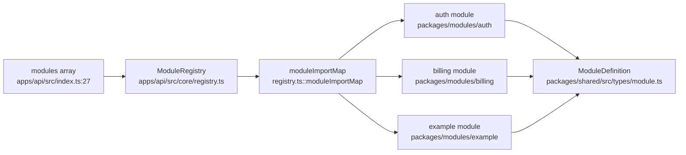
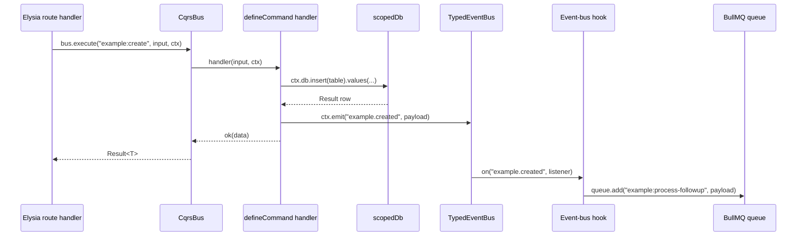
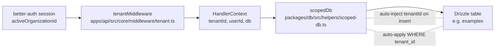

# Architecture Overview

This document describes the backend architecture of Baseworks — module system, CQRS flow, request lifecycle, and tenant scoping. Each subsystem is illustrated with one Mermaid diagram using concrete code identifiers so readers can grep for the names in the source tree.

---

## Audience and prerequisites

This document assumes familiarity with Elysia, Drizzle, and BullMQ. Every example cites the source file it describes. The full stack overview with version pins and alternatives considered lives in the project root `CLAUDE.md` §"Technology Stack".

## 1. Module system

Every subsystem beyond core infrastructure is a **module**. A module is a `ModuleDefinition` (see `packages/shared/src/types/module.ts`) exporting routes, CQRS commands, CQRS queries, BullMQ jobs, and a list of emitted event names. The `ModuleRegistry` (`apps/api/src/core/registry.ts`) loads each module declared in the `modules: []` array in `apps/api/src/index.ts:27` and `apps/api/src/worker.ts:23`.



### What a module contributes

A `ModuleDefinition` (see `packages/shared/src/types/module.ts`) may contribute up to five surfaces:

- **`routes`** — Elysia plugin factory or plugin instance providing HTTP routes.
- **`commands`** — Map of namespaced command names (e.g., `"example:create"`) to validated `CommandHandler` functions.
- **`queries`** — Map of namespaced query names to validated `QueryHandler` functions.
- **`jobs`** — Map of job names to `JobDefinition { queue, handler }` for BullMQ worker registration.
- **`events`** — List of domain event names the module may emit through `TypedEventBus`.

### How modules are registered

The static import map at `apps/api/src/core/registry.ts::moduleImportMap` declares the known module IDs and their `import()` callbacks. Bun statically analyzes these imports — there is no string-interpolated dynamic loading. The active modules for a process are listed in `apps/api/src/index.ts:25-28` (API role) and `apps/api/src/worker.ts:20-24` (worker role). `registry.loadAll()` iterates each configured module, imports it, and registers its commands and queries into the `CqrsBus`.

### Adding a module

See [add-a-module.md](./add-a-module.md) for the annotated walkthrough of `packages/modules/example`.

## 2. CQRS flow

Incoming requests dispatch to command or query handlers through a typed bus (`CqrsBus` in `apps/api/src/core/cqrs.ts`). Commands mutate state and may emit domain events through `TypedEventBus` (`apps/api/src/core/event-bus.ts`). Queries return `Result<T>` without side effects.



### HandlerContext

`HandlerContext` is defined in `packages/shared/src/types/cqrs.ts::HandlerContext` (lines 20-31). It is the contract every command and query handler consumes.

```typescript
// From packages/shared/src/types/cqrs.ts:20-31
export interface HandlerContext {
  tenantId: string;
  userId?: string;
  db: any;
  emit: (event: string, data: unknown) => void;
  enqueue?: (job: string, data: unknown) => Promise<void>;
}
```

The `enqueue` field is declared optional and is NOT populated by the live API derive at `apps/api/src/index.ts:104-118` (only `tenantId`, `userId`, `db`, and `emit` are present at runtime). It is a reserved type slot for a future direct-enqueue pathway. Today, command handlers emit a domain event and a module-owned hook on the event bus performs the actual `queue.add(...)` — see `docs/integrations/bullmq.md` §"Wiring in Baseworks" and `packages/modules/example/src/hooks/on-example-created.ts` for the reference implementation.

### Queries vs commands

`defineCommand` and `defineQuery` (both in `packages/shared/src/types/cqrs.ts`) return `Promise<Result<T>>` and share the same input-validation pipeline built on TypeBox. Commands may emit events through `ctx.emit` and — indirectly, via an event-bus hook listening on that event — trigger BullMQ enqueues; queries have no side effects. `CqrsBus.execute` dispatches commands by namespaced key; `CqrsBus.query` dispatches queries.

## 3. Request lifecycle

Every HTTP request passes through a fixed middleware chain declared in `apps/api/src/index.ts`. The chain captures error handling, request tracing, locale, CORS, auth, tenant resolution, and finally the handler context that module routes consume.

```mermaid
flowchart TD
  Req[HTTP Request] --> EM[errorMiddleware<br/>apps/api/src/core/middleware/error.ts]
  EM --> RT[requestTraceMiddleware<br/>request-trace.ts]
  RT --> LM[localeMiddleware<br/>packages/modules/auth/src/locale-context.ts]
  LM --> CR[cors<br/>@elysiajs/cors]
  CR --> AR[auth routes<br/>better-auth .mount]
  AR --> TM[tenantMiddleware<br/>apps/api/src/core/middleware/tenant.ts]
  TM --> DV[derive handlerCtx<br/>tenantId, userId, db, emit]
  DV --> MR[module routes]
  MR --> Bus[CqrsBus.execute / CqrsBus.query]
```

Each middleware in the chain, in order:

- **`errorMiddleware`** (`apps/api/src/core/middleware/error.ts`) — Global exception handler; registered first so every downstream throw is formatted consistently.
- **`requestTraceMiddleware`** (`apps/api/src/core/middleware/request-trace.ts`) — Generates a `requestId`, logs method/path/status/duration through pino.
- **`localeMiddleware`** (`packages/modules/auth/src/locale-context.ts`) — Reads the `NEXT_LOCALE` cookie into AsyncLocalStorage so auth callbacks can resolve the request locale.
- **`cors`** (`@elysiajs/cors`) — Configured with `credentials: true` and an allowlist of `WEB_URL` + `ADMIN_URL`.
- **auth routes** (`apps/api/src/index.ts:101`) — better-auth handler mounted via `.use(authRoutes)` before tenant middleware so signup, login, and OAuth callbacks do not require tenant context.
- **`tenantMiddleware`** (`apps/api/src/core/middleware/tenant.ts`) — Derives `tenantId` from `session.activeOrganizationId` and attaches `tenantId`, `userId`, `user`, `session` to the Elysia scope.
- **derive `handlerCtx`** (`apps/api/src/index.ts:104-118`) — Builds the `HandlerContext { tenantId, userId, db: scopedDb(db, tenantId), emit }` consumed by module route handlers.
- **module routes** — Loaded via `registry.getModuleRoutes()` and Elysia `.use()` chaining so Eden Treaty preserves end-to-end type inference.

## 4. Tenant scoping

Tenant isolation is enforced by `scopedDb` (`packages/db/src/helpers/scoped-db.ts`). The wrapper auto-injects `tenantId` into INSERTs and auto-applies `WHERE tenant_id = ?` to SELECTs, UPDATEs, and DELETEs. Row-level security at the PostgreSQL layer is available if ever required but is NOT currently used (per CLAUDE.md).



### Why scopedDb over RLS

Application-level enforcement is easier to test, debug, and mock than PostgreSQL row-level security. The `scopedDb` implementation in `packages/db/src/helpers/scoped-db.ts` is small enough to audit at a glance and produces SQL identical to what a handler would write by hand with an explicit `tenantId` predicate. Unit tests mock it through the Phase 14 `createMockDb()` helper without touching a real database.

### Bypass (admin routes)

`packages/db/src/helpers/unscoped-db.ts` exposes the raw Drizzle client for admin routes that must cross tenant boundaries (e.g., listing every tenant for the owner dashboard). Never import `unscoped-db.ts` from a module command or query — tenant isolation is a correctness requirement for module code, and `ctx.db` is the only supported access path.

## Next steps

- [Add a module](./add-a-module.md) — hands-on walkthrough of the module system using `packages/modules/example`.
- [Configuration](./configuration.md) — module loading and provider selection.
- [Testing](./testing.md) — how the CQRS bus and `HandlerContext` are mocked in unit tests.
- Integration docs under [integrations/](./integrations/) for better-auth, billing, BullMQ, and email.
