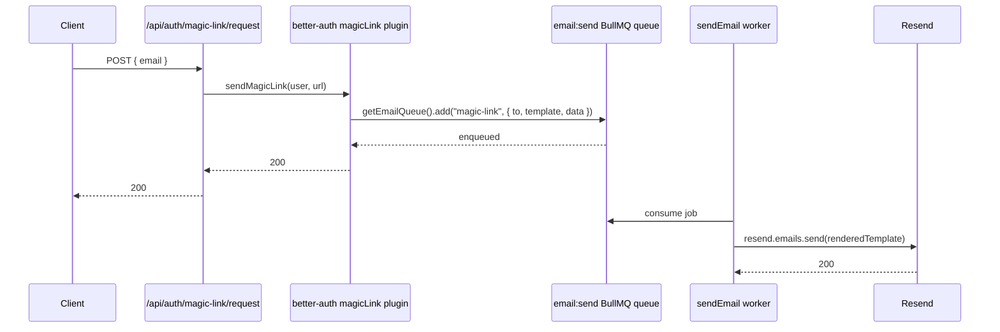

# better-auth

## Overview

better-auth provides email/password authentication, OAuth providers, magic-link sign-in, and an organization plugin that powers Baseworks' multitenancy. Configuration lives in `packages/modules/auth/src/auth.ts`. Sessions are database-backed via the Drizzle adapter so revocation is immediate. The magic-link and password-reset flows enqueue a job to the `email:send` BullMQ queue rather than calling Resend inline.

## Upstream Documentation

- [better-auth official documentation](https://www.better-auth.com)
- [better-auth Drizzle adapter](https://www.better-auth.com/docs/adapters/drizzle)
- [better-auth organization plugin](https://www.better-auth.com/docs/plugins/organization)
- [better-auth magic-link plugin](https://www.better-auth.com/docs/plugins/magic-link)

## Setup

### Env vars

| Env var | Required | Purpose |
| --- | --- | --- |
| `BETTER_AUTH_SECRET` | yes | Session signing secret. Zod enforces `min(32)`; shorter values fail env validation at startup. |
| `BETTER_AUTH_URL` | no (default `http://localhost:3000`) | Public base URL. Used in magic-link callbacks and OAuth redirects. |
| `GOOGLE_CLIENT_ID` / `GOOGLE_CLIENT_SECRET` | no | Enable Google OAuth. Both must be set; presence of only one does not register the provider. |
| `GITHUB_CLIENT_ID` / `GITHUB_CLIENT_SECRET` | no | Enable GitHub OAuth. Same pairing rule as Google. |

Full env reference: [configuration.md](../configuration.md).

### Module wire-up

The exported `auth` instance in `packages/modules/auth/src/auth.ts::auth` is consumed by `packages/modules/auth/src/routes.ts`, which mounts it via `.mount(auth.handler)` — without a prefix, per the basePath gotcha below. The auth module is listed in the `modules` array in `apps/api/src/index.ts:27` and in the worker entrypoint `apps/api/src/worker.ts:23`. Registration happens automatically through `ModuleRegistry.loadAll()` — no separate wire-up call is required.

### Smoke test

```bash
curl -X POST http://localhost:3000/api/auth/sign-up/email \
  -H "Content-Type: application/json" \
  -d '{"email":"test@example.com","password":"test-password-123","name":"Test User"}'
```

A 200 response with a session cookie confirms the handler is reachable and the database is wired. A 404 almost always indicates the `basePath` doubling gotcha described below.

## Wiring in Baseworks

`betterAuth(...)` is configured in `packages/modules/auth/src/auth.ts:58-177`. The config uses `drizzleAdapter(db, { provider: "pg" })` against `packages/db`, conditionally registers `socialProviders` based on env var presence, enables email/password with `minPasswordLength: 8`, and enables the `magicLink` and `organization` plugins. Sessions are database-backed (not JWT) so revocation propagates immediately; `expiresIn` is 7 days and `updateAge` refreshes the session every 24 hours. A `databaseHooks.user.create.after` hook auto-creates a personal organization (tenant) for every new user so every account belongs to at least one tenant from signup.

The magic-link flow does not send email inline. The `sendMagicLink` callback enqueues onto `email:send` and returns; the worker process consumes the job, renders the template, and calls Resend:



The password-reset enqueue mirrors the same pattern — see `packages/modules/auth/src/auth.ts:70-82` for the `sendResetPassword` call site. Both magic-link and password-reset reuse the `PasswordResetEmail` React Email component (the template map aliases `magic-link` to that component with an aliased `userName` field). See [email.md](./email.md) for template details.

## Gotchas

- **basePath doubling.** `betterAuth({ basePath: "/api/auth" })` already carries the prefix. Mount via `.mount(auth.handler)` WITHOUT an Elysia `prefix`. Prefixing produces `/api/auth/api/auth/*` routes and every request returns 404 — source: `packages/modules/auth/src/auth.ts:54-57` documents the invariant inline.
- **OAuth providers silently absent.** `socialProviders` is built conditionally from `env.GOOGLE_CLIENT_ID` and `env.GITHUB_CLIENT_ID` presence (`auth.ts:29-43`). If a provider fails to appear in the UI, confirm BOTH the client ID and the secret env vars are set; TypeScript's `!` non-null assertion does not create the secret at runtime.
- **Graceful email fallback without Redis.** When `REDIS_URL` is absent (dev without Docker), `getEmailQueue()` returns `null` and `sendResetPassword` / `sendMagicLink` write the reset URL to stdout instead of sending email (`auth.ts:70-82`, `auth.ts:127-138`). This is intentional for local development. Never rely on it in production — deployments must set `REDIS_URL` and `RESEND_API_KEY`.

## Extending

### Add another OAuth provider

better-auth exposes an extensible `socialProviders` option plus a plugin system for providers beyond Google and GitHub. To add a new provider, extend `socialProviders` in `packages/modules/auth/src/auth.ts:29-43` following the conditional pattern:

1. Add the provider-specific env vars (e.g., `DISCORD_CLIENT_ID`, `DISCORD_CLIENT_SECRET`) to `packages/config/src/env.ts` as optional strings.
2. Add a new conditional block after the GitHub branch that populates `socialProviders.discord = { clientId, clientSecret }` when both env vars are set.
3. Ensure the redirect URI configured in the provider's developer console matches `BETTER_AUTH_URL` + the provider-specific callback path. better-auth documents the exact callback shape per provider.

Provider-specific options (scopes, profile mapping, PKCE settings) are documented by better-auth — see [better-auth social providers docs](https://www.better-auth.com/docs/authentication/social). Do not re-document upstream options here; cite the upstream page and link from this doc if a deployment needs a non-default scope set.

## Security

- `BETTER_AUTH_SECRET` is validated as `z.string().min(32)` in `packages/config/src/env.ts:17`. Shorter values fail startup.
- Sessions are database-backed via the Drizzle adapter — revocation via `auth.api.revokeSession` propagates immediately; there is no JWT expiry window to wait out.
- `trustedOrigins` is derived from `env.WEB_URL` and `env.ADMIN_URL` (`auth.ts:62`). OAuth callbacks and CORS-sensitive sign-ins only accept redirects to these origins.
- `minPasswordLength: 8` is enforced by better-auth on every sign-up and password change.
- Cross-origin requests use CORS configured in `apps/api/src/index.ts`; the auth routes are mounted BEFORE the tenant middleware so unauthenticated sign-in and sign-up are allowed.

## Next steps

- [Billing integration](./billing.md) — auth emits `tenant.created`; billing listens and provisions a provider customer record.
- [Email integration](./email.md) — the Resend dispatcher that magic-link and password-reset enqueue into.
- [Configuration](../configuration.md) — full env reference including `BETTER_AUTH_SECRET`, `WEB_URL`, `ADMIN_URL`, and the OAuth client pairs.
