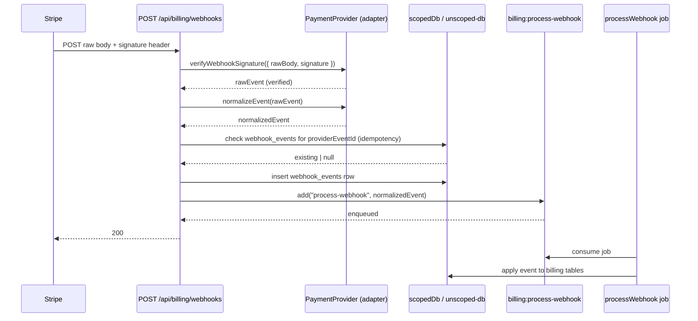

# Billing

## Overview

Baseworks supports Stripe and Pagar.me through a port-and-adapter pattern. The `PaymentProvider` port declares the full contract (13 members: 12 methods plus one readonly `name` property); each adapter translates it to its SDK. A factory selects the adapter at runtime based on the `PAYMENT_PROVIDER` env var. Every command handler and the webhook route obtain their provider through `getPaymentProvider()`, never through an SDK import, which keeps the billing module provider-agnostic at the call site.

## Upstream Documentation

- [Stripe API reference](https://stripe.com/docs)
- [Stripe webhooks](https://stripe.com/docs/webhooks)
- [Pagar.me documentation](https://docs.pagar.me)
- [Stripe Node SDK](https://github.com/stripe/stripe-node)

## Setup

### Env vars

| Env var | Required | Purpose |
| --- | --- | --- |
| `PAYMENT_PROVIDER` | no (default `stripe`) | Enum `stripe` / `pagarme`. Selects the adapter instantiated by `getPaymentProvider`. |
| `STRIPE_SECRET_KEY` | conditional | Required when `PAYMENT_PROVIDER=stripe` in non-test environments. `validatePaymentProviderEnv` throws at startup when missing. |
| `STRIPE_WEBHOOK_SECRET` | yes in production | Webhook signature verification key. Absence in production is a fatal startup error. |
| `PAGARME_SECRET_KEY` | conditional | Required when `PAYMENT_PROVIDER=pagarme` in non-test environments. |
| `PAGARME_WEBHOOK_SECRET` | yes in production (pagarme) | Pagar.me webhook signature key. |

See [configuration.md](../configuration.md) for the full schema and `validatePaymentProviderEnv` enforcement rules.

### Module wire-up

The billing module is listed in the `modules` array in both `apps/api/src/index.ts:27` and `apps/api/src/worker.ts:23`. Registration happens automatically via `ModuleRegistry.loadAll()` — the module's `routes`, commands, queries, and `jobs` map are all wired by the registry. The auth-to-billing hook is registered at API startup via `registerBillingHooks(registry.getEventBus())`.

### Smoke test

```bash
bun api
# In another shell, after signing in via /api/auth/sign-in/email:
curl http://localhost:3000/api/billing/subscription \
  -b "better-auth.session_token=<paste session cookie>"
```

A `Result` JSON envelope with `success: true` and subscription data for the authenticated tenant confirms the adapter is reachable, the provider factory resolved, and the tenant middleware derived `tenantId` correctly. A 400 typically indicates the active provider is Stripe but `STRIPE_SECRET_KEY` is missing — see `validatePaymentProviderEnv`.

## Wiring in Baseworks

### PaymentProvider port

The port is declared in `packages/modules/billing/src/ports/payment-provider.ts:38-159`. It declares 13 members: 12 methods plus one readonly `name` property. Grouped by concern: provider identity (`name`), customer lifecycle (`createCustomer`), subscription lifecycle (`createSubscription`, `cancelSubscription`, `changeSubscription`, `getSubscription`), checkout (`createCheckoutSession`, `createOneTimePayment`), portal (`createPortalSession`), webhooks (`verifyWebhookSignature`, `normalizeEvent`), invoices (`getInvoices`), and an optional `reportUsage` for providers that support metered billing. Every adapter implements these as `implements PaymentProvider`, so the TypeScript compiler enforces that new adapters cover the full port. The test utility at `packages/modules/__test-utils__/mock-payment-provider.ts:5` documents the same count ("all 13 interface methods").

### Provider factory

The singleton factory lives at `packages/modules/billing/src/provider-factory.ts::getPaymentProvider`. It is lazy: the first call branches on `env.PAYMENT_PROVIDER` and instantiates the matching adapter (`StripeAdapter` or `PagarmeAdapter`), validating that the adapter's required secrets are present at instantiation time. Subsequent calls return the cached instance. `resetPaymentProvider()` and `setPaymentProvider(provider)` exist for tests (see [testing.md](../testing.md) §"Testing adapters and handlers that import external SDKs").

### Adapters

- `packages/modules/billing/src/adapters/stripe/stripe-adapter.ts` implements the port against the `stripe` SDK.
- `packages/modules/billing/src/adapters/pagarme/pagarme-adapter.ts` implements the port against Pagar.me's HTTP API.

Each adapter directory also contains a `*-webhook-mapper.ts` that normalizes provider-specific webhook payloads into the Baseworks canonical `NormalizedEvent` shape. Keeping the mapper alongside the adapter lets provider quirks stay localized to one directory.

### Webhook flow

Webhook requests are handled by the `POST /api/billing/webhooks` route in `packages/modules/billing/src/routes.ts:52-114`. The route is mounted WITHOUT `tenantMiddleware` because the tenant is derived from the event payload, not from a session. Signature verification runs FIRST on the raw request body — before any parsing, before any idempotency check.



Cite `packages/modules/billing/src/routes.ts:52-114` for the verbatim route implementation.

### Auth to Billing hook

`packages/modules/billing/src/hooks/on-tenant-created.ts::registerBillingHooks` registers a `tenant.created` listener on the `TypedEventBus`. The listener calls `provider.createCustomer(...)` and inserts a `billing_customers` row linking the tenant to the provider customer ID. Registration happens at API startup (`apps/api/src/index.ts`). If the active provider's secret is absent (test environments), the listener logs and returns without throwing — same graceful-skip pattern used elsewhere in the codebase.

## Gotchas

- **Webhook signature verification must run before body parsing.** The route reads the raw request body via `ctx.request.clone().text()` and passes it to `provider.verifyWebhookSignature`. If Elysia auto-parses JSON before the handler runs, signature verification fails because the HMAC is computed from a reformatted body. The current route clones the request explicitly to side-step Elysia's auto-parse.
- **Idempotency is not optional.** Providers re-deliver webhooks on transient failure. The `webhook_events` table stores each `providerEventId` with a status; a duplicate delivery short-circuits with `{ received: true }` and status 200. The enqueue also uses `providerEventId` as the BullMQ `jobId` so duplicate enqueues dedupe at the queue level.
- **No tenant middleware on the webhook route.** Webhooks originate from the provider, not from a tenant session. Tenant context is derived from the webhook payload — the adapter's normalizer maps the provider customer ID to a tenant via `billing_customers`. Do not try to reuse `tenantMiddleware` on this route.
- **Test-mode validation is lenient.** `validatePaymentProviderEnv` warns instead of throwing when `NODE_ENV=test`, so the test runner can import the billing module without real keys. Production MUST have the active provider's key set; `packages/config/src/env.ts:49-84` documents the symmetric Stripe/Pagar.me enforcement.

## Extending

### Add a third payment provider

The canonical example for adding a provider is how Pagar.me was added alongside Stripe. Repeat the same six steps for your target provider:

1. Implement the `PaymentProvider` port in `packages/modules/billing/src/adapters/{provider}/{provider}-adapter.ts`. All 13 members (12 methods plus the readonly `name` property) must be implemented — the TypeScript compiler enforces coverage via `implements PaymentProvider`. Reference: `packages/modules/billing/src/adapters/pagarme/pagarme-adapter.ts`.
2. Implement a webhook mapper in `packages/modules/billing/src/adapters/{provider}/{provider}-webhook-mapper.ts`. The mapper normalizes provider-specific webhook payloads into the canonical `NormalizedEvent` shape. Reference: `pagarme-webhook-mapper.ts`.
3. Add the provider name to the `PAYMENT_PROVIDER` Zod enum in `packages/config/src/env.ts:23`, and add `{PROVIDER}_SECRET_KEY` and `{PROVIDER}_WEBHOOK_SECRET` as optional strings.
4. Extend `validatePaymentProviderEnv` in `packages/config/src/env.ts:49-84` with a new conditional branch mirroring the Stripe/Pagar.me branches — test mode warns, non-test throws.
5. Register the new adapter in `packages/modules/billing/src/provider-factory.ts::getPaymentProvider` with a new `case` that validates the provider's secrets and returns a new adapter instance.
6. Write a conformance test at `packages/modules/billing/src/__tests__/{provider}-adapter.test.ts` asserting every port method round-trips against mocked SDK responses. Reference template: `packages/modules/billing/src/__tests__/pagarme-adapter.test.ts`.

No existing call site in the billing module needs to change — every command and the webhook route obtain the provider through `getPaymentProvider()`.

## Security

- Webhook handlers MUST call `provider.verifyWebhookSignature(...)` as the FIRST operation on the raw request body. A rejected signature returns 400. The current route implementation enforces this.
- Idempotency prevents double-applying events on provider re-delivery. The `webhook_events` table's `providerEventId` unique constraint and the BullMQ `jobId` dedup are both active.
- Webhook routes are exempt from `tenantMiddleware` — tenant resolution happens after signature verification and event normalization, not from a session.
- Real API keys and webhook secrets are never committed. All env examples use placeholders (see [configuration.md](../configuration.md)).

## Next steps

- [better-auth integration](./better-auth.md) — billing hooks into the `tenant.created` event emitted by the auth module.
- [BullMQ integration](./bullmq.md) — `billing:process-webhook` is a standard BullMQ queue using the shared `createQueue` helper.
- [Testing](../testing.md) — adapter conformance test pattern and the `mock.module` approach for handlers that import external SDKs.
