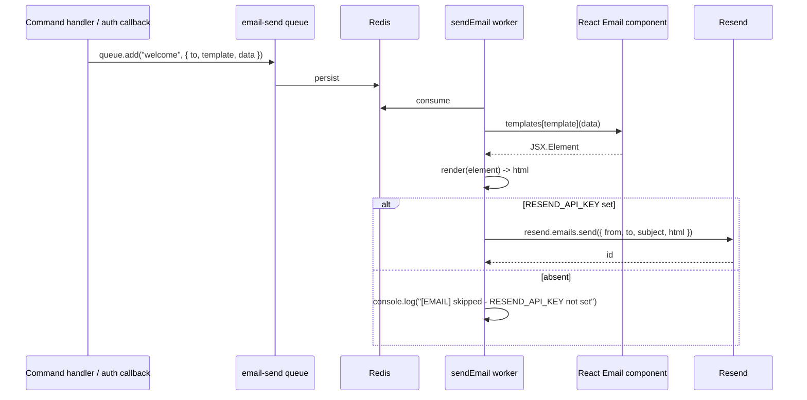

# Email

## Overview

Baseworks sends transactional email through Resend using React Email templates. A single dispatcher job (`packages/modules/billing/src/jobs/send-email.ts`) routes a template name to a React Email component, renders it to HTML with `@react-email/components`, and calls `resend.emails.send(...)`. Every caller — auth password resets, magic links, team invitations, billing notifications — enqueues onto the `email-send` BullMQ queue rather than calling Resend inline. The dispatcher gracefully skips sending when `RESEND_API_KEY` is absent so development and tests work without a real key.

## Upstream Documentation

- [Resend documentation](https://resend.com/docs)
- [Resend Node SDK](https://github.com/resend/resend-node)
- [React Email](https://react.email)

## Setup

### Env vars

| Env var | Required | Purpose |
| --- | --- | --- |
| `RESEND_API_KEY` | no | Resend API key. When absent, the dispatcher logs and returns without throwing (dev and test). Production deployments must set this for users to receive email. |
| `REDIS_URL` | yes (for enqueuing) | Required for the `email-send` queue. Without Redis, callers fall back to stdout logs rather than enqueuing. |

### Module wire-up

The dispatcher lives in the billing module at `packages/modules/billing/src/jobs/send-email.ts` and is registered in the billing `ModuleDefinition.jobs` map under the `email-send` queue. The worker entrypoint (`apps/api/src/worker.ts:32-77`) auto-starts a BullMQ worker for `email-send` as part of the normal module-job iteration. Callers — auth, billing, any future module — enqueue via `queue.add("{template-name}", { to, template, data })` and the job crosses the app ↔ Redis boundary into the worker process.

### Smoke test

```bash
bun worker
# From another shell, trigger a password reset:
curl -X POST http://localhost:3000/api/auth/forget-password \
  -H "Content-Type: application/json" \
  -d '{"email":"test@example.com"}'
```

The worker logs `Job started` for `email-send` and then either calls Resend (when `RESEND_API_KEY` is set) or logs `[EMAIL] Skipping send (no RESEND_API_KEY)` and returns — see `packages/modules/billing/src/jobs/send-email.ts:135-138` for the graceful-skip branch.

## Wiring in Baseworks

### Dispatcher

The handler in `packages/modules/billing/src/jobs/send-email.ts` accepts `{ to, template, data, locale? }`, looks up the React Email component in the `templates` map, calls `render()` to produce HTML, and invokes `resend.emails.send({ from, to, subject, html })`. When `env.RESEND_API_KEY` is absent the handler logs and returns without calling Resend — dev and test paths both rely on this. The `team-invite` template is the one exception: it pre-resolves i18n strings via `@baseworks/i18n` before rendering (see `send-email.ts::resolveTeamInvite`).

### Template map

```typescript
// From packages/modules/billing/src/jobs/send-email.ts:15-24
const templates: Record<string, (data: any) => JSX.Element> = {
  "welcome": (data) => WelcomeEmail(data),
  "password-reset": (data) => PasswordResetEmail(data),
  "magic-link": (data) => PasswordResetEmail({ ...data, userName: data.email }),
  "billing-notification": (data) => BillingNotificationEmail(data),
  "team-invite": (data) => TeamInviteEmail(data),
};
```

The `magic-link` entry reuses the `PasswordResetEmail` component with an aliased `userName` field — a dev convenience until visual differentiation is needed. `team-invite` pre-resolves its translated strings in the enqueuing context; the other templates receive raw data and resolve strings at render time.

### Flow



Cite `packages/modules/billing/src/jobs/send-email.ts` for the full dispatcher implementation.

### Existing templates

| Template | File |
| --- | --- |
| `welcome` | `packages/modules/billing/src/templates/welcome.tsx` |
| `password-reset` | `packages/modules/billing/src/templates/password-reset.tsx` |
| `magic-link` (alias of password-reset) | same file |
| `billing-notification` | `packages/modules/billing/src/templates/billing-notification.tsx` |
| `team-invite` | `packages/modules/billing/src/templates/team-invite.tsx` |

### Call-site example

```typescript
// From packages/modules/auth/src/auth.ts:70-82 — password reset enqueue
const queue = getEmailQueue();
if (queue) {
  await queue.add("password-reset", {
    to: user.email,
    template: "password-reset",
    data: { url, userName: user.name },
  });
}
```

## Gotchas

- **Graceful skip when `RESEND_API_KEY` is absent.** The dispatcher returns `void` without error when the key is missing. This is intentional for dev and test. Production deployments must set `RESEND_API_KEY` or users will never receive email — there is no log-level alarm for this, so treat it as a deployment-checklist item.
- **i18n pre-resolution for team-invite.** Unlike other templates, `team-invite` has its i18n strings pre-resolved in the enqueuing context via `@baseworks/i18n` and `AsyncLocalStorage`-backed locale context. The props passed into `TeamInviteEmail` are already translated — do not call i18n lookups inside the React Email component. `resolveTeamInvite` in `send-email.ts:55-107` owns the resolution.
- **Template name is both a template lookup key and the BullMQ job name.** `queue.add("welcome", { to, template: "welcome", ... })` passes the same string twice — first as the BullMQ job name (shown in metrics and logs), second as the `template` field in the payload (used by the dispatcher to look up the component). Keep them identical to avoid a mismatch where metrics show `welcome` but the dispatcher renders the wrong template.
- **Magic-link reuses the password-reset component.** The templates map aliases `magic-link` to `PasswordResetEmail` with an aliased `userName` field set from the recipient email. A dedicated `MagicLinkEmail` component can replace it when visual differentiation is required; the aliasing is a convenience, not a contract.

## Extending

### Add a new email template

1. Create a React Email component in `packages/modules/billing/src/templates/{name}.tsx`. Reference: `welcome.tsx` (simplest) or `team-invite.tsx` (with pre-resolved i18n strings).
2. Add entries to BOTH the `templates` map and the `subjects` map in `packages/modules/billing/src/jobs/send-email.ts:15-35`. Both entries use the template name as the key; the dispatcher looks up the component and the subject line separately but by the same key.
3. Enqueue from the call site: `await queue.add("{name}", { to, template: "{name}", data: { ... } })`. Reference call site: `packages/modules/auth/src/auth.ts:70-82` for the password-reset pattern.
4. Validate by enqueuing from a scratch script or a real flow and running `bun worker`. With `RESEND_API_KEY` unset, check the graceful-skip log line for confirmation the dispatcher received the job; with `RESEND_API_KEY` set, check a real Resend inbox for the rendered email.

If the template needs localized strings, follow the team-invite pattern: extend `resolveTeamInvite` into a generic `resolve{Template}` function, pre-resolve translations in the dispatcher before `render()`, and keep the React Email component a pure presentation layer.

## Security

- `RESEND_API_KEY` is a secret. Documentation examples use placeholder shapes only; real keys are configured per-environment in the deployment's env. Never commit a real key.
- Template data crosses the app ↔ Redis boundary via the job payload. Validate payload fields before rendering. React Email escapes text nodes by default, but raw HTML passed via `dangerouslySetInnerHTML` bypasses this — do not echo untrusted input through that path.
- The `from` address is configured at the Resend account level. Ensure your sending domain is verified in Resend before production; unverified domains deliver poorly and expose the deployment to spoofing vectors.

## Next steps

- [BullMQ integration](./bullmq.md) — the `email-send` queue uses the standard BullMQ `createQueue` / `createWorker` conventions.
- [better-auth integration](./better-auth.md) — auth's `sendResetPassword`, `sendMagicLink`, and `sendInvitationEmail` callbacks are the primary enqueue call sites.
- [Add a module](../add-a-module.md) — new modules can enqueue emails the same way using the `email-send` queue.
