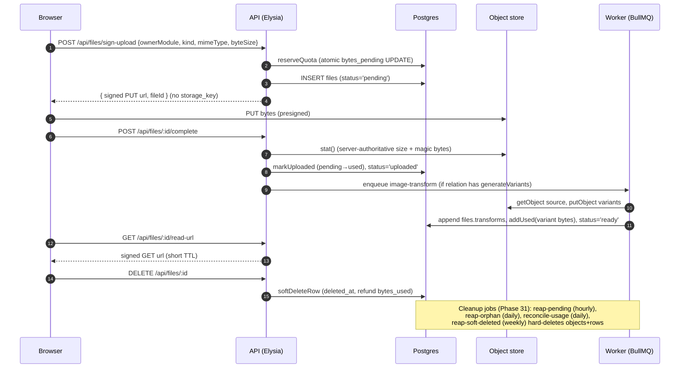

# File Storage & Uploads — integration guide

Phase 31 / OPS-03. Operator-facing guide for the v1.4 file-storage milestone: the
upload lifecycle, per-backend CORS + bucket lifecycle policies, CDN/Cache-Control
guidance, the Docker base-image pin required by `sharp`, and what the storage
health contributor reports.

## 1. Overview

Files live in object storage (S3 / S3-compatible) or local disk (dev only). The
central `files` table is the single source of truth for metadata; per-tenant
`tenant_storage_usage` tracks `bytes_used` / `bytes_pending` against a quota.
Uploads are direct-to-storage via presigned URLs — bytes never transit the API.



## 2. Per-backend CORS templates

Direct browser PUT to the object store requires CORS on the bucket. Ready-to-apply
templates live in [`docs/integrations/file-storage/cors/`](./file-storage/cors/)
(Phase 25), one per backend:

- [`cors/aws-s3.json`](./file-storage/cors/aws-s3.json) — AWS S3
- [`cors/r2.json`](./file-storage/cors/r2.json) — Cloudflare R2
- [`cors/minio.json`](./file-storage/cors/minio.json) — MinIO
- [`cors/garage.json`](./file-storage/cors/garage.json) — Garage

Validate them with `bun run validate-cors`. Key rules:

- **Required methods:** `PUT` (upload) and `GET` (signed read); `HEAD` for `stat`.
- **`ExposeHeaders` must include `ETag`** — the client/SDK reads it to confirm the
  object landed; without it multipart/verification flows break.
- **No wildcard origins in production.** List your exact app + admin origins
  (`WEB_URL`, `ADMIN_URL`). A `"*"` origin with credentials is rejected by browsers
  and leaks your bucket to any site.
- Keep `MaxAgeSeconds` modest (e.g. 3000) so policy changes propagate.

Apply (AWS example): `aws s3api put-bucket-cors --bucket <bucket> --cors-configuration file://docs/integrations/file-storage/cors/aws-s3.json`.

## 3. Bucket lifecycle policies

Two lifecycle rules keep the bucket clean independently of the app's cleanup jobs:

- **Abort incomplete multipart uploads after 7 days** — orphaned multipart parts
  accrue storage cost invisibly.
- **Expire the `tmp/` prefix after 1 day** — scratch/temp objects never need to live
  longer.

AWS S3 lifecycle (`aws s3api put-bucket-lifecycle-configuration`):

```json
{
  "Rules": [
    {
      "ID": "abort-incomplete-multipart-7d",
      "Status": "Enabled",
      "Filter": { "Prefix": "" },
      "AbortIncompleteMultipartUpload": { "DaysAfterInitiation": 7 }
    },
    {
      "ID": "expire-tmp-1d",
      "Status": "Enabled",
      "Filter": { "Prefix": "tmp/" },
      "Expiration": { "Days": 1 }
    }
  ]
}
```

R2 / MinIO / Garage expose the same S3 lifecycle API (`mc ilm` for MinIO). These
rules are storage-side hygiene; the app's `cleanup-reap-*` jobs (§6) handle the
DB-tracked lifecycle (pending, orphan, soft-deleted) and quota reconciliation.

## 4. CDN / Cache-Control guidance

- **Variant objects are content-addressed** (deterministic keys per source +
  spec) — serve them with a long-lived immutable cache:
  `Cache-Control: public, max-age=31536000, immutable`. A new variant gets a new
  key, so there is nothing to invalidate.
- **Signed originals are private** — never cache them at a shared CDN. Use
  `Cache-Control: private, no-store` and rely on the short signed-URL TTL
  (`STORAGE_SIGNED_URL_TTL_SEC`, 5–15 min).
- **CDN in front of signed URLs:** if you must, key the cache on the FULL signed
  query string and set TTL <= the signature lifetime, or you will serve expired or
  cross-tenant URLs. Prefer a CDN only for the public, content-addressed variants.
- Disposition is forced to `attachment` for non-inline types (e.g. SVG) to prevent
  stored-XSS from the storage origin.

## 5. Docker base-image pin (sharp)

The default image-transform provider is **`sharp`**, which needs a **glibc**
runtime. The Phase 28 spike confirmed sharp works under Bun on
**`oven/bun:1-debian-slim`** (Debian/glibc) but **NOT on Alpine/musl** — the
prebuilt native binding will not load on musl.

```dockerfile
# Worker (and API, if it runs transforms) base image — Debian, NOT Alpine.
FROM oven/bun:1-debian-slim
```

If a glibc base is impossible, set `IMAGE_TRANSFORM_PROVIDER=imagescript` to use the
pure-JS fallback (slower, larger output, no native binding). See
[../runbooks/image-transform-failure.md](../runbooks/image-transform-failure.md).

## 6. Storage health contributor

`/health/detailed` (owner / platform-admin gated) includes a `data.storage`
section from the files-module health contributor (Phase 31 / QUO-03, OPS-03):

```
data.storage = {
  status: "healthy" | "degraded" | "unhealthy",
  provider: "local" | "s3" | "s3-compat",
  adapter: { reachable, kind, detail, diskFreePct },   // sanitized; no key/secret
  quota:   { tenantCount, topTenants:[{tenantId,bytesUsed,bytesLimit,pctUsed}],
             tenantsAtWarn, tenantsAtLimit },
  jobs:    [{ name, lastRunAt, status, itemsSwept, durationMs, ageSec, stale }]
}
```

Status rollup: `unhealthy` if `adapter.reachable === false`; `degraded` if local
`diskFreePct < 10`, any job `stale`/`error`, or `tenantsAtLimit > 0`; else
`healthy` (tenants at >=90% are informational — alerted by Sentry, not a health
degrade). The `jobs[]` array is read from the `storage_job_runs` table written by
the worker, so a stopped scheduler shows up as `stale` (`ageSec` past 2× the
expected interval).

### Cleanup-job cron schedule

| Job (queue) | Cadence | Cron | Purpose |
|---|---|---|---|
| `cleanup-reap-pending-uploads` | hourly | `0 * * * *` | delete >1h pending rows, release `bytes_pending` |
| `quota-reconcile-tenant-usage` | daily | `0 2 * * *` | rebuild `bytes_used` from authoritative SUM (drift correction) |
| `cleanup-reap-orphan-files` | daily | `30 3 * * *` | soft-delete files whose owner is definitively gone (backstop) |
| `cleanup-reap-soft-deleted` | weekly | `0 4 * * 0` | hard-delete objects + variants + rows past retention |

Schedules are registered idempotently by the worker via
`queue.upsertJobScheduler` (scheduler id === job name), so redeploys never
duplicate them. Related runbooks:
[storage-quota-exceeded.md](../runbooks/storage-quota-exceeded.md),
[s3-unreachable.md](../runbooks/s3-unreachable.md),
[orphan-files-detected.md](../runbooks/orphan-files-detected.md),
[image-transform-failure.md](../runbooks/image-transform-failure.md).
