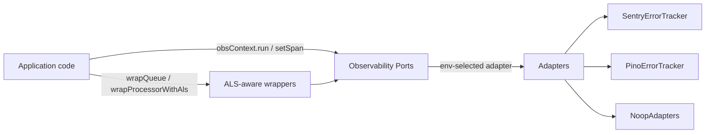

# Observability in Baseworks

Observability in Baseworks is built on a small set of vendor-agnostic ports — `Tracer`, `MetricsProvider`, `ErrorTracker` — wired to env-selected adapters at boot. Adapters today: `SentryErrorTracker` (Sentry + GlitchTip via `kind` tag), `PinoErrorTracker` (default, structured logs), and `NoopAdapters`. Cross-cutting wrappers — `wrapQueue`, `wrapProcessorWithAls`, `wrapCqrsBus` — instrument the BullMQ producer/consumer boundary and the CQRS dispatch path. The unified AsyncLocalStorage carrier `obsContext` (single instance, banned `enterWith` pattern enforced by Biome GritQL since Phase 19) propagates `requestId / traceId / spanId / tenantId / userId / locale` from the Bun.serve fetch boundary through every async hop, including BullMQ jobs via the W3C `traceparent` carrier on `job.data._otel`.

## Where observability lives in the code

## Reading Order

Start with `attributes.md` to learn what context fields exist on every span/log/metric. Read `cardinality.md` next to learn which of those values must NOT become metric labels. Read `trace-propagation.md` last to see the end-to-end flow from HTTP request through CQRS dispatch through Drizzle query through BullMQ enqueue and back to the worker.

## Contents

| Document | Purpose |
| --- | --- |
| [attributes.md](./attributes.md) | Glossary of legitimate context attributes (lives on span/log/metric, type, cardinality risk). |
| [cardinality.md](./cardinality.md) | Cardinality rules + Baseworks-specific high-card values forbidden as metric labels. |
| [trace-propagation.md](./trace-propagation.md) | Single-trace flow API to DB to enqueue to worker (Mermaid). |

## Scope

This directory ships the v1.3 observability concept docs (DOC-04). Operator-facing incident response material lives under [`../runbooks/`](../runbooks/); Sentry alert template JSON lives under [`../alerts/sentry/`](../alerts/sentry/). The wiring guides for self-hosted OTLP exporters and Grafana dashboards are deferred to v1.4+ (Phase 21 deferral, 2026-04-27 — Sentry SaaS substitutes for hosted forks).
