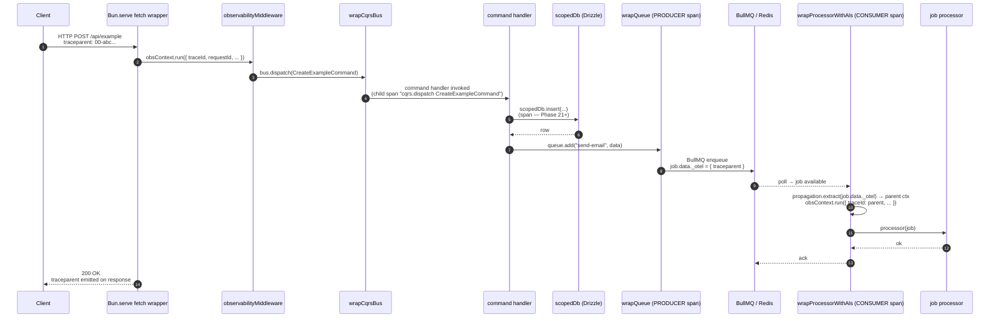
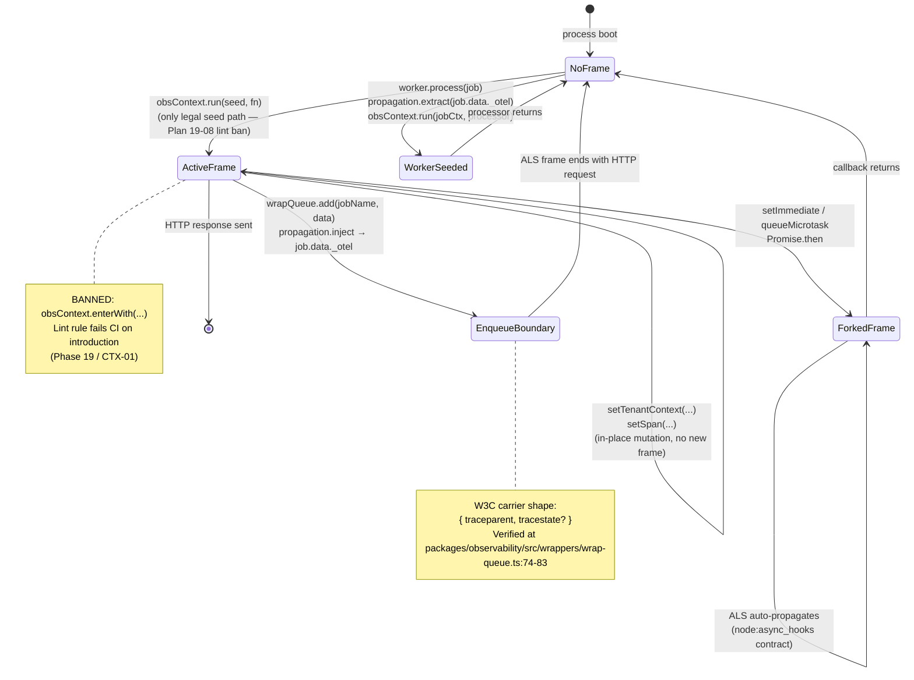

# Trace Propagation in Baseworks

A request enters at the Bun.serve fetch boundary, opens an `obsContext` frame seeded with `traceId / requestId / tenantId / userId`, dispatches a CQRS command, queries the database, enqueues a BullMQ job, and returns. The same `traceId` flows from the HTTP request through to the worker that processes the job. This document maps every hop with verified file:line refs to the v1.3 implementation.

---

## Diagram 1: HTTP request flow



### Walkthrough — HTTP request flow

**Step 2: ObsMW seeds the ALS frame.** The single `obsContext` ALS instance lives at `packages/observability/src/context.ts:57` (`export const obsContext = new AsyncLocalStorage<ObservabilityContext>()`). The Bun.serve fetch wrapper calls `obsContext.run(seed, fn)` exactly once per request — the only legal seed path; the banned `enterWith` form is policed by a Biome GritQL lint rule shipped in Phase 19. Every downstream pino log line, CQRS span, queue producer, and worker consumer reads from this same store via `obsContext.getStore()`.

**Step 3-4: CqrsBus opens a child span.** `wrapCqrsBus` (Phase 18 D-01) is an external wrapper around the registry's `CqrsBus` instance. Each `bus.dispatch(...)` call opens a `cqrs.dispatch <CommandName>` span before invoking the handler, surfaces thrown exceptions to the active `ErrorTracker`, and closes the span on return. The same wrapper is in place for the `EventBus` (`wrapEventBus`).

**Step 5-6: Drizzle queries.** `scopedDb` (the tenant-scoped Drizzle wrapper) is the standard DB call site. v1.3 ships without OTEL DB spans (TRC-future-01 deferred); when wired in v1.4+, the spans will inherit the request's `traceId` automatically because Drizzle queries run inside the same ALS frame.

**Step 7-8: wrapQueue injects the W3C carrier.** When a handler calls `queue.add(jobName, data, opts)`, `wrapQueue` opens a PRODUCER span via `@opentelemetry/api`, injects the W3C `traceparent` (and `tracestate` when present) into a fresh `_otel` envelope on `job.data`, and copies `requestId / tenantId / userId` to flat top-level fields on the job data. Verified at `packages/observability/src/wrappers/wrap-queue.ts:74-83`:

```typescript
// From packages/observability/src/wrappers/wrap-queue.ts:74-83
    const carrier: Record<string, string> = {};
    propagation.inject(trace.setSpan(context.active(), span), carrier);

    const dataWithCarrier = {
      ...data,
      _otel: carrier,
      _requestId: store.requestId,
      _tenantId: store.tenantId,
      _userId: store.userId,
    };
```

When no `obsContext` frame is active (D-09 short-circuit at `packages/observability/src/wrappers/wrap-queue.ts:55-59`), `wrapQueue` calls the underlying `origAdd` unwrapped — no span, no carrier, no orphan-trace span pointing at nothing.

**Step 9-11: Worker extracts and re-seeds.** `wrapProcessorWithAls` lives at `packages/queue/src/index.ts:85-130`. On each job invocation it:

1. Reads `job.data._otel ?? {}` (defensive — workers tolerate carrier-less jobs).
2. Calls `propagation.extract(ROOT_CONTEXT, carrierIn)` to reconstruct the producer trace context. When the carrier is absent or malformed, `extract` returns `ROOT_CONTEXT` unchanged → the consumer span opens with no parent (Phase 19 fresh-fallback).
3. Opens a `<queueName> process` CONSUMER span via `context.with(parentCtx, () => tracer.startSpan(...))` so the consumer's `traceId` inherits the producer's when available; the `spanId` is fresh per attempt (D-10 — retries produce sibling consumer spans under one producer parent).
4. Calls `obsContext.run(jobCtx, () => processor(job, token))` to seed the ALS frame for the job's lifetime, with `_tenantId / _userId / _requestId` lifted from the carrier and `traceId / spanId` taken from the new consumer span's `SpanContext`.

---

## Diagram 2: ALS lifecycle



### Walkthrough — ALS lifecycle

**Legal-seed-only invariant.** The `obsContext` store is opened exclusively via `obsContext.run(seed, fn)` — the Bun.serve fetch wrapper for HTTP requests, the central `createWorker` (`packages/queue/src/index.ts:148-160`) for BullMQ jobs. The banned `obsContext.enterWith(...)` form would dangle a frame across unrelated async work; Phase 19 ships a Biome GritQL lint rule that fails CI on any introduction of `enterWith`, with `setTenantContext / setSpan / setLocale` as the three sanctioned in-place mutators (`packages/observability/src/context.ts:75-113`). In-place mutation does not open a new frame; the same store object the seed referenced is updated in place.

**W3C carrier shape.** The W3C trace-context spec defines a 4-segment ASCII string at the `traceparent` key: `version-traceId-spanId-flags`. Baseworks's producer writes it via `propagation.inject(trace.setSpan(context.active(), span), carrier)` (verified at `packages/observability/src/wrappers/wrap-queue.ts:74-83` above); `tracestate` is populated only when an upstream caller forwarded one. The consumer reads both keys back via `propagation.extract`. The carrier shape is enforced by `@opentelemetry/api`, not custom code — Baseworks does not parse the strings directly.

**Fork → restore lifecycle.** Inside an active ALS frame, any standard async hop — `setImmediate`, `queueMicrotask`, `Promise.then`, `await`, BullMQ callbacks running off the producer's call stack — auto-propagates the frame because `node:async_hooks` (the runtime contract Bun's ALS implementation honors) carries the store across the boundary. The frame closes when its outermost callback returns; the next request opens a fresh frame. There is no shared mutable state between frames. The HTTP frame ends when the response is sent; the worker frame ends when the processor returns. The two never overlap — the carrier on `job.data._otel` is the only continuity, and it carries trace identity (a string), not context state (no closures, no references).

---

## Cross-references

- [attributes.md](./attributes.md) — the canonical field shape for every value carried in `obsContext`.
- [cardinality.md](./cardinality.md) — `traceId / spanId / requestId` are HIGH-cardinality and never become metric labels.
- [../runbooks/otel-exporter-failing.md](../runbooks/otel-exporter-failing.md) — operator runbook for diagnosing observability egress failures (forward-looking link; Plan 23-03 ships the file).
